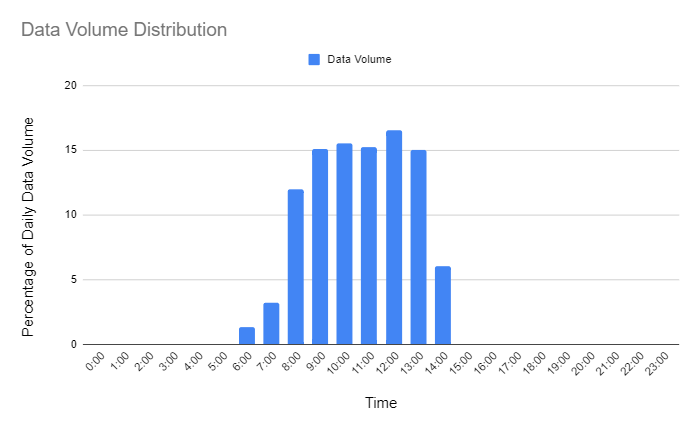
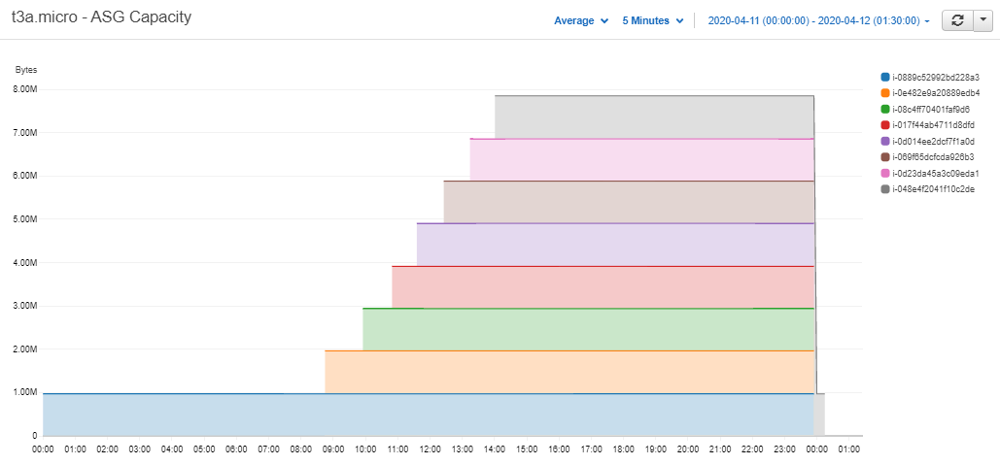
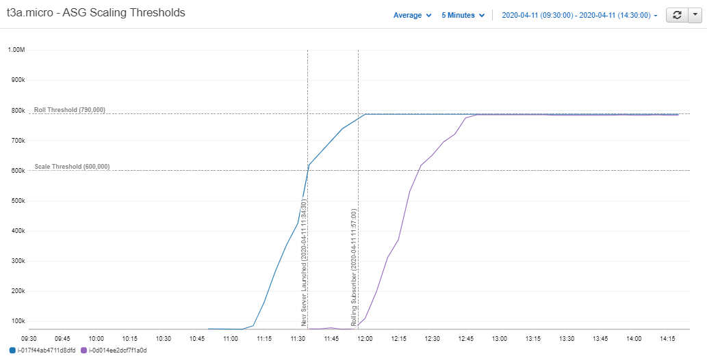
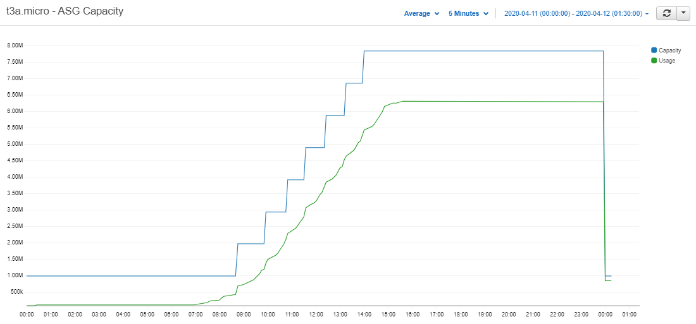
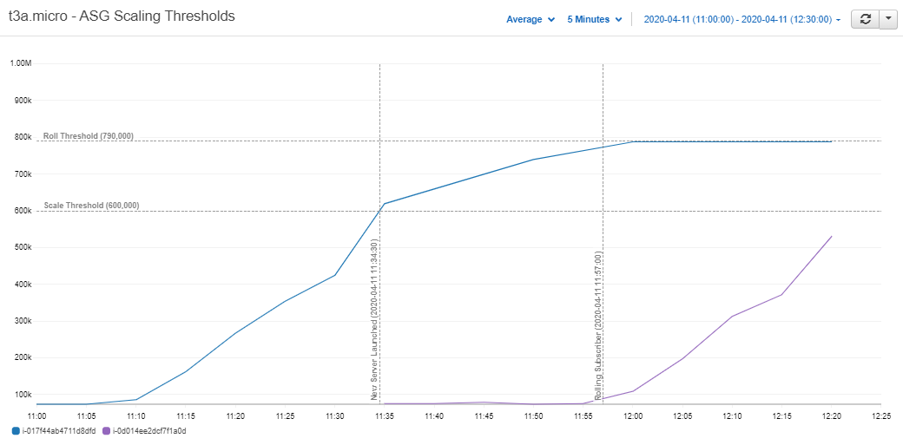
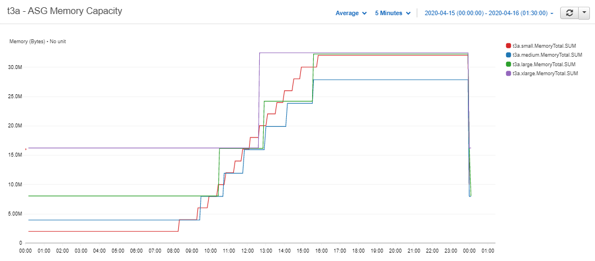
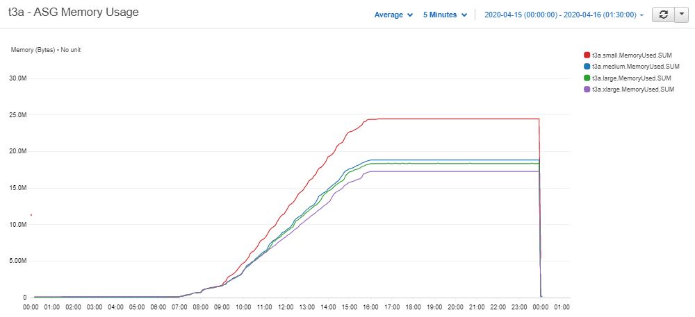
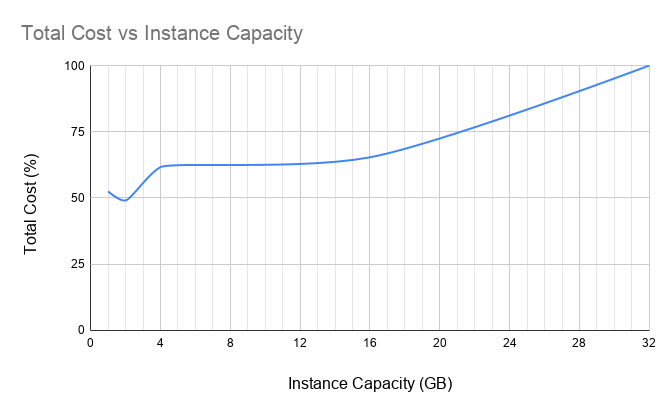
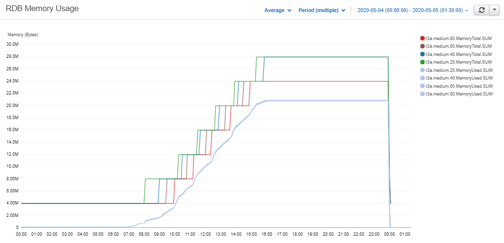
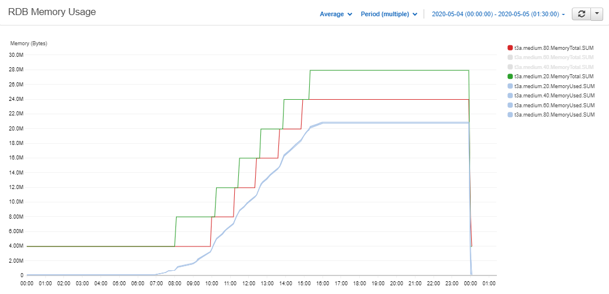

# Cost/risk analysis


To determine how much cost savings our cluster of RDBs can make we will deploy the stack and simulate a day in the market.

`t3` instances were used here for simplicity.
Their small sizes meant the clusters could scale in and out to demonstrate cost savings without using a huge amount of data.
In reality they can incur a significant amount of excess costs due to their burstable performance.
For production systems fixed cost instances like `r5`, `m5`, and `i3` should really be used.


## Initial simulation

First we just want to see the cluster in action so we can see how it behaves.
To do this we will run the cluster with `t3a.micro` instances.

In the [Auto Scaling the RDB](index.md#auto-scaling-the-rdb) section above, data is distributed evenly throughout the day.
This will not be the case in most of our systems as data volumes will be highly concentrated between market open and close.
To simulate this as closely as possible we will generate data following the distribution below.


<br>
_<small>Figure 2.1: Simulation data volume distribution </small>_

In this simulation we will aim to send in 6GB of data of mock trade and quote data.
The peak data volume will be almost 1GB of data per hour (15% of the daily data) .
The `t3a.micro` instances only have 1GB of RAM so we should see the cluster scaling out quite quickly while markets are open.

The behavior of the cluster was monitored using Cloudwatch metrics.
Each RDB server published the results of the Linux `free` command.
First we will take a look at the total capacity of the cluster throughout the day.


<br>
_<small>Figure 2.2: Total memory capacity of the t3a.micro cluster – Cloudwatch Metrics </small>_

As expected we can see the number of servers stayed at one until the market opened.
The RDBs then started to receive data and the cluster scaled up to eight instances.
At end-of-day the data was flushed from memory and all but the live server was terminated.
So the capacity was reduced back to 1GB and the cycle continued the day after.

Plotting the memory usage of each server we see that the rates at which they rose were higher in the middle of the day when the data volumes were highest.


<br>
_<small>Figure 2.3: Memory usage of each of the t3a.micro servers – Cloudwatch Metrics </small>_

Focusing on just two of the servers we can see the relationship between the live server and the one it eventually launches.


<br>
_<small>Figure 2.4: Scaling thresholds of t3a.micro servers – Cloudwatch Metrics </small>_

At 60% memory usage the live server increased the ASG’s `DesiredCapacity` and launched the new server.
We can see the new server then waited for about twenty minutes until the live RDB reached the roll threshold of 80%.
The live server then unsubscribed from the tickerplant and the next server took over.


## Cost factors

Now that we can see the cluster working as expected we can take a look at its cost-efficiency.
More specifically, how much of the computing resources we provisioned did we actually use.
To do that we can take a look at the capacity of the cluster versus its memory usage.


<br>
_<small>Figure 2.5: T3a.micro cluster’s total memory capacity vs total memory usage – Cloudwatch Metrics </small>_

We can see from the graph above that the cluster’s capacity follows the demand line quite closely.
As we pay per GB of RAM we use, the capacity line can be taken as the cost of the cluster.
The gap between it and the usage line is where the cluster can make savings.

Our first option is to reduce the size of each step up in capacity by reducing the size of our cluster’s servers.
To bring the step itself closer to the demand line we need to either scale the server as late as possible or have each RDB hold more data.

To summarize, there are three factors we can adjust in our cluster.

-   The server size
-   The scale threshold
-   The roll threshold


### Risk analysis

Care will be needed when adjusting these factors for cost-efficiency as each one will increase the risk of failure.
First and foremost a roll threshold should be chosen so that the chance of losing an RDB to a `'wsfull` error is minimized.

The main risk associated with scaling comes from not being able to scale out fast enough.
This will occur if the lead time for an RDB server is greater than the time it takes for the live server to roll after it has told the ASG to scale out.


<br>
_<small>Figure 2.6: T3a.micro server waiting to become the live subscriber – Cloudwatch Metric </small>_

Taking a closer look at Figure 2.4 we can see the t3a.micro took around one minute to initialize.
It then waited another 22 minutes for the live server to climb to its roll threshold of 80% and took its place.
So for this simulation the cluster had a 22-minute cushion.
With a one-minute lead time, the data volumes would have to increase to 22 times that of the mock feed before the cluster started to fall behind.

We could reduce this time by narrowing the gap between scaling and rolling, but it may not be worth it.
Falling behind the tickerplant will mean recovering data from its log.
This issue will be a compounding one as each subsequent server that comes up will be farther and farther behind the tickerplant.
More and more data will need to be recovered, and live data will be delayed.

One of the mantras of Auto Scaling is to _stop guessing demand_.
By keeping a cushion for the RDBs in the tickerplant’s queue we will likely not have to worry about large spikes in demand affecting our system.

Further simulations will be run to determine whether cost savings associated with adjusting these factors are worth the risk.


## Server size comparison

To determine the impact of using smaller instances four clusters were launched each with a different instance type.
The instances used had capacities of 2, 4, 8, and 16GB.


<br>
_<small>Figure 3.1: T3a instance types used for cost efficiency comparison </small>_

As in the first simulation the data volumes were distributed in order to simulate a day in the market.
However, in this simulation we aimed to send in around 16GB of data to match the total capacity of one `t3a.xlarge` (the largest instance type of the clusters).
`.sub.i` was published from each of the live RDBs allowing us to plot the `upd` message throughput.


<br>
_<small>Figure 3.2: T3a cluster’s upd throughput – Cloudwatch Metrics </small>_

Since there was no great difference between the clusters, the assumption could be made that the amount of data in each cluster at any given time throughout the day was equivalent.
So any further comparisons between the four clusters would be valid.
Next the total capacity of each cluster was plotted.


<br>
_<small>Figure 3.3: T3a clusters' total memory capacity </small>_

Strangely the capacity of the `t3a.small` cluster (the smallest instance) rose above the capacity of the larger ones.
Intuitively they should scale together but the smaller steps of the `t3a.small` cluster should still have kept it below the others.
When the memory usage of each server was plotted we saw that the smaller instances once again rose above the larger ones.


<br>
_<small>Figure 3.4: T3a clusters' memory usage – Cloudwatch Metrics </small>_

This comes down to the latent memory of each server, when an empty RDB process is running the memory usage is approximately 150 MB.

```bash
(base) [ec2-user@ip-10-0-1-212 ~]$  free
              total        used        free      shared  buff/cache   available
Mem:        2002032      150784     1369484         476      481764     1694748
Swap:             0           0           0
```

So for every instance that we add to the cluster, the overall memory usage will increase by 150MB.
This extra 150MB will be negligible when the data volumes are scaled up as much larger servers will be used.

The effect is less prominent in the 4, 8, and 16GB servers so going forward we will use them to compare costs.


<br>
_<small>Figure 3.5: Larger t3a Clusters' Memory Usage - Cloudwatch Metrics </small>_

The three clusters here behave as expected.
The smallest cluster’s capacity stays far closer to the demand line, although it does move towards the larger ones as more instances are added.
This is the worst-case scenario for the `t3a.xlarge` cluster, as 16GBs means it has to scale up to safely meet the demand of the simulation’s data, but the second server stays mostly empty until end-of-day.
The cluster will still have major savings over a `t3.2xlarge` with 32GB.

The cost of running each cluster was calculated, the results are shown below.
We can see that the two smaller instances have significant savings compared to the larger ones.
50% savings when compared to running a `t3a.2xlarge`.
The clusters with larger instances saw just 35 and 38%.

| instance | capacity (GB) | total cost ($) | cost saving (%) |
|---|---|---|---|
| t3a.small | 1 | 3.7895 | 48 |
| t3a.medium | 2 | 3.5413 | 51 |
| t3a.large | 4 | 4.4493 | 38 |
| t3a.xlarge | 16 | 4.7175 | 35 |
| t3a.2xlarge | 32 | 7.2192 | 0 |


<br>
_<small>Figure 3.6: T3a clusters' cost savings </small>_

If data volumes are scaled up the savings could become even greater as the ratio of server size to total daily data volume becomes greater.
However it is worth noting that the larger servers did have more capacity when the data volumes stopped, so the differences may also be slightly exaggerated.

Taking a look at Figure 3.5 we can intuitively split the day into three stages.

1. End of Day to Market Open
2. Market Open to Market Close
3. Market Close to End of Day

Savings in the first stage will only be achieved by reducing the instance size.
In the second stage savings look to be less significant, but could be achieved by both reducing server size and reducing the time in the queue of the servers.

From market-close to end-of-day the clusters have scaled out fully.
In this stage cost-efficiency will be determined by how much data is in the final server.
If it is only holding a small amount of data when market closes there will be idle capacity in the cluster until end-of-day occurs.

This will be rather random and depend mainly on how much data is generated by the market.
Although having smaller servers will reduce the maximum amount of capacity that could be left unused.

The worst-case scenario in this stage is that the amount of data held by the last live server falls in the range between the scale and roll thresholds.
This will mean an entire RDB server will be sitting idle until end-of-day.
To reduce the likelihood of this occurring it may be worth increasing the scale threshold and risking falling behind the tickerplant in the case of high data volumes.

## Threshold window comparison

To test the effects of the scale threshold on cost another stack was launched (also with four RDB clusters).
In this stack all four clusters used `t3a.medium` EC2 instances (4GB) and a roll threshold of 85% was set.
Data was generated in the same fashion as the previous simulation.

The scale thresholds were set to 20, 40, 60, and 80% and the memory capacity was plotted as in Figure 3.4.


<br>
_<small>Figure 4.1: T3a.medium clusters' memory capacity vs memory usage – Cloudwatch Metrics </small>_

As expected the clusters with the lower scale thresholds scale out farther away from the demand line.
Their new servers will then have a longer wait time in the tickerplant queue.
This will reduce the risks associated with the second stage but also increase its costs.
This difference can be seen more clearly if only the 20 and 80% clusters are plotted.


<br>
_<small>Figure 4.2: T3a.medium 20 and 80% clusters' memory capacity vs memory usage – Cloudwatch Metrics </small>_

Most importantly we can see that in the third stage the clusters with lower thresholds started an extra server.
So a whole instance was left idle in those clusters from market-close to end-of-day.
The costs associated with each cluster were calculated below.

| instance | threshold | capacity (GB) | total cost ($) | cost saving (%) |
|---|---|---|---|---|
| t3a.medium | 80% | 4 | 3.14 | 43 |
| t3a.medium | 60% | 4 | 3.19 | 44 |
| t3a.medium | 40% | 4 | 3.56 | 49 |
| t3a.medium | 20% | 4 | 3.61 | 50 |
| t3a.2xlarge | n/a | 32 | 7.21 | 0 |

The 20 and 40% clusters and the 60 and 80% clusters started the same amount of servers as each other throughout the day.
So we can compare their costs to analyze cost-efficiencies in the second stage (market-open to close).
With differences of under 1% compared to the `t3.2xlarge` the cost savings we can make from this stage are not that significant.

Comparing the difference between the two pairs we can see that costs jump from 44 to 49%.
Therefore the final stage where there is an extra server sitting idle until end-of-day has a much larger impact.

Even though raising the scale threshold has a significant impact when no extra server is added at market-close, choosing whether to do so will still be dependant on the needs of each system.
A 5% decrease in costs may not be worth the risk of falling behind the tickerplant.


## Taking it further

### Turning the cluster off

The saving estimates in the previous sections could be taken a step further by adding scheduled scaling.
When the RDBs are not in use we could scale the cluster down to zero, effectively turning off the RDB.
Weekends are a prime example of when this could be useful, but it could also be extended to the period between end-of-day and market open.

If data only starts coming into the RDB at around 07:00 when markets open there is no point having a server up.
So we could schedule the ASG to turn down to zero instances at end-of-day.
We then have a few options for scaling back out, each have some pros and cons.

option | remarks
-------|--------
Schedule the ASG to scale out at 05:30 before the market opens | Data will not be available until then if it starts to come in before. 
Monitor the tickerplant for the first `upd` message and scale out when it is received | Data will not be available until the RDB comes up and recovers from the tickerplant log. Will not be much data to recover.
Scale out when the first query is run | Useful because data is not needed until it is queried. RDBs may come up before there is any data. A large amount of data may need to be recovered if queries start to come in later in the day.


### Intraday write-down

The least complex way to run this solution would be in tandem with a write-down database (WDB) process.
The RDBs will then not have to save down to disk at end-of-day so scaling in will be quicker.
The complexity will also be reduced.
If the RDBs were to write down at end-of-day a separate process would be needed to coordinate the writes of each one and sort and part the data.

As the cluster will most likely be deployed alongside a WDB process an intraday write-down solution could also be incorporated.
If we were to write to the HDB every hour, the RDBs could then flush their data from memory allowing the cluster to scale in each time.

Options for how to set up an intraday write-down solution have been discussed in a whitepaper by Colm McCarthy. 

:fontawesome-regular-map:
[Intraday writedown solutions](../../wp/intraday-writedown/index.md)


### Querying distributed RDBs

As discussed, building a gateway to query the RDBs is beyond the scope of this paper.
When a gateway process is set up, distributed RDBs could offer some advantages over a regular RDB:

-   RDBs can be filtered out by the gateway pre-query based on which data sets they are holding.
-   Each RDB will be holding a fraction of the day’s data, decreasing query memory and duration.
-   Queries across multiple RDBs can be done in parallel.


## Conclusion

This article has presented a solution for a scalable real-time database cluster.
The simulations carried out showed savings of up to 50% could be made.
These savings, along with the increased availability of the cluster, could make holding a whole day’s data in memory more feasible for our kdb+ databases.

If not, the cluster can be used alongside an intraday write-down process.
If an intraday write is incorporated in a system it is usually one that needs to keep memory usage low.
The scalability of the cluster can guard against large spikes in intraday data volumes crippling the system.
Used in this way very small instances could be used to reduce costs.

The `.u.asg` functionality in the tickerplant also gives the opportunity to run multiple clusters at different levels of risk.
Highly important data can be placed in a cluster with a low scale threshold or larger instance size.
If certain data sources do not need to be available with a low latency clusters with smaller instances and higher scale thresholds can be used to reduce costs.


## Author

Jack Stapleton is a kdb+ consultant for Kx who has worked for some the world’s largest financial institutions. 

Based in Dublin, Jack is currently working on the design, development, and maintenance of a range of kdb+ solutions in the cloud for a leading financial institution.


----
:fontawesome-brands-github:
[kxcontrib/cloud-autoscaling](https://github.com/kxcontrib/cloud-autoscaling)
companion scripts
