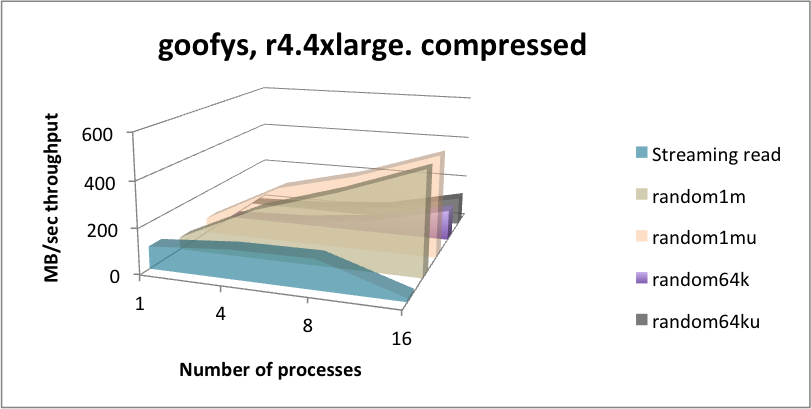

# Appendix E - Goofys

Goofys is an open-source Linux client distribution. 
It uses an AWS S3 storage backend, behind a running and a normal Linux AWS EC2 instance. 
It presents a POSIX file system layer to kdb+ using the FUSE layer. 
It is distributed in binary form for RHEL/CentOS and others, or can be built from source.

Limitations of the POSIX support are that hard links, symlinks and appends are not supported.

function       | latency (mSec) | function   | latency (mSec) 
---------------|----------------|------------|---------------
`hclose hopen` | 0.468          | `();,;2 3` | DNF
`hcount`       | 0.405          | `read1`    | 0.487

<small>_Metadata operational latencies - mSecs (headlines)_</small>

## Summary

Operational latency is high. The natural streaming throughput seems to hover around 130&nbsp;MB/sec, or approximately a quarter of the EBS rate. The solution thrashes at 16 processes of streaming reads. Metadata latency figures are in the order of 100-200× higher that of EBS. 

The compressed tests show that the bottleneck is per-thread read speeds, as the data when decompressed rates improve a lot over the uncompressed model.

[D. MapR-FS](app-d-mapr.md)

[F. S3FS](app-f-s3fs.md)

