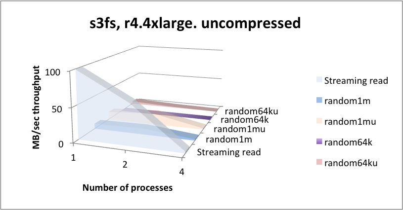

# Appendix F - S3FS

S3FS is an open-source Linux client software layer that arbitrates between the AWS S3 storage layer and each AWS EC2 instance. It presents a POSIX file system layer to kdb+.

S3FS uses the Linux user-land FUSE layer. By default, it uses the POSIX handle mapped as an S3 object in a one-to-one map. It does not use the kernel cache buffer, nor does it use its own caching model by default.

Due to S3’s eventual consistency limitations file creation with S3FS can occasionally fail.

Metadata operations with this FS are slow. The append function, although supported is not usable in a production setting due to the massive latency involved.

With multiple kdb+ processes reading, the S3FS service effectively stalled.

function       | latency (mSec) | function   | latency (mSec) 
---------------|----------------|------------|---------------
`hclose hopen` | 7.57           | `();,;2 3` | 91.1
`hcount`       | 10.18          | `read1`    | 12.64

<small>_Metadata operational latencies - mSecs (headlines)_</small>

[E. Goofys](app-e-goofys.md)

[G. S3QL](app-g-s3ql.md)

