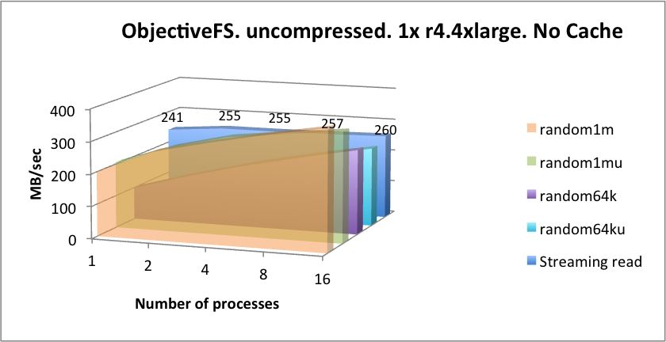
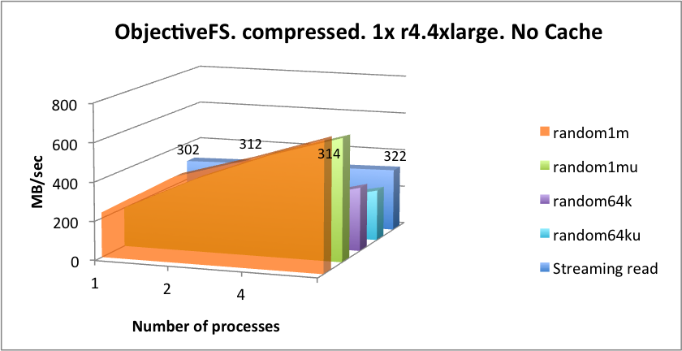
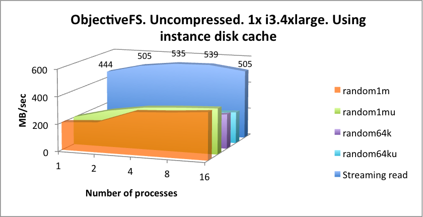
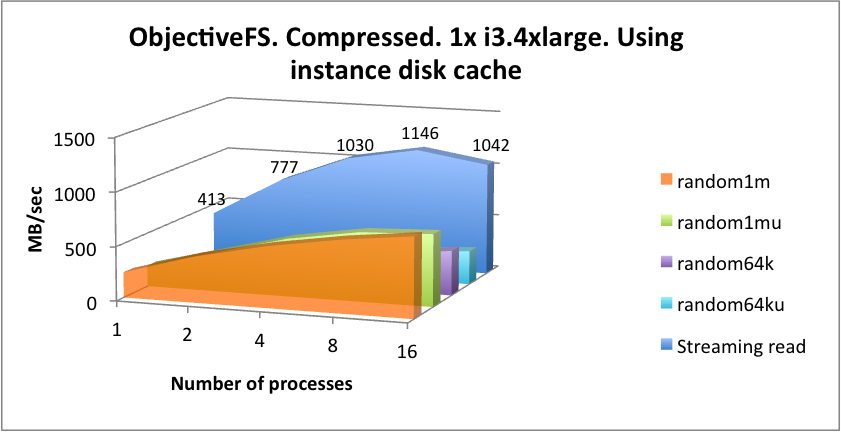

# Appendix H - ObjectiveFS

!!! info "ObjectiveFS is qualified with kdb+."

ObjectiveFS is a commercial Linux client/kernel package. 
It arbitrates between S3 storage (each S3 bucket is presented as a FS) and each AWS EC2 instance running ObjectiveFS.

It presents a POSIX file system layer to kdb+. 
This is distinct from the EFS NFS service from AWS, which is defined independently from the S3 service. 
With this approach, you pay storage fees only for the S3 element, alongside a usage fee for ObjectiveFS.

ObjectiveFS contains a pluggable driver, which allows for multithreaded readers to be implemented in kernel mode. 
This gives an increase in the concurrency of the reading of S3 data. 
ObjectiveFS would be installed on each kdb+ node accessing the S3 bucket containing the HDB data.

ObjectiveFS V5.3.1 is qualified with kdb+. 
ObjectiveFS achieves significantly better performance than EFS. 
It also has significantly better metadata operation latency than all of the EFS and open source S3 gateway products. 
ObjectiveFS also scales aggregate bandwidth as more kdb+ nodes use the same S3 bucket. 
It scales up close to linearly for reads, as the number of reader nodes increase, since Amazon automatically partitions a bucket across service nodes, as needed to support higher request rates.

This shows that the read rates from the S3 buckets scale well when the number of nodes increases. 
This is more noticeable than the read rate seen when measuring the throughput on one node with varying numbers of kdb+ processes. 
Here it remains around the 260&nbsp;MB/sec mark irrespective of the number of kdb+ processes reading.

If you select the use of instance local SSD storage as a cache, this can accelerate reads of recent data. 
The instance local cache is written around for writes, as these go direct to the S3 bucket. 
But any re-reads of this data would be cached on local disk, local to that node. 
In other words, the same data on multiple client nodes of ObjectiveFS would each be copies of the same data. 
The cache may be filled and would be expired in a form of LRU expiry based on the access time of a file. 
For a single node, the read rate from disk cache is:

function       | latency (mSec) | function   | latency (mSec) 
---------------|----------------|------------|---------------
`hclose hopen` | 0.162          | `();,;2 3` | 0.175
`hcount`       | 0.088          | `read1`    | 0.177

<small>_ObjectiveFS metadata operational latencies - mSecs (headlines)_</small>

Note that ObjectiveFS encrypts and compresses the S3 objects using its own private keys plus your project’s public key. 
This will require a valid license and functioning software for the length of time you use this solution in a production setting.

## Summary

This is a simple and elegant solution for the retention of old data on a slower, lower cost S3 archive, which can be replicated by AWS, geographically or within availability zones. 
It magnifies the generically very low S3 read rates by moving a “parallelizing” logic layer into a kernel driver, and away from the FUSE layer. 
It then multithreads the read tasks. 

It requires the addition of the ObjectiveFS package on each node running kdb+ and then the linking of that system to the target S3 bucket. 
This is a very simple process to install, and very easy to set up.

For solutions requiring higher throughput and lower latencies, you
can consider the use of their local caching on instances with internal
SSD drives, allowing you to reload and cache, at runtime, the most
recent and most latency sensitive data. 
This cache can be pre-loaded according to a site-specific recipe, and could cover, for example, the most recent market data written back to cache, even through originally written to S3.

Like some of the other solutions tested, ObjectiveFS does not use the kernel block cache.
Instead it uses its own memory cache mechanism.
The amount used by it is defined as a percent of RAM or as a fixed size. 
This allocation is made dynamically. 

Therefore attention should be paid to the cases where a kdb+ writer (e.g. RDB or a TP write-down) is growing its private heap space dynamically, as this could extend beyond available space at runtime. 
Reducing the size of the memory cache for ObjectiveFS and use of disk cache would mitigate this.

[G. S3QL](app-g-s3ql.md)

[I. WekaIO Matrix](app-i-wekaio-matrix.md)

