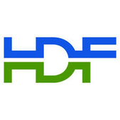

#  Using HDF5 data with kdb+

<i class="fab fa-github"></i> [KxSystems/hdf5](https://github.com/KxSystems/hdf5)

`hdf5` is a wrapper for kdb+ around the HDF5 C API outlined in detail [here](https://support.hdfgroup.org/HDF5/doc/RM/RM_H5Front.html)

## Introduction

Hierarchical Data Format 5(HDF5) is a file format designed specifically for the storage and organisation of large amounts of data. It is supported by the HDF Group and free to use under a BSD-like licence. This data format is used across a number of sectors with use cases including but limited to

1. Storing of neural network architectures (Python Keras)
2. Storing of astronomical/geological/hydrological data

Further use cases and users of this data format can be found [here](https://support.hdfgroup.org/HDF5/users5.html)

In many ways HDF5 acts like a truly hierarchical file system similar to that used by linux or windows. This structure contains two major types of object:

1. Datasets - These may contain multidimensional arrays of homogenously typed data or compound data containing a mixture of types. This is similar to files within a traditional POSIX file system.
2. Groups - These act as container structures which can hold datasets or other further groups. These act similar to folders in a traditional POSIX file system.

There are a number of secondary objects and structures which add complexity to the format and in doing so allow the format to be used for a wider number of use cases

* Attributes: These allow metadata information to be associated with a dataset or group i.e. Associate the date of data collection with a group or the room temperature at the time a set of results was collected.
* Linking functionality: Like a traditional unix-like file system it is possible to create links between objects (hard/soft/external), these allow datasets or groups relevant to multiple experiments or use-cases to be accessed via routes that a user may find more intuitive.

## API

The library follows the `HDF5` C API closely where possible however structures or types common in HDF5 or q may by necessity need to be modified to account for differences between the two data formats.

In cases where this is necessary documentation will indicate the assumptions made and expected behaviour within the interface.

## Status

This interface is currently available as a beta version under an Apache 2.0 licence and is supported on a best effort basis by the Fusion team. This interface is currently in active development, with additional functionality to be released on a rolling basis.

If you find issues with the interface or have feature requests please consider raising an issue [here](https://github.com/KxSystems/hdf5-kdb/issues). If you wish to contribure to this project please follow the contributing guide [here](https://github.com/KxSystems/hdf5-kdb/blob/master/CONTRIBUTING.md)
