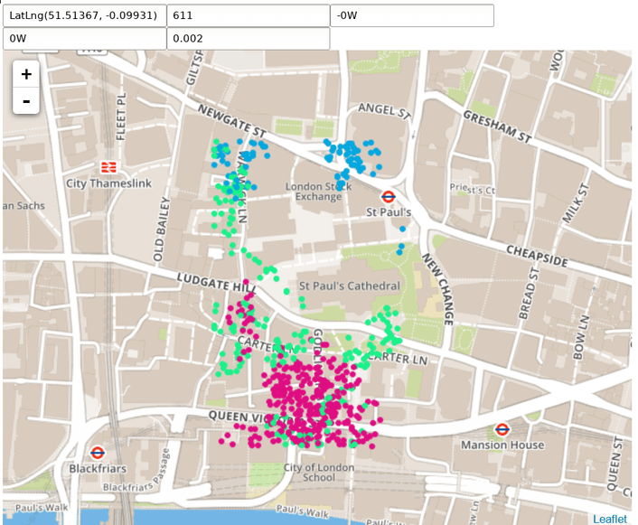

# Geospatial indexing


This demo shows the basics of geospatial indexing with q.

A 10-million-point random data set is queried from the HTML map client. Click on the map to see nearby points. 

Download <i class="fab fa-github"></i> [KxSystems/kdb/e/geo.zip](https://github.com/KxSystems/kdb/blob/master/e/geo.zip) and run:

```bash
$ make -C s2
$ q q/geo.q
$ open html/geo.html
```


This should then open a browser, connect to the kdb+ process and retrieve `geo.html`, displayed similar to:



There are five text fields in the top row:

-   Last-click coordinates 
-   Number of returned results 
-   Min date* 
-   Max date* 
-   Lookup rectangle size* (degrees)

Those marked with * are editable filters.

When the mouse is clicked on the map, the underlying lat-lon coordinates are sent to the kdb+ process along with the filters over a websocket connection, and the points in the response are then plotted on the map. In addition to coordinates, kdb+ returns a `trk` column, which the client interprets as point colour.

This uses the [Google S2 library](http://blog.christianperone.com/2015/08/googles-s2-geometry-on-the-sphere-cells-and-hilbert-curve/) as a kdb+ shared object.

To create the index, the function `ids[lats;lons]` maps (lat-lon) coordinates on a sphere to one-dimensional cell IDs. These are stored as 32-bit integers with the `` `p`` attribute applied.

```q
q)geo
time                          trk  lat      lon       cid       
----------------------------------------------------------------
2016.09.26D00:40:05.783973634 3233 51.79961 0.1946887 1205375107
2016.09.26D01:12:53.469740152 3233 51.80003 0.1923668 1205375107
2016.09.26D01:40:23.427598178 3233 51.79994 0.192314  1205375107
2016.09.26D04:11:52.743414938 3233 51.79958 0.1950875 1205375107
2016.09.26D08:39:32.459766268 3233 51.80044 0.1923126 1205375107
..

q)meta geo
c   | t f a
----| -----
time| p    
trk | j    
lat | f    
lon | f    
cid | i   p
```

`lu`, defined in `geo.q` as

```q
{[x;y]select from pl rect . x where all(lat;lon;time)within'(x,enlist y)}
```

retrieves points contained in the given spherical rectangle. `lu` takes the rectangle coordinates with a time filter, and calculates the coverage (ranges of cells covering the rectangle) with `rect[(lat0;lat1);(lon0;lon1)]`. The cell ID ranges are looked up with `pl`, defined in `geo.q` as

```q
{raze{select[x]lat,lon,trk,time from geo}each flip deltas geo.cid binr/:x}
```

The result is then filtered to remove points outside the rectangle (since the covering might exceed the rectangle dimensions) and to constrain by time.

The simple HTML interface is implemented with [openstreetmap](http://www.openstreetmap.org/) and [leaflet](https://leafletjs.com).


!!! warning "OpenSSL 1.1 and Ubuntu 18.04"

    `geo.zip` conflicts with OpenSSL 1.1 and won’t compile on Ubuntu 18.04.

    For now, a workaround can be found at 
    <i class="fab fa-github"></i>
    [rianoc/geo](https://github.com/rianoc/geo)
