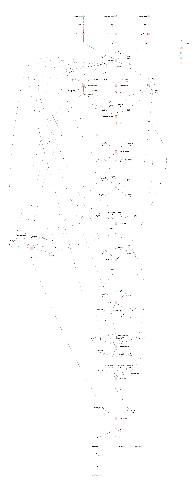

# :fontawesome-solid-share-alt: Overview

:fontawesome-brands-github:
[KxSystems/automl](https://github.com/kxsystems/automl)

The documentation presented for this framework provides a number of entry points for users who wish to interact with the AutoML framework.

1. Users wishing to use the interface without need for detailed information on the implementation can use the [Framework Interaction](functions.md) section of the documentation.
2. Users who require a low level introduction to the procedures being undertaken within the framework can find this information in 3 sections dedicated to the core elements of most machine learning workflows.
	1. [Data pre-processing](preproc.md) (data retrieval, data cleaning, feature extraction)
	2. [Data processing](proc.md) (model selection and optimization)
	3. [Data post-processing](postproc.md) (saving reports, models, graphs and metadata)
3. Users who need to make changes to the underlying functionality by changing tunable parameters can find this information in the [Advanced parameter modifications](advanced.md) section.

## Graphing structure

Version `0.3.0` of the AutoML framework changed fundamentally the approach to code structure used by the framework. In particular moving from a small number of closely dependent functions to a coding pattern which separates the individual pieces of required functionality into separated and distinct sections. This is facilitated by the directed acyclic graph structure outlined [here](../../toolkit/graph/index.md).

Understanding of this underlying structure provides insights into the functionality provided and the interdependencies of individual pieces of functionality. It also allows a user to understand the documentation breakdown within the [data pre-processing](preproc.md), [data processing](proc.md) and [data post-processing](postproc.md) sections which reference the applied functions within each of these sections based on their `node` within the graph i.e. `.automl.trainTestSplit.node.function`, `.automl.saveGraph.node.function` or `.automl.featureData.node.function`.

The following image provides a full understanding of the interconnection between sections of the framework

