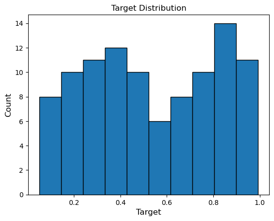
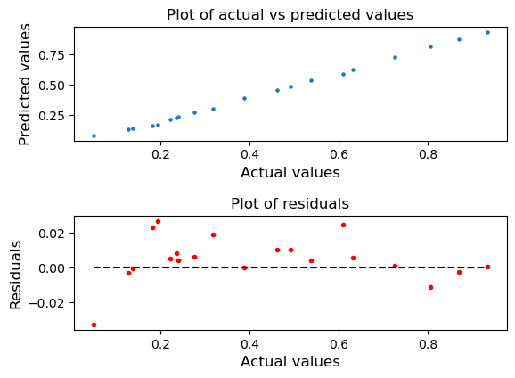

# :fontawesome-solid-share-alt: Automated Post-Processing


:fontawesome-brands-github: 
[KxSystems/automl](https://github.com/kxsystems/automl)

This section describes the outputs produced following model selection and optimization. All outputs are contained in an `outputs` directory within the `automl` repository.

In its default configuration, the pipeline returns:

1. Visualizations - data split, target distribution, feature impact, confusion matrix (classification only) and regression analysis (regression only) plots.
2. The best model saved as a H5/binary file 
3. A configuration file outlining the procedure carried out for a run which can be used in re-running a pipeline.
4. A report outlining the steps taken and results achieved at each step of a run.

These outputs are contained within subfolders for `images`, `models`, `config`, and `reports` respectively, contained within a directory specific to the date and time of the run. The folder structure for each unique run is as follows: `automl/outputs/date/run_time/...`.


## Visualizations

### Data split

Within any run, an image showing the specific split applied to the data will be generated. In the default case (depicted below), 20% of the data is used as the testing set, then 20% of the remaining data is used as a holdout set, while the rest of the data used as the training set.


### Target distribution

A target distribution plot it generated for both classification and regression tasks. For classification, the plot simply shows the split between the classes within the target vector. While in the regression case, the target values are separated into 10 bins, as demonstrated in the example below.



### Feature impact

The feature impact plot identifies the features which have the highest impact when predicting the outcomes of a model. Within the framework, the impact of a single feature column is determined by shuffling the values in that column and running the best model again with this new, scrambled feature.

It should be expected that if a feature is an important contributor to the output of a model, then scrambling or shuffling that feature will cause the model to not perform as well. Conversely, if the model performs better on the shuffled data, which is effectively noise, it is safe to say that the feature is not relevant for model training.

A score is produced by the model for each shuffled column, with all scores ordered and scaled using `.ml.minmaxscaler` contained within the ML Toolkit. An example plot is shown below for a table containing four features, using a Gradient Boosting Regressor.


### Confusion matrix

A confusion matrix is produced for classification problems and highlights how well the predictions produced by a model predict the actual class. This gives a user a visual representation of the success or otherwise of their produced model.


### Regression analysis

For regression problems, plots of true vs predicted targets and their residuals values are produced. Users can use these plots to determine how well their model performed given that a model which produced perfect predictions would show a perfect correlation between predicted and true values, with all residuals equal to zero. An example is shown below for a Random Forest Regressor model. 



## Models

The best performing model produced by the pipeline is saved to disk such that it can be used on new data and maintained for a production environment. The following describes the format models are saved in based on their library:

Model library | Save type 
--------------|-----------
Sklearn       | Pickled binary file
Keras         | hdf5 file containing model information


## Report

A report is generated containing the following information:

- Total extracted features
- Cross validation scores
- Scoring metrics
- Above listed plots
- Best model and holdout score
- Runtimes for each section


## Configuration

Once the pipeline has been completed a configuration dictionary is saved down as a binary file. This file is used for running on new data and can be used for oversight purposes in cases where configuration data is important for regulation.

The following is an example of the config file produced for a single run of AutoML which used FRESH classification data.

```q
q)get`:metadata
modelLib       | `sklearn
mdlType        | `multi
startDate      | 2020.11.02
startTime      | 18:02:42.644
featExtractType| `fresh
problemType    | `class
aggcols        | `n
funcs          | `.ml.fresh.params
xv             | (`.ml.xv.kfshuff;5)
gs             | (`.automl.gs.kfshuff;5)
rs             | (`.automl.rs.kfshuff;5)
hp             | `grid
trials         | 256
prf            | `.automl.utils.fitPredict
scf            | `class`reg!`.ml.accuracy`.ml.mse
seed           | 64962667
saveopt        | 2
hld            | 0.2
tts            | `.automl.utils.ttsNonShuff
sz             | 0.2
sigFeats       | `.automl.featureSignificance.significance
tf             | 1b
configSavePath | ("automl/outputs/2020.11.02/run_18.02.42.644/config/"...
modelsSavePath | ("automl/outputs/2020.11.02/run_18.02.42.644/models/"...
imagesSavePath | ("automl/outputs/2020.11.02/run_18.02.42.644/images/"...
reportSavePath | ("automl/outputs/2020.11.02/run_18.02.42.644/report/"...
```
