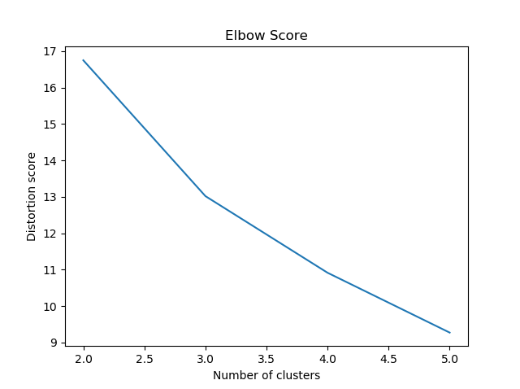

# <i class="fas fa-share-alt"></i> Scoring Metrics

<i class="fab fa-github"></i>
[KxSystems/ml/clust/score.q](https://github.com/kxsystems/ml/clust/score.q)

# Unsupervised Learning

Each of the scoring metrics described below are used in unsupervised learning to analyze how well groups of data have been assigned to clusters. The metrics measure the intra-cluster similarity (cohesion) and inter-cluster differences (separation) of data. It is therefore preferred that clusters are well-spaced and densely packed.

## Davies-Bouldin Index

### `.ml.clust.daviesbouldin`

_Calculate the Davies-Bouldin index for clustered data. Minimum value of zero, where lower values indicate better clustering._

Syntax: `.ml.clust.daviesbouldin[data;clt]`

Where

- `data` is the data points in a horizontal matrix format
- `clt` is the list of clusters returned by the clustering algorithms in `.ml.clust`

returns the Davies-Bouldin index.

```q
q)show d:2 10#20?10.
3.927524 5.170911 5.159796  4.066642 1.780839 3.017723 7.85033  5.347096..
4.931835 5.785203 0.8388858 1.959907 3.75638  6.137452 5.294808 6.916099..
q)show r1:.ml.clust.hc[d;`edist;`single;3]
0 0 1 1 0 0 2 0 1 0
q)show r2:.ml.clust.kmeans[d;`e2dist;3;10;0b]
0 0 1 1 0 2 0 2 1 2
q).ml.clust.daviesbouldin[d;r1]  / lower values indicate better clustering
0.56649
q).ml.clust.daviesbouldin[d;r2]
1.424637
```

!!! note
	The Davies-Bouldin index can only be used with Euclidean distances (`edist`/`e2dist`).
    
## Dunn Index

### `.ml.clust.dunn`

_Calculate the Dunn index for clustered data. Minimum value of 0, where higher values indicate better clustering._

Syntax: `.ml.clust.dunn[data;df;clt]`

Where

- `data` is the data points in a horizontal matrix format
- `df` is the distance function as a symbol, e.g. `e2dist` `edist` `mdist` etc.
- `clt` is the list of clusters returned by the clustering algorithms in `.ml.clust`

returns the Dunn index.

```q
q)d
3.927524 5.170911 5.159796  4.066642 1.780839 3.017723 7.85033  5.347096..
4.931835 5.785203 0.8388858 1.959907 3.75638  6.137452 5.294808 6.916099..
q)r1
0 0 1 1 0 0 2 0 1 0
q)r2
0 0 1 1 0 2 0 2 1 2
q).ml.clust.dunn[d;`edist;r1]  / higher values indicate better clustering  
0.5716933
q).ml.clust.dunn[d;`e2dist;r2]
0.03341283
```

## Silhouette Coefficient

### `.ml.clust.silhouette`

_Calculate the Silhouette coefficient for clustered data. `+1` indicates correct clustering, `0` indicates that clusters are close to each other, if not overlapping and `-1` indicates incorrect clustering._

Syntax: `.ml.clust.silhouette[data;df;clt;isavg]`

Where

- `data` is the data points in a horizontal matrix format
- `df` is the distance function as a symbol, e.g. `e2dist` `edist` `mdist` etc.
- `clt` is the list of clusters returned by the clustering algorithms in `.ml.clust`
- `isavg` is a boolean - `1b` to return the average coefficient, `0b` to return a list of coefficients

returns the Silhouette coefficient.

```q
q)d
3.927524 5.170911 5.159796  4.066642 1.780839 3.017723 7.85033  5.347096..
4.931835 5.785203 0.8388858 1.959907 3.75638  6.137452 5.294808 6.916099..
q)r1
0 0 1 1 0 0 2 0 1 0
q)r2
0 0 1 1 0 2 0 2 1 2
q).ml.clust.silhouette[d;`edist;r1;1b]
0.3698386
q).ml.clust.silhouette[d;`e2dist;r2;1b]
0.2409856
```

# Supervised Learning

If the correct cluster is known for each data point in a chosen dataset, the problem of clustering the data can be treated as supervised learning. The true and predicted labels can be compared using scores such as the homogeneity score detailed below.

## Homogeneity Score

### `.ml.clust.homogeneity`

_Returns a score between 0 and 1, where 1 indicates correct clustering_

Syntax: `.ml.clust.homogeneity[x;y]`

Where

-  `x` is the predicted cluster labels
-  `y` is the true cluster labels

returns the homogeneity score.

```q
q)true
2 1 0 0 0 0 2 0 1 2
q)pred
2 1 2 0 1 0 1 2 0 1
q).ml.clust.homogeneity[pred;true]
0.225179
q).ml.clust.homogeneity[true;true]
1f
```

# Optimum Number of Clusters

## Elbow Method

The elbow method is used to find the optimum number of clusters for data grouped using k-means clustering. k-means is applied to a dataset for a range of k values and the average score for each set of clusters is calculated. Traditionally, the distortion score is used in the elbow method. This score calculates the sum of square distances from each point to its assigned center.

Plotting the average cluster score against the k values, the line graph produced will resemble an arm, where the value at the elbow indicates the optimum number of clusters for the chosen dataset.

### `.ml.clust.elbow`

_Returns a distortion score for each value of k applied to data using k-means clustering_

Syntax: `.ml.clust.elbow[data;df;k]`

Where

- `data` is the data points in a horizontal matrix format
- `df` is the distance function as a symbol, e.g. `e2dist` `edist` `mdist` etc.
- `k` is the maximum number of clusters

returns the distortion score for each set of clusters produced in k-means with a different value of k.

```q
q)d
3.927524 5.170911 5.159796  4.066642 1.780839 3.017723 7.85033  5.347096..
4.931835 5.785203 0.8388858 1.959907 3.75638  6.137452 5.294808 6.916099.. 
..
q).ml.clust.elbow[d;`edist;5]
16.74988 13.01954 10.91546 9.271871
```

!!! note
	If the values produced by `.ml.clust.elbow` are plotted it is possible to determine the optimum number of clusters. The above example produces the following graph

	

	It is clear that the elbow score occurs when the data should be grouped into 3 clusters.
