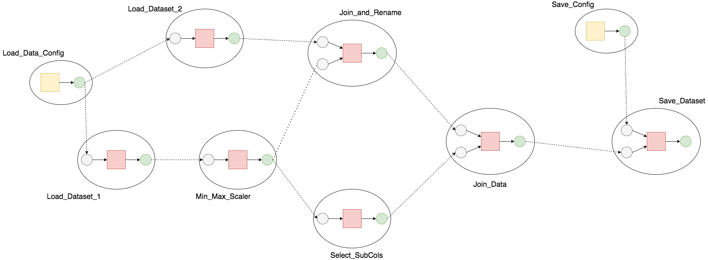
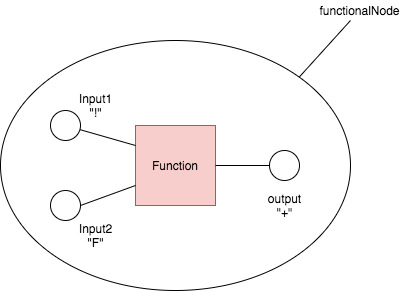

# :fontawesome-solid-share-alt: ML Graph

As outlined [here](index.md) the graph structure described below follows the basic structure of a directed mathematical graph consisting of nodes which contain the core functionality of a pipeline and edges which describe the connections between nodes. The image below shows a basic representation of a graph containing multiple nodes connected together by relevant edges within this structure.




## Structure

Prior to the description of the functionality which allows a user to generate, update and remove components of a graph, a number of notes on the technical aspects on the structure of these components must be outlined.


### Functional node

A functional node is defined in this library as a dictionary.

key | value
----|------
inputs | The expected input datatype: a char atom, for a node receiving one input; or a dictionary mapping named inputs to their datatypes.
outputs | The expected output datatype: a char atom, for a node putting out one item; or a dictionary mapping named outputs to their datatypes.
function | A function containing the logic to be executed by the node.<br><br>Its rank must be the count of the `inputs` entry, and its result either a single value (for a node with a single output) or a dictionary with keys from the `outputs` dictionary.


The following image shows a graphical representation of such a node followed by a number of examples showing the basic structure of these nodes.



```q
// Node taking one input of float type and outputting one float type 
q)nodeInputs:"f"
q)nodeOutputs:"f"
q)nodeFunction:{x wsum x}
q)node:`inputs`outputs`function!(nodeInputs;nodeOutputs;nodeFunction)

// Node taking multiple inputs and returning multiple values
q)nodeInputs:`xIn`yIn`zIn!"sF!"
q)nodeOutputs:`xOut`yOut`zOut!"sF!"
q)nodeFunction:{[x;y;z]`xOut`yOut`zOut!(x;y;z)}
q)node:`inputs`outputs`function!(nodeInputs;nodeOutputs;nodeFunction)
```


### Configuration node

Configuration nodes in this library are a subset of the functional nodes described above. A configuration node takes as input a dictionary provided by a user and outputs this unmodified adding the named node to the overall graph.


### Edges

An edge is a connection between the output of one functional or configuration node and the input of another node. In order to ensure that a graph is valid all input nodes must be connected to the output from another node within the graph. Output nodes do not need to be connected to anything for a graph to be valid. In the case an output node is not connected, the return of a fully executed graph will store the output data for retrieval by the user.

!!! warning "Ensure the type allocated to the input coincides with the type allocated to the output"

    This is currently not checked by pipeline execution.


## Functionality

<div markdown="1" class="typewriter">
Graph
  [.ml.createGraph](#mlcreategraph)      Generate an empty graph

Configuration
  [.ml.addCfg](#mladdcfg)           Add a configuration node to a graph
  [.ml.delCfg](#mldelcfg)           Delete a configuration node from a graph
  [.ml.updCfg](#mlupdcfg)           Update the content of a configuration node

Nodes
  [.ml.addNode](#mladdcfg)          Add a functional node to a graph
  [.ml.delNode](#mldelcfg)          Delete a functional node from a graph
  [.ml.updNode](#mlupdcfg)          Update the content of a functional node

Edges
  [.ml.connectEdge](#mlconnectedge)      Connect the output of one node to the input of another
  [.ml.disconnectEdge](#mldisconnectedge)   Disconnect an edge connected to a specified node

</div>

### `.ml.addCfg`

_Add a configuration node to a graph_


```txt
.ml.addCfg[graph;nodeId;config]
```

Where:

* `graph` is a graph originally generated using `.ml.createGraph`.
* `nodeId` is a symbol unique to the graph denoting the name to be associated with the configuration node.
* `config` is a dictionary containing any configuration information to be supplied to other nodes in the graph.

returns a graph with the the new configuration added to the graph structure

```q
// Add a configuration node to the graph
q)show graph:.ml.addCfg[graph;`config;`a`b!1 2]
nodes| (+(,`nodeId)!,``config)!+``function`inputs`outputs!((::;::);(::;![,`ou..
edges| (+`destNode`destName!(,`;,`))!+`sourceNode`sourceName`valid!(,`;,`;,0b)

// Display the nodes
q)graph.nodes
nodeId|    function                             inputs          outputs
------| ---------------------------------------------------------------
      | :: ::                                   ::              ::
config| :: ![,`output]@[enlist]@[;`a`b!1 2]     (`symbol$())!"" (,`out..

q)graph.edges
destNode destName| sourceNode sourceName valid
-----------------| ---------------------------
                 |                       0

// Attempt to add a node with non unique name
show graph:.ml.addCfg[graph;`config;`a`b!1 2]
'invalid nodeId
```

### `.ml.addNode`

_Add a functional node to a graph_


```txt
.ml.addNode[graph;nodeId;config]
```

Where

-   `graph` is a graph originally generated using `.ml.createGraph`
-   `nodeId` is a symbol unique to the graph denoting the name to be associated with the functional node
-   `config` is a [functional node](#funtional-node)

returns a graph with the the new node added to the graph structure.

```q
// Define a node with one input and one output
q)newInput:"!"
q)newOutput:"F"
q)newFunction:{[dict]dict`floatVector}
// Generate relevant configuration and add to an empty graph
q)newNode:`inputs`outputs`function!(newInput;newOutput;newFunction)
q)show graph:.ml.addNode[graph;`newNode;newNode]
nodes| (+(,`nodeId)!,``newNode)!+``function`inputs`outputs!((::;::);(::..
edges| (+`destNode`destName!(``newNode;``input))!+`sourceNode`sourceNam..
q)graph.nodes
nodeId |    function                                     inputs        ..
-------| --------------------------------------------------------------..
       | :: ::                                           ::            ..
newNode| :: ![,`output]@[enlist]{[dict]dict`floatVector} (,`input)!,"!"..
q)graph.edges
destNode destName| sourceNode sourceName valid
-----------------| ----------------------------
                 |                       0
newNode  input   |                       0

// Define a node with multiple inputs and outputs
q)multiInput:`input1`input2!"!+"
q)multiOutput:`output1`output2!"!+"
q)multiFunction:{[input1;input2]`output1`output2!(input1;input2)}
// Generate the node with multiple inputs and outputs
q)multiNode:`inputs`outputs`function!(multiInput;multiOutput;multiFunct..
q)show graph:.ml.addNode[graph;`multiNode;multiNode]
nodes| (+(,`nodeId)!,``newNode`multiNode)!+``function`inputs`outputs!((..
edges| (+`destNode`destName!(``newNode`multiNode`multiNode;``input`inpu..
q)graph.nodes
nodeId   |    function                                          inputs ..
---------| ------------------------------------------------------------..
         | :: ::                                                ::     ..
newNode  | :: ![,`output]@[enlist]{[dict]dict`floatVector}      (,`inpu..
multiNode| :: {[input1;input2]`output1`output2!(input1;input2)} `input1..
q)graph.edges
destNode   destName| sourceNode sourceName valid
-------------------| -----------------------------
                   |                       0
newNode    input   |                       0
multiNode  input1  |                       0
multiNode  input2  |                       0
```

### `.ml.connectEdge`

_Connect the output of one node to the input to another_


```txt
.ml.connectEdge[graph;sourceNode;sourceName;destNode;destName]
```

Where

* `graph` is a graph originally generated using `.ml.createGraph`
* `sourceNode` is a symbol denoting the name of a node in the graph which contains the relevant output
* `sourceName` is a symbol denoting the name of the output to be connected to an associated input node
* `destNode` is a symbol denoting the name of a node in the graph which contains the relevant input to be connected to
* `destName` is a symbol denoting the name of the input which is connected to the output defined by `sourceNode` and `sourceName`

returns the graph with the relevant connection made between the inputs and outputs of two nodes.

```q
// Graph edges prior to connection
q)graph.edges
destNode  destName | sourceNode sourceName valid
-------------------| ----------------------------
                   |                       0
sourceNode input   |                       0
destNode   destName|                       0
// Connect a suitable output from one node to suitable input of anoth..
q)graph:.ml.connectEdge[graph;`sourceNode;`sourceName;`destNode;`dest..
// Display edges following appropriate connection
q)graph.edges
destNode  destName | sourceNode sourceName valid
-------------------| ---------------------------
                   |                       0
sourceNode input   |                       0
destNode   destName| sourceNode sourceName 1
```

### `.ml.createGraph`

_Generate an empty graph_


```txt
.ml.createGraph[]
```

returns a dictionary containing the structure required for the generation of a connected graph. This includes a key for information on the nodes present within the graph and edges outlining how the nodes within the graph are connected.

```q
// Generate an empty graph
q)show graph:.ml.createGraph[]
nodes| (+(,`nodeId)!,,`)!+``function`inputs`outputs!(,::;,::;,::;,::)
edges| (+`destNode`destName!(,`;,`))!+`sourceNode`sourceName`valid!(..

// Retrieve the nodes schema
q)graph.nodes
nodeId|    function inputs outputs
------| --------------------------
      | :: ::       ::     ::

// Retrieve the edges schema
q)graph.edges
destNode destName| sourceNode sourceName valid
-----------------| -----------------------------
                 |                       0
```

### `.ml.delCfg`

_Delete a named configuration node_


```txt
.ml.delCfg[graph;nodeId]
```

-   `graph` is a graph originally generated using `.ml.createGraph`
-   `nodeId` is a symbol denoting the name of a configuration node to be deleted

returns the graph with the named node removed.

```q
// Display the graph nodes prior to deletion of a configuration node
q)show graph.nodes
nodeId       |    function                                            ..
-------------| -------------------------------------------------------..
             | :: ::                                                  ..
configuration| :: @[;`xdata`ydata!(+`x`x1!(0.06165008 0.285799 0.66847..

// Delete the configuration node
q)graph:.ml.delCfg[graph;`configuration]


// Display the graph nodes
q)show graph.nodes
nodeId|    function inputs outputs
------| --------------------------
      | :: ::       ::     ::
```


### `.ml.delNode`

_Delete a named function node_


```txt
.ml.delNode[graph;nodeId]
```

Where

-   `graph` is a graph originally generated using `.ml.createGraph`
-   `nodeId` is a symbol denoting the name of a functional node to be deleted

returns the graph with the named functional node removed.

```q
// Display the graph nodes prior to deletion of a configuration node
q)show graph.nodes
nodeId |    function inputs         outputs
-------| -------------------------------------------
       | :: ::       ::             ::
newNode| :: {x}      (,`input)!,"!" (,`sourceName)!,"!"

// Delete the configuration node
q)graph:.ml.delNode[graph;`newNode]

// Display the graph nodes
q)show graph.nodes
nodeId|    function inputs outputs
------| --------------------------
      | :: ::       ::     ::
```


### `.ml.disconnectEdge`

_Disconnect an edge from the input of a node_


```txt
.ml.disconnectEdge[graph;destNode;destName]
```

Where

-   `graph` is a graph originally generated using `.ml.createGraph`
-   `destNode` is the name as a symbol of the node containing the edge to be deleted
-   `destName` is the name as a symbol of the edge associated with a specific input to be disconnected

returns the graph with the edge connected to the destination input removed from the graph.

```q
// Display the graph prior to disconnection of an edge
q)graph.edges
destNode  destName | sourceNode sourceName valid
-------------------| ---------------------------
                   |                       0
sourceNode input   |                       0
destNode   destName| sourceNode sourceName 1

// Disconnect an edge
q)graph:.ml.disconnectEdge[graph;`destNode;`destName]

// Display the graph edges post disconnection
q)graph.edges
destNode  destName | sourceNode sourceName valid
-------------------| ---------------------
                   |                 0
sourceNode input   |                 0
destNode   destName|                 0
```


### `.ml.updCfg`

_Update the contents of a configuration node_


```txt
.ml.updCfg[graph;nodeId;config]
```

Where

-   `graph` is a graph originally generated using `.ml.createGraph`
-   `nodeId` is a symbol denoting the name of a configuration node to be updated
-   `config` is a dictionary containing any configuration information to be supplied to other nodes in the graph

returns the graph with the named configuration node contents overwritten.

```q
// Display the node prior to overwriting the configuration contents
q)graph.nodes
nodeId       |    function                                            ..
-------------| -------------------------------------------------------..
             | :: ::                                                  :: ..
configuration| :: ![,`output]@[enlist]@[;`xdata`ydata!(,0.3138309;`tes..

// Update the configuration node content
q)graph:.ml.updCfg[graph;`configuration;enlist[`xdata]!enlist 2?1f]
q)graph.nodes
nodeId       |               function                                  ..
-------------| --------------------------------------------------------..
             | ::            ::                                        ..
configuration| (,`xdata)!,:: (,`xdata)!,![,`output]@[enlist](,`xdata)!,..
```


### `.ml.updNode`

_Update the contents of a functional node_


```txt
.ml.updNode[graph;nodeId;config]
```

Where

-   `graph` is a graph originally generated using `.ml.createGraph`
-   `nodeId` is a symbol denoting the name of a functional node to be updated
-   `config` is a [functional node](#functional-node)

returns the graph with the named functional node contents overwritten.

```q
// Display the node prior to overwriting node content
q)graph.nodes
nodeId    |    function                inputs            outputs
----------| ------------------------------------------------------------
          | :: ::                      ::                ::
sourceNode| :: {x}                     (,`input)!,"!"    (,`sourceName)!..
destNode  | :: ![,`output]@[enlist]{x} (,`destName)!,"!" (,`output)!,"F"


// Generate node content to overwrite the function for sourceNode
q)updSrcInput:"!"
q)updSrcOutput:enlist[`sourceName]!enlist "!"
q)updSrcFunction:{x+1}
q)updSrc:`inputs`outputs`function!(updSrcInput;updSrcOutput;updSrcFunction)

// Overwrite the functional node
q)graph:.ml.updNode[graph;`sourceNode;updSrc]
q)show graph.nodes
nodeId    |    function                inputs            outputs
----------| ----------------------------------------------------------
          | :: ::                      ::                ::
sourceNode| :: {x+1}                   (,`input)!,"!"    (,`sourceName)!..
destNode  | :: ![,`output]@[enlist]{x} (,`destName)!,"!" (,`output)!,"F"
```
