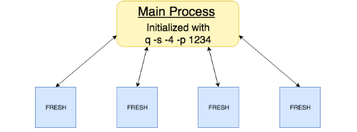

# :fontawesome-solid-share-alt: Multiprocess distribution framework


:fontawesome-brands-github:
[KxSystems/ml](https://github.com/kxsystems/ml/)


The framework described below is designed to provide a user-friendly interface for the execution of both q and Python code across multiple processes. This is currently utilized by default in both the FRESH and cross-validation procedures outlined within this toolkit, provided the process is located on a defined port and with a specified number of secondary processes.

The following workflow shows how FRESH can be initialized exclusively, without loading of the entire toolkit.

Initialize a q process with four workers on a user-defined central port.

``` bash
$ q ml/ml.q -s -4 -p 1234
```

The above command sets four secondary processes with the central process on port 1234. The below must be executed to load the relevant functionality contained in `util/mproc.q` and to load the appropriate functionality for the FRESH algorithm on each of the processes.

```q
q).ml.loadfile`:util/mproc.q
q).ml.mproc.init[abs system"s"]enlist".ml.loadfile`:fresh/init.q"
```

This results in the following architecture.



If the central process is initialized as above and the toolkit is loaded in its entirety, both FRESH and cross validation will make use of this architecture, multiprocessed by default.

While general purpose in nature, this framework is particularly useful when distributing Python.

The primary difficulty with Python distribution surrounds Python’s use of a Global Interpreter Lock (GIL). This limits execution of Python bytecode to a single thread at a time. We can subvert this by either wrapping the Python functionality within a q lambda or by converting the Python functionality to a byte stream using Python `pickle` and passing these to the worker processes for execution. Both of these options are possible within the framework outlined here.

This method is not restricted to functions contained only within the ML library, and can be be used to distribute any function, q or otherwise, across worker processes. This can be seen in the example below.


### `.ml.mproc.init`

_Distributes functions to worker processes_

Syntax: `mproc.init[n;x]`

Where 

- `n` is the number of processes open
- `x` is a string of the function to be passed to the process

has each of the `n` worker processes evaluate `x`.

Example: create the following file as `$QHOME/ml/multip.q` or `%QHOME%\ml\multip.q`.

```q 
// write a function to create evenly-spaced arrays with 5 values
// between two numbers 
npf:{.p.import[`numpy][`:linspace][0;x;5]}
func:{npf[x]`}
```

Initialize a q process with multiple workers.

```bash
$ q ml/ml.q -s -4 -p 5001
```
```q
q).ml.loadfile`:init.q
q).ml.loadfile`:multip.q

q)// Check this function exists in the central process
q)func
{npf[x]`}

q)// Execute on central process
q)func each 1+til 3
0 0.25 0.5 0.75 1
0 0.5  1   1.5  2
0 0.75 1.5 2.25 3

q)// attempt to execute over distributed processes 
q)// fails due to function not existing on processes
q)func peach 1+til 3
'func
  [0]  fnc peach til 3

q)// load this functionality on each process
q).ml.mproc.init[abs system"s"]enlist".ml.loadfile`:multip.q"

q)// distribute execution
q)func peach 1+til 3
0 0.25 0.5 0.75 1
0 0.5  1   1.5  2
0 0.75 1.5 2.25 3
```
