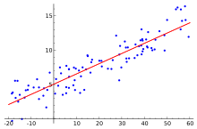

<div markdown="1" style="float: right">

</div>

# `lsq`


_Least squares, matrix divide_

Syntax: `x lsq y`, `lsq[x;y]`


Where: 

-   `x` and `y` are float matrixes with the same number of columns
-   the number of rows of `y` do not exceed the number of columns
-   the rows of `y` are linearly independent

returns the least-squares solution of `x = (x lsq y) mmu y`. That is, if

```q
d:x - (x lsq y) mmu y
```

then `sum d*d` is minimized. If `y` is a square matrix, `d` is the zero matrix, up to rounding errors.

```q
q)a:1f+3 4#til 12
q)b:4 4#2 7 -2 5 5 3 6 1 -2 5 2 7 5 0 3 4f
q)a lsq b
-0.1233333 0.16      0.4766667 0.28
0.07666667 0.6933333 0.6766667 0.5466667
0.2766667  1.226667  0.8766667 0.8133333
q)a - (a lsq b) mmu b
-4.440892e-16 2.220446e-16 0             0
0             8.881784e-16 -8.881784e-16 8.881784e-16
0             0            0             1.776357e-15
q)a ~ (a lsq b) mmu b      / tolerant match
1b

q)b:3 4#2 7 -2 5 5 3 6 1 -2 5 2 7f
q)a lsq b
-0.1055556 0.3333333 0.4944444
0.1113757  1.031746  0.7113757
0.3283069  1.730159  0.9283069
q)a - (a lsq b) mmu b     / minimum squared difference
0.5333333 -0.7333333 -0.2       0.7333333
1.04127   -1.431746  -0.3904762 1.431746
1.549206  -2.130159  -0.5809524 2.130159
```


## Polynomial fitting

`lsq` can be used to approximate `x` and `y` values by polynomials.

```q
lsfit:{(enlist y) lsq x xexp/: til 1+z} / fit y to poly in x with degree z
poly:{[c;x]sum c*x xexp til count c}    / polynomial with coefficients c
x:til 6
y:poly[1 5 -3 2] each x   / cubic
lsfit[x;y] each 1 2 3     / linear,quadratic,cubic(=exact) fits
-33 37.6
7 -22.4 12
1 5 -3 2
```


<i class="far fa-hand-point-right"></i>
[`mmu`](mmu.md)  
Basics: [Math](../basics/math.md)