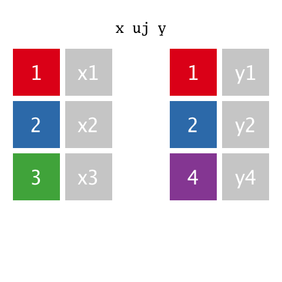

{: style="float:right; margin-left: 3em; max-width: 250px;"}

# `uj`, `ujf`


_Union join_

<div markdown="1" class="typewriter">
x uj  y     uj [x;y]
x ujf y     ujf[x;y]
</div>


Where `x` and `y` are both keyed or both unkeyed tables, returns the union of the columns, filled with nulls where necessary:

-   if `x` and `y` have matching key column/s, then records in `y` update matching records in `x`
-   otherwise, `y` records are inserted.

```q
q)show s:([]a:1 2;b:2 3;c:5 7)
a b c
-----
1 2 5
2 3 7

q)show t:([]a:1 2 3;b:2 3 7;c:10 20 30;d:"ABC")
a b c  d
--------
1 2 10 A
2 3 20 B
3 7 30 C

q)s,t                            / tables do not conform for ,
'mismatch

q)s uj t                         / simple, so second table is inserted
a b c  d
--------
1 2 5
2 3 7
1 2 10 A
2 3 20 B
3 7 30 C

q)(2!s) uj 2!t                   / keyed, so matching records are updated
a b| c  d
---| ----
1 2| 10 A
2 3| 20 B
3 7| 30 C
```

!!! note "`uj` generalizes the [`,` Join](join.md) operator."


??? detail "Changes in V3.0"

    The union join of two keyed tables is equivalent to a [left join](lj.md) of the two tables with the catenation of unmatched rows from the second table.

    As a result a change in the behavior of `lj` causes a change in the behavior of `uj`:

    ```q
    q)show x:([a:1 2]b:`x`y;c:10 20)
    a| b c
    -| ----
    1| x 10
    2| y 20
    q)show y:([a:1 2]b:``z;c:1 0N)
    a| b c
    -| ---
    1|   1
    2| z
    q)x uj y		/ kdb+ 3.0
    a| b c
    -| ---
    1|   1
    2| z
    q)x uj y        / kdb+ 2.8
    a| b c
    -| ----
    1| x 1
    2| z 20
    ```

    Since 2017.04.10, the earlier version is available in all V3.5 and later versions as `ujf`.


---
:fontawesome-solid-book-open:
[Joins](../basics/joins.md)
<br>
:fontawesome-solid-street-view:
_Q for Mortals_
[§9.9.7 Union Join](/q4m3/9_Queries_q-sql/#997-union-join)

