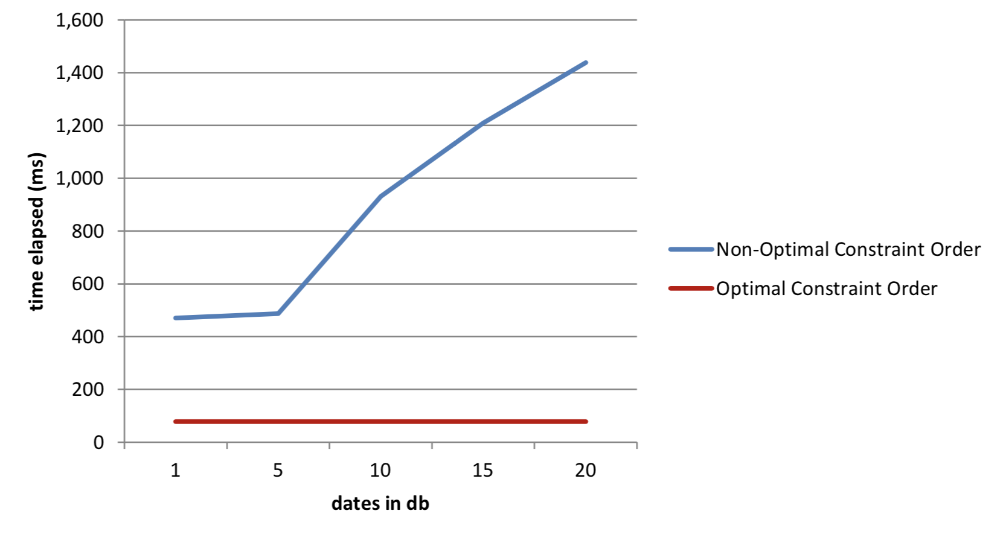
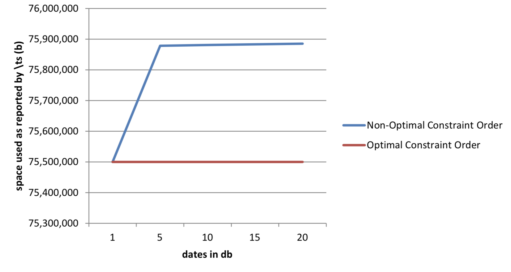
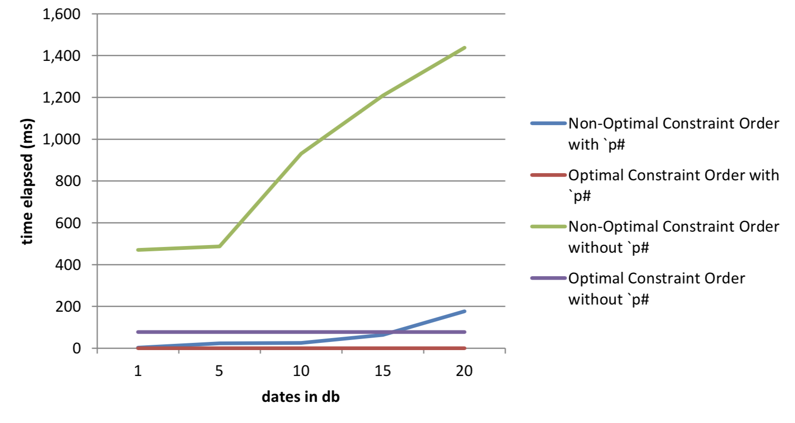
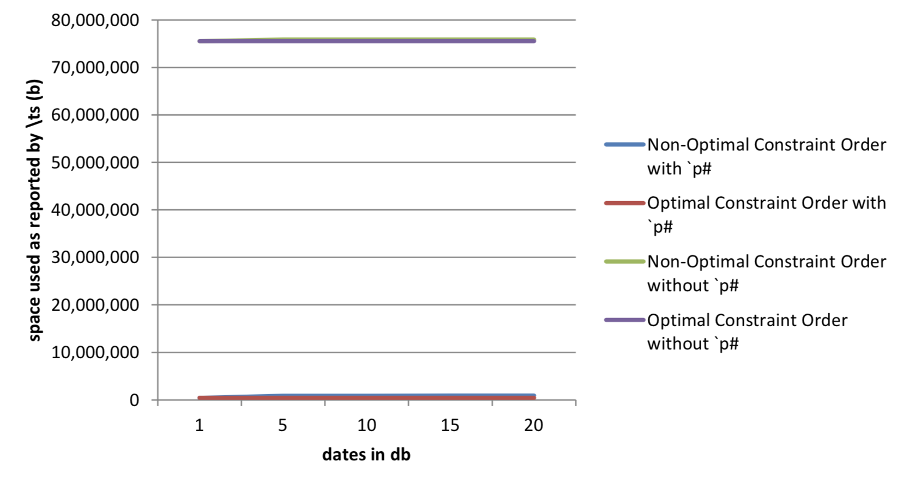
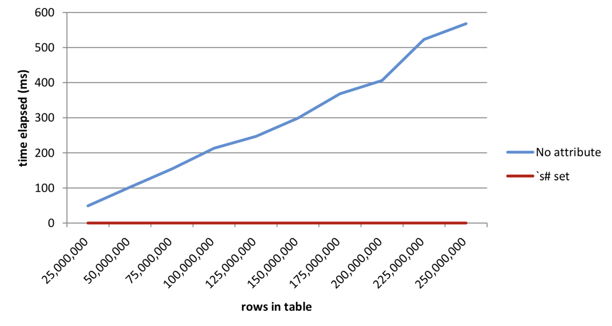
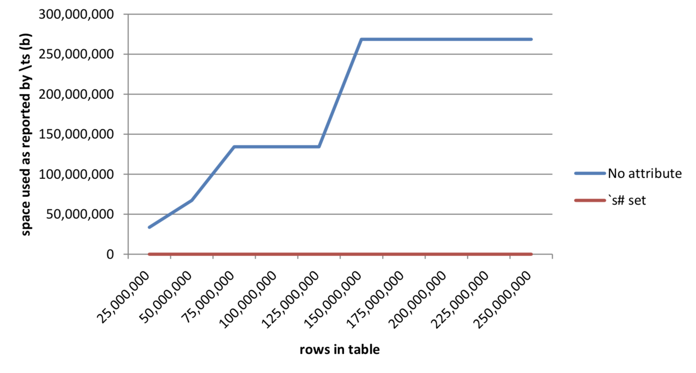
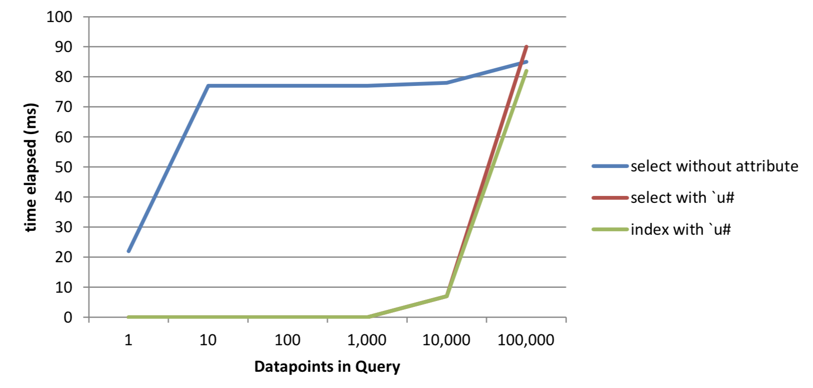

# Columnar database and query optimization


The purpose of this white paper is to give an overview of some of the methods that are available to a kdb+ developer when trying to optimize the performance of a kdb+ database when queried.

Kdb+ has a well deserved reputation as a high-performance database, appropriate for capturing, storing and analyzing massive amounts of data. Developers using kdb+ can use some of the techniques outlined in this white paper to optimize the performance of their installations. These techniques encompass variations in the structure of queries, how data is stored, and approaches to aggregation.

Adjustments to column attributes are made using the `dbmaint.q` library.

:fontawesome-brands-github:
[KxSystems/kdb/utils/dbmaint.q](https://github.com/KxSystems/kdb/blob/master/utils/dbmaint.md)

Where appropriate, OS disk cache has been flushed using Simon
Garland’s `io.q` script. 

:fontawesome-brands-github:
[simongarland/io](https://github.com/simongarland/io)

Tests performed using kdb+ version 2.8 (2012.05.29)


## Overview of test data

The data used for the majority of the examples within this white paper is simulated NYSE TaQ data, with a minimal schema and stored in a date-partitioned database. The data consists of the constituents of the S&P 500 index over a 1-month period, which has in the region of 10,000 trades and 50,000 quotes per security per day. Initially, no attributes are applied, although the data is sorted by sym, and within sym on time. Where an example requires a larger dataset, we will combine multiple partitions or create a new example dataset.

```q
q)meta trade 
c    | t f a 
-----| ----- 
date | d 
time | t 
sym  | s 
price| f 
size | i 
stop | b 
cond | c
excc | c

q)meta quote 
c    | c f a 
-----| ----- 
date | d 
time | t 
sym  | s 
bid  | f 
ask  | f 
bsize| i 
asize| i 
mode | c
ex   | c

q)t:select tradecount:count i by date from trade
q)q:select quotecount:count i by date from quote
q)t lj q
date      | tradecount quotecount
----------| ---------------------
2010.12.01| 4940021    24713334
2010.12.02| 4940300    24714460
2010.12.03| 4940482    24708283
...
2010.12.30| 4982917    24933374
2010.12.31| 4994626    25000981
```


## Query structure

Before considering optimizations that can be achieved through amendments to data structures, etc., it is important to approach query construction correctly. This is important in all types of databases, but especially when dealing with on-disk data where the database is partitioned, as poorly structured queries can cause the entire database to be scanned to find the data needed to satisfy the query.

While kdb+ generally evaluates left-of-right, the constraints on select statements are applied from left to right following the Where clause. It is important to make sure that the first constraint in a request against a partitioned table is against the partition column. (Typically this will be date.)

For partitioned and non-partitioned tables, one should aim to reduce the amount of data that needs to be scanned/mapped as early as possible through efficient ordering of constraints.


### Query structure example

The purpose of this example is to examine the performance of queries with differently-ordered constraints as the database grows. In order to vary the size of the database, we will use [`.Q.view`](../../ref/dotq/#qview-subview). To measure performance, we will use [`\ts`](../../basics/syscmds.md##ts-time-and-space) to measure the execution time in ms and space used in bytes.

Note that while the non-optimal requests complete successfully in our relatively small test database, these queries run much slower on a larger database. These queries should be executed with caution.

The following queries will be performed, with OS disk cache flushed between requests by restarting the process and using the flush functionality in `io.q`.

```q
//set the date to be requested
d:first date

//sym before date (non-optimal order)
select from trade where sym=`IBM, date=d

//date before sym (optimal order)
select from trade where date=d, sym=`IBM
```

```txt
         |   sym before date  |   date before sym
dates in |  time         size |  time         size
database |  (ms)          (b) |  (ms)          (b) 
---------|--------------------|----------------------
     1   |   470   75,499,920 |    78   75,499,984
     5   |   487   75,878,400 |    78   75,499,984
    10   |   931   75,880,624 |    78   75,499,984
    15   | 1,209   75,882,912 |    78   75,499,984
    20   | 1,438   75,885,072 |    78   75,499,984
```

<small>_Table 1: Results from queries as database grows_</small>



<small>_Figure 1: Effect of constraint order on execution times_</small>

The results show that with non-optimal constraint order, the elapsed time for queries increases with the size of the database, while the request times for optimal constraint order is constant. The reason for the increase is that kdb+ has to inspect a much larger range of data in order to find the calculation components.

One result of interest is the performance for the non-optimal request in a database containing one date; we are only looking at one date, therefore one might expect that the performance would be similar. In order to explain the difference here we have to recall that date is a virtual column in the database – inferred by kdb+ by inspecting the folder names in the partitioned database. When the partition column is a constraint, but not the first constraint, kdb+ creates this data for comparison. What we are observing is the cost of this promotion and comparison.



<small>_Figure 2: Effect of constraint order on workspace used_</small>

The scale of the chart above has been adjusted to show that there is a slight difference in space used as reported by `\ts` for each request. This is because the virtual column is promoted to an in-memory vector of date values for comparison if it is used as a constraint other than the first constraint.

It should be noted that even for optimal constraint order, this is a high amount of space to use, given the size of the result set. We will address this when we look at attributes later.


## Precalculation

For any system, it is advisable to pay particular attention to the queries that are commonly performed and analyze them for optimizations that can be made by precalculating components of the overall calculation. For example, if the database is regularly servicing requests for minute-interval aggregated data, then it probably makes sense to precalculate and store this data. Similarly, daily aggregations can be precalculated and stored for retrieval.


### Precalculation as query grows

The aim of this example is to show the impact on request times of precalculation and storage of intermediate/final calculation results. We will make baseline requests against our example date-partitioned `trade` table. For the precalculated data, we will create a new table `ohlc` with daily aggregated data, and save this as a date-partitioned table in the same database. Between each test, kdb+ will be restarted and the OS cache will be flushed.

```q
//make dictionary containing groups of distinct syms 
//drawn from our sym universe
syms:n!{(neg x)?sym}each n: 1 10 100 500

//make call for open prices for ranges of security drawn from the dictionary
select open:first price by sym from trade 
  where date=first date, sym in syms 1
select open:first price by sym from trade 
  where date=first date, sym in syms 500
```

Now we have a baseline for values drawn from the quote table, save a table with daily aggregates for each security.

```q
//create ohlc table with a number of different day-level aggregations, 
//and save to disk using dpft function.
//perform across each date in the db
{ohlc::0!select 
  open:first price, 
  high:max price, 
  low:min price, 
  close: last price, 
  vwap: size wavg price by sym from trade where date= x;
  .Q.dpft[`:.;x;`sym;`ohlc]; } each date
```
```q
//This will create one row per security/date pair.
q)select count i by date from ohlc 
date      | x
----------| ---
2010.12.01| 500
2010.12.02| 500
...
2010.12.30| 500
2010.12.31| 500

//reload db
q)\l .
//repeat the same requests, but target our new aggregation table.
q)select open by sym from ohlc where date=first date, sym in syms 1 
...
q)select open by sym from ohlc where date=first date, sym in syms 500
```

```txt
           |      from trade     |      from ohlc
sym values | time (ms)  size (b) | time (ms)  size (b) 
-----------|---------------------|--------------------
        1  |      1      265,056 |      0        2,896
       10  |     13    2,100,224 |      0        3,504
      100  |     53   16,781,680 |      0       12,400
      500  |    125  134,228,736 |      0       48,752
```

<small>_Table 2: Results from queries as more securities are requested_</small>


<small>_Figure 3: Effect of using precalculated data on execution times_</small>

We can see that for a relatively low expenditure on storage, there are significant performance gains by pre-calculating commonly requested data or components of common calculations.


## Take advantage of the built-in map-reduce capabilities of kdb+ partitioned databases

For certain aggregation functions, kdb+ has built-in map-reduce capabilities. When a query crosses partitions – for example a multi-day volume weighted average price (VWAP), kdb+ identifies whether the aggregation can be map-reduced. If so, it will perform the map operation across each of the partitions. Some aggregations that support map-reduce are `avg`, `count`, `max`, `min`, `sum`, `wavg`.

Map-reduce implementation is transparent to the user. For requests that do not involve aggregation, the map component is simply a retrieval of the required rows, and the reduce combines to form the result table.


### Map-reduce as table grows

In this example, we will look at the impact of increasing the amount
of data being aggregated. We will perform the same query over widening
time periods.

```q
//perform the same query over widening date windows 
//restart kdb+ and flush os cache between each request
select size wavg price by sym from trade where date in 5#date 
...
select size wavg price by sym from trade where date in 20#date
```

```txt
dates in query  time (ms)
-------------------------
       5         1,863
      10         3,152
      15         4,596
      20         7,597
```

<small>_Table 3: Results from queries using map-reduce_</small>

When we look at the performance of the requests, we can see that due to map-reduce, the time for the calculation is scaling near-linearly as the number of dates increases. If there were no map-reduce implementation for this aggregation, the cost of mapping in all data then calculating over this dataset would lead to performance worse than linear scaling.


<small>_Figure 4: Map-reduce execution times as database grows_</small>

It is possible to take advantage of this behavior with kdb+’s secondary processes, where the map calculation components are distributed to secondary processes in parallel, which can lead to very fast performance. The use of secondary processes is outside the scope of this paper.


## Use of attributes

[Attributes](../../ref/set-attribute.md) can be applied to a vector, table, or dictionary to inform kdb+ that the data has certain properties that allow different treatments to be applied when dealing with that data.


### Parted attribute

The parted index is typically used to provide fast access to sorted data in splayed on-disk tables, where the most commonly filtered and/or grouped field (often the instrument) has a sort applied prior to saving. It indicates that a vector is organized into contiguous (but not necessarily sorted) chunks.

Setting the parted attribute allows kdb+ to identify the unique values within a vector quickly, and where in the vector the segments begin The result of this is an improvement in the time required to perform a request, and also a reduction in the amount of data required to perform some calculations. The performance improvement will be most noticeable where the values in the vector are sufficiently repetitive. There is a memory overhead to set the attribute on a vector, and kdb+ will verify that the data is actually parted as described.


### Parted attribute as table grows

If we apply the parted attribute to the sym columns in the on-disk database we have created for testing and retry the example from the [Query Structure example](#query-structure-example) above, one can see the benefits of the reduced work that kdb+ has to carry out to find the data it is looking for. We will then be able to compare the results and examine the impact from applying attributes.

In this test, we want to examine the performance of queries applied against data partitioned by date and parted on sym, with the parted attribute applied to the sym column. The database will be varied in size using `.Q.view`, and between each test we will restart kdb+ and flush the OS cache.

```q
//add `p attribute using setattrcol from dbmaint.q
//NOTE: setattrcol does not adjust the order of the data. 
//Our data is already segmented by sym.
setattrcol[`:.;`trade;`sym;`p]
\l .

//set the date to be requested
d:first date

//sym before date (non-optimal order)
select from trade where sym=`IBM, date=d

//date before sym (optimal order)
select from trade where date=d, sym=`IBM
```

<div style="font-size:95%" markdown="1">
```txt
      |       no attribute (from example)  |         parted attribute set
      | sym before date  | date before sym | sym before date | date before sym  
dates |  time      size  | time      size  |  time     size  |  time   size  
in db |  (ms)       (b)  | (ms)       (b)  |  (ms)      (b)  |  (ms)    (b)  
------|------------------|-----------------|-----------------|----------------
   1  |   470 75,499,920 |  78  75,499,984 |    3    445,024 |    0    445,088
   5  |   487 75,878,400 |  78  75,499,984 |   24    889,936 |    0    445,088
  10  |   931 75,880,624 |  78  75,499,984 |   26    892,816 |    0    445,088
  15  | 1,209 75,882,912 |  78  75,499,984 |   64    896,336 |    0    445,088
  20  | 1,438 75,885,072 |  78  75,499,984 |  177    898,576 |    0    445,088
```
</div>
<small>_Table 4: Results from queries on data with parted attribute_</small>

As we can see in the table above, when we compare optimal to non-optimal query construction there is still a significant increase in timings and space required when a non-optimal constraint order is used. However, in general the time and space required is much lower than the corresponding examples without the parted attribute applied.



<small>_Figure 5: Effect of parted attribute on execution times_</small>

When we look at the results of the parted-attribute and non-optimal constraint-order examples, we can see the benefits of both applying the attribute and using an optimal constraint order in the query. 

Initially, both optimal and non-optimal requests against the database with the attribute set are faster than their counterparts without attributes. As the database grows, we can see that the optimally ordered request without the attribute starts to outperform the non-optimal request with the attribute set. The reason for this is that requests with optimal constraint order only
have to search within the data for one date. While the parted attribute has optimized the search within each date for the non-optimal request, the data it has to search through is growing as the database grows, and before long the work being done surpasses the work being done in the database withour the attribute.

As the database grows it becomes clear that the best-performing version is with the parted attribute applied and optimal constraint order.



<small>_Figure 6: Effect on workspace used of setting the parted attribute_</small>

The queries where the attribute is set also require significantly less space for calculation than those without it. This is because kdb+ is able to move directly to the location in the sym vector that is of interest, rather than scanning sym to find values that match the constraint.


### Sorted attribute

The sorted attribute indicates that the vector is sorted in ascending order. It is typically applied to temporal columns, where the data is naturally in ascending order as it arrives in real time. When kdb+ encounters a vector with the sorted attribute applied, it will use a binary search instead of the usual linear search. Operations such as `asof` and `within` are much faster using the binary search. Requests for `min` and `max` can be fulfilled by inspecting the start and end of the vector, and other comparison operations are optimized.

Setting the sorted attribute on a vector has no overhead in terms of memory required, and kdb+ will verify that the data is sorted ascending before applying the attribute.


#### Sorted attribute as table grows

Let’s look at the impact of applying the sorted attribute on query performance as the dataset grows. We will be applying the attribute to the time column by sorting the data on time as we select it from the on-disk data. As we are not interested in the contents of the calculation results, we can combine data from multiple dates in the database and sort on time to simulate growing realtime tables. Between each request, we will restart kdb+.

```q
//create time we will use for test requests
t:first 09:30:00.000+1?07:00:00.000

//create temporary table using one or more days of saved data 
// – vary from 1 through 10 on each iteration
rtquote:{
  `time xasc select from quote where date in x#date
  }1 
rtquote:{
  `time xasc select from quote where date in x#date
  }10

//make requests against rtquote for IBM data. 
//Repeat as the rtquote table grows
select from rtquote where time=t, sym=`IBM

//repeat process with `s removed from time vector
rtquote:update `#time from{
  `time xasc select from quote where date in x#date
  }1
rtquote:update `#time from{
  `time xasc select from quote where date in x#date
  }10
```

```txt
            |    no attribute   | sorted attribute
rows in     | time         size | time        size  
table       | (ms)          (b) | (ms)         (b) 
------------|-------------------|-----------------
 25,000,000 |   49   33,554,944 |    0       1,248
 50,000,000 |  102   67,109,392 |    0       1,248
 75,000,000 |  154  134,218,288 |    0       1,248
100,000,000 |  213  134,218,288 |    0       1,248
125,000,000 |  247  134,218,288 |    0       1,248
150,000,000 |  299  268,436,016 |    0       1,248
200,000,000 |  406  268,436,016 |    0       1,248
225,000,000 |  523  268,436,016 |    0       1,248
250,000,000 |  568  268,436,016 |    0       1,248
```

<small>_Table 5: Results from queries on data with sorted attribute_</small>



<small>_Figure 7: Effect of sorted attribute on execution times_</small>

We can see in the chart above the benefits from setting the attribute on the time column. While the request times without the attribute grow linearly with the increase in data, the times for the requests against the data with the attribute set are uniform – in this case returning instantly.



<small>_Figure 8: Effect of sorted attribute on workspace used_</small>

We observe similar results here for the amount of space used for the request. Kdb+ is able to perform the calculation with a much smaller subset of the data. We can see that the curve representing space used for requests without an attribute set has a series of steps. These steps reflect the fact that kdb+’s buddy-memory algorithm allocates according to powers of 2.


### Unique attribute

The unique attribute is a hash map used to speed up searches on primary key columns, or keys of simple dictionary maps, where the list of uniques is large and/or lookups are very frequent. There is a memory overhead for applying the attribute to a vector, and kdb+ will verify that the data is unique before applying it.


#### Unique attribute as table grows

This example will examine the effect of the attribute on performance as the dataset being queried grows. The example data we’ve used for the previous examples does not contain values with a high enough degree of uniqueness to be used here. We will create some new data for this example using the q [`rand`](../../ref/rand.md) function. The table that we will use for this example will be similar to a last-value cache, although to observe the behavior, we will probably grow it beyond a reasonable size for tables of this form.

```q
//function to create example last value cache keyed table with x rows 
//also creates global s to retrieve query value later 
mktbl:{([sym:s::(neg x)?`7];lprice:0.01*x?10000)}

//make example table, vary through the values on each iteration
tbl:mktbl 100
...
tbl:mktbl 10000000

//create test value
req:first 1?s

//select value
select lprice from tbl where sym=req

//directly index to retrieve value and create table
enlist tbl[req]

//repeat with `u# applied to sym column
tbl:update `u#sym from mktbl 100
...
tbl:update `u#sym from mktbl 10000000
```

```txt
            |           no attribute         |    unique attribute set
            |      select      |    index    |    select    |    index       
    rows in | time        size | time   size | time    size | time   size
      table | (ms)         (b) | (ms)    (b) | (ms)     (b) | (ms)    (b) 
------------|------------------|-------------|--------------|------------
        100 |   0        1,040 |   0     528 |   0    1,040 |   0     528
      1,000 |   0        1,536 |   0     528 |   0    1,040 |   0     528
     10,000 |   0       16,896 |   0     528 |   0    1,040 |   0     528
    100,000 |   0      131,584 |   0     528 |   0    1,040 |   0     528
  1,000,000 |   2    1,049,088 |   0     528 |   0    1,040 |   0     528
 10,000,000 |  23   16,777,728 |   7     528 |   0    1,040 |   0     528
100,000,000 | 233  134,218,240 |  96     528 |   0    1,040 |   0     528
```

<small>_Table 6: Results from queries on data with unque attribute as table grows_</small>


<small>_Figure 9: Effect of unique attribute on execution times as table grows**_</small>

The chart above shows that as the table size crosses 1M data points, the time taken for requests against non-attributed data starts to grow. Requests against attributed data remain uniform in response time, in this case returning instantly.

In addition, it can be observed that directly indexing into the keyed table with no attributes applied is faster and uses less data than performing a select against it.


#### Unique attribute as query grows

For this example, we’ll create a static last-value cache table and grow the number of sym values being requested.

```q
//function to create example last value cache keyed table with x rows 
//create global s to retrieve query value later 
mktbl:{([sym:s::(neg x)?`7];lprice:0.01*x?10000)}

//create fixed size example table
tbl:mktbl 10000000

//make dictionary containing groups of distinct syms 
//drawn from our sym universe
syms:as!{(neg x)?s}each as:1 10 100 1000 10000 100000

//select value
select lprice from tbl where sym in syms 1
...
select lprice from tbl where sym in syms 100000

//directly index to retrieve value and create table
tbl each syms[1]
...
tbl each syms[100000]

//repeat with `u# applied to sym
q)tbl:mktbl 10000000
q)update `u#sym from `tbl
```

<div style="font-size: 95%" markdown="1">
```txt
        |           no attribute              |      unique attribute set
        |      select     |       index       |     select    |     index       
    sym | time       size |    time      size | time     size | time      size
 values | (ms)        (b) |    (ms)       (b) | (ms)      (b) | (ms)       (b) 
--------|-----------------|-------------------|---------------|---------------
      1 |  22  16,777,776 |       0       608 |  0      1,344 |   0        608
     10 |  77  83,886,624 |      60     1,392 |  0      1,344 |   0      1,392
    100 |  77  83,886,624 |     462     9,872 |  0      6,288 |   0      9,872
  1,000 |  77  83,886,624 |   7,454    88,976 |  0     53,008 |   0     88,976
 10,000 |  78  83,886,624 |  48,822 1,033,616 |  7    648,208 |   7  1,033,616
100,000 |  85  83,886,624 | 484,486 9,546,128 | 90  5,821,968 |  82  9,546,128
```
</div>
<small>_Table 7: Results as query grows from data with unique attribute set_</small>



<small>_Figure 10: Comparison of query times with unique attribute as query size grows_</small>

NB: In order to observe the lower points on the curve, the ‘index without attribute’ curve is not charted.

As we can see, selects against vectors with the unique attribute applied significantly outperform those without an attribute applied. As the queries grow, we can see that there can be limitations to the performance gains with large queries. For the index syntax, the reason for this is that our example code is written in such a way that we are operating in a scalar fashion across the requested sym vector.

This example is provided as commentary, not as an example of recommended design. As mentioned previously, the unique is typically applied to aggregation tables or dictionary keys, so it is unlikely to be required to service requests of the size we reach in this example. In a scenario where there is a large query domain, it may be faster to break up into smaller queries and combine the results.


### Grouped attribute

The grouped attribute is a conventional database ‘index’ of all instances of a particular value. The ability of kdb+ to maintain this in real time as data is inserted allows fast searching, grouping and filtering on important fields.

Applying the grouped attribute to a column causes the regular search algorithm to be substituted for a hash-based search. This allows developers to identify the unique values within a vector quickly, and to quickly retrieve the values required. There is a significant memory/disk cost for applying the attribute to a vector.


#### Grouped attribute as table grows

This example is concerned with observing the performance of setting the grouped attribute on the sym column of a real-time quote table, which is typically ordered by time. We will observe the performance of locating matched through an unordered sym vector. As we are not interested in the contents of the calculation results, we can combine data from multiple dates in the database and sort on time to simulate growing real-time tables. We will not set any attribute on the time column, and will restart kdb+ between queries.

```q
//create rt quote table with `g#sym. Vary through 1-10 dates
rtquote:update `g#sym, `#time from 
  `time xasc select from quote where date in 1#date
...
rtquote:update `g#sym, `#time from 
  `time xasc select from quote where date in 10#date

//select all IBM data from throughout the table
select from rtquote where sym=`IBM

//repeat the process for data without `g#sym
rtquote:update `#time from 
  `time xasc select from quote where date in 1#date
...
rtquote:update `#time from 
  `time xasc select from quote where date in 10#date
```

```txt
            |      no attribute   |  grouped attribute 
    rows in |  time          size |  time          size 
      table |  (ms)           (b) |  (ms)           (b) 
-------------------------------------------------------
 25,000,000 |   119   301,990,304 |     8     2,228,848
 50,000,000 |   243   603,980,192 |    10     4,457,072
 75,000,000 |   326 1,207,959,968 |    14     8,913,520
100,000,000 |   472 1,207,959,968 |    20     8,913,520
125,000,000 |   582 1,207,959,968 |    26     8,913,520
150,000,000 |   711 2,415,919,520 |    30    17,826,416
175,000,000 |   834 2,415,919,520 |    36    17,826,416
200,000,000 |   931 2,415,919,520 |    40    17,826,416
225,000,000 | 1,049 2,415,919,520 |    46    17,826,416
250,000,000 | 1,167 2,415,919,520 |    50    17,826,416
```

<small>_Table 8: Results as table grows from queries on data with grouped attribute set_</small>


<small>_Figure 11: Effect of grouped attribute on execution times as query grows**_</small>

We can see from this example that even when sym values are distributed across the table, having the group attribute applied to the sym vector allows for a significant speedup.


<small>_Figure 12: Effect as table grows of grouped attribute on workspace used_</small>

The chart showing space used shows a similar pattern to the timing curve. The slight increase in space used is because the result set is growing as the size of the table increases.


#### Grouped attribute to retrieve daily last

As discussed, setting the grouped attribute causes the regular search algorithm to be replaced with a hash-based search. We can make use of this hash directly using the group function with the column that has the attribute applied.

To illustrate this, consider the following methods for calculating the last price for each symbol for a day of simulated real-time trade data. We will restart between examples:

```q
//create simulated realtime trade table sorted on time
q)rttrade:update `#time from `time xasc select from trade where date=first date
q)\ts select last price by sym from rttrade
24 33561280

//create simulated realtime trade table sorted on time
q)rttrade:update `g#sym, `#time from `time xasc select from trade where date=first date
q)\ts select last price by sym from rttrade
15 33559232

//create simulated realtime trade table sorted on time
q)rttrade:update `g#sym, `#time from `time xasc select from trade where date=first date

//use group on the sym column to get the indices for each sym and find 
//last value in each vector. Use these index values to directly index 
//into the price vector, then create a table with the results
q)\ts {1!([]sym:key x;price::value x)} rttrade[`price] last each group[rttrade`sym]
0 15072
```

As we can see in the results above, using the same form of query with the attribute applied results in a significant speedup. However, using an alternative approach in which we retrieve the individual indexes for each security, then find the last, results in a much faster calculation, and usage of much less data.


#### Grouped attribute as query grows

This example will examine the behavior of the grouped attribute as the requested universe grows. We will use more than one query format, and observe whether the format of the request impacts performance. The data used for the example is quote data drawn from our example database, and sorted on time to simulate real-time data. Kdb+ will be restarted between tests.

```q
//make dictionary containing groups of distinct syms 
//drawn from our sym universe
syms:n!{(neg x)?sym}each n:1 10 100 500

//create rt quote table with `g#sym
rtquote:update `g#sym, `#time from 
  `time xasc select from quote where date=first date

//comparing the performance of different query forms 
//as we increase the number of securities requested
select first bid by sym from rtquote where sym in syms 1
...
select first bid by sym from rtquote where sym in syms 500
raze{
  select first bid by sym from rtquote where sym=x
  } each syms 1 
...
q)raze{
  select first bid by sym from rtquote where sym=x
  } each syms 500
```

<div style="font-size:95%" markdown="1">
```txt
      |           no attribute               |         unique attribute
      |     select      |        index       |      select       |    index       
  sym | time       size | time          size | time        size  | time   size
 vals | (ms)        (b) | (ms)           (b) | (ms)         (b)  | (ms)    (b) 
------|-----------------|--------------------|-------------------|------------
    1 | 132 301,990,624 |    133 301,991,104 |    1      787,408 |   1 787,904
   10 | 197 402,653,920 |  1,319 301,993,792 |   29   12,583,696 |  13 790,592
  100 | 309 402,653,920 | 13,204 302,202,608 |  417  201,327,824 | 125 817,408
  500 | 444 536,879,984 | 27,484  33,965,504 | 3,634 536,879,984 | 616 935,680
```
</div>

<small>_Table 9: Results as query grows from queries on data with grouped attribute set_</small>


<small>_Figure 13: Comparison of query times with grouped attribute set as query size grows_</small>

NB: omitted curve for ‘using = and each’ without attributes in order to examine more closely the faster-returning examples.

As we can see from the chart above, there are points at which it has been more performant to use `=` for comparison and loop over the universe of securities being requested, then join the result sets using `raze`. This is because `select` preserves the order of records in the table, so has to coalesce the indices from the grpuped-attribute hash records for each security into a single ascending index when using in and a list, but this step is not necessary when using a function over a list of securities.

!!! warning "Aggregation results"

    If an aggregation on sym is being performed, using a function and operating over the list of values will result in the same data set, but if an aggregation is not being performed (e.g. `select from rtquote where sym = x`), then the result sets will differ. The result set for the function format will have data grouped into contiguous sym groups.


## Conclusion

This paper has described a number of different techniques that are available to kdb+ developers when trying to optimize the performance of a kdb+ database when queried. We have looked at query structure, precalculation, map-reduce, and various effects from applying attributes to data. With each of these topics, we have attempted to provide an indication of the reasons for variations in the performance of kdb+, and identify some limits and edge cases associated with these techniques.

Use of these techniques should be married to an appropriate overall system design that takes into account the data structures they are being applied to, the type of access required, and outside factors such as hardware constraints. They should not be used as ‘magic bullets’ to rescue an inefficient design. Doing that would likely lead to larger problems in the longer term. Developers should experiment with the techniques outlined above (and additional performance techniques not explored in this paper) to find the approach that best fits the use case being handled.

Tests performed using kdb+ version 2.8 (2012.05.29)


## Author

Ciarán Gorman is a financial engineer who has designed and developed data-management systems across a wide range of asset classes for top-tier investment banks.


