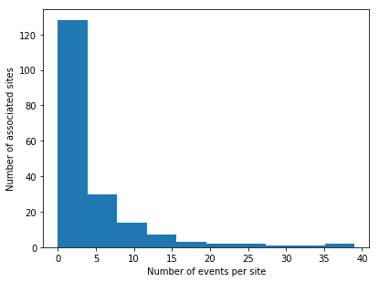
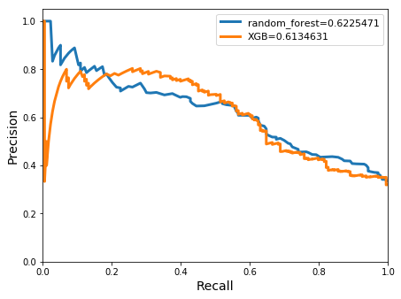
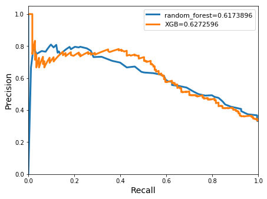
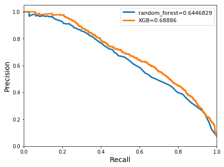
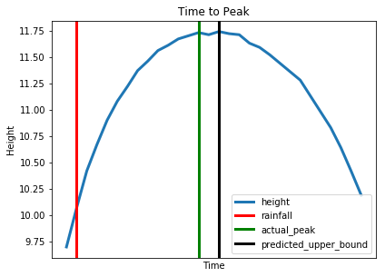
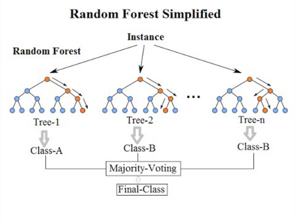

# NASA Frontier Development Lab - Disaster Prevention, Progress and Response (Floods)	 	
 	
The Frontier Development Lab(FDL) is a public private partnership run annually with both the European Space Agency (ESA) and National Aeronautics and Space Administration(NASA). The objective of FDL is to bring together researchers in both the Artificial Intelligence (AI) and the space science sector over the summer to tackle a broad spectrum of challenges in the space industry. The projects this year include challenges in lunar and heliophysics research, astronaut health and disaster prevention. This paper will focus on the Disaster Prevention,Progress and Response (Floods) challenge which Kx was a sponsor for this year. 

## The need for AI in Disaster Prevention

Floods are the most destructive and dangerous natural disasters worldwide. All regions can be affected by flooding events and with the increased variability in weather patterns due to global warming this is likely to become a more prelevant issue moving forward <sup>[1]</sup>. The speed at which these events can occur and difficulties in predicting their occurrance create huge logistic problems for both governmental and non-governmental agencies. In the US alone,in the last 10 years floods caused on average 95 deaths a year <sup>[2]</sup>, making them the deadliest weather related phenomenon <sup>[3]</sup>. Worldwide, floods cost on average in excess of 40 Billion dollars per year <sup>[4]</sup>, impacting property, agriculture and the health of individuals.
	 	 	
During the duration of the project, we collaborated with United States Geological Survey (USGS), this is a scientific agency within the US Department of the Interior. The objective of the organization is to study the landscape of the US and provide information about its natural resources and the natural hazards that affect them. Currently, hydrologists use physical models to help predict floods. These models require predictions to be carefully calibrated for each stream or watershed and careful consideration must be taken for dams, levees etc. Producing these models are extremely costly due to resource requirements. This limits the areas within the US that can avail of such systems allowing them to better prepare for flood events.

## The Challenge

To predict the flood susceptibility of a stream area, the project was separated into two distinct problems.

_Monthly Model_

Predicting per month if a stream height will reach a flood threshold or not. These flood thresholds are set by the National Oceanic and Atmospheric Administration (NOAA) and are location specific. Knowing what areas are susceptible to floods, will allow locations to better prepare for a flood event. 

_Time to Peak Model_

Predicting the time to peak of a flood event. When a major rain event occurs, knowing how long it will take for a river to reach its peak height is necessary in order to inform potentially affected individuals if and when they need to evacuate. This can help to reduce structural damage and loss of life during a disaster.

## Dependencies

All development was done with the following software versions

software | version
-------- | -------
kdb+     | 3.6
Python   | 3.7.0


The python modules that were used are:

library         | version
--------------- |--------
TensorFlow      | 16.04
NumPy           | 1.14.0
pandas          | 0.20.3
Matplotlib      | 2.1.1
scikit_learn    | 0.19.1
xgboost         | 1.0.0
gmaps           | 0.9.0
geopandas       | 0.5.1

In addition to this a number of kdb+ libraries and interfaces were leveraged

library/interface | Release
----------------- | -------
EmbedPy           | 1.3.2
JupyterQ          | 1.1.7
ML-Toolkit        | 0.3.2

## The Data

This project, focusses on 6 states within the US over a period of 10 years between July 2009 and June 2019, this consists of ~800 gauge sites. Not all gauge sites have continuous historical data over that 10 year period but all the available data for each site was used. 

The six states are:

-	`New Jersey`
-	`Nebraska`
-	`South Carolina`
-	`New York`
-	`South Dakota`
-	`Virginia`

These states were chosen for a number of reasons. Primary among which is that each of these states exhibits similar climate and landscape. Given that it is difficult to predict flooding events, focusing on similar geographies is important to ensure that the models produced are precise.

Required datasets and providers:

_USGS_

USGS provided their Surface Water [dataset](https://waterdata.usgs.gov/nwis/sw). This consists of the height of a stream as measured by gauges for over 11,000 sites in the US. The data is updated every 15 minutes, with some locations having historical data for over 50 years. As previously mentioned, the data chosen in this case is a subset of these sites based on geographical location.


_PRISM_

[The PRISM Climate Group](http://www.prism.oregonstate.edu/), provides climate observations across the whole of the US. This data contains information on total precipitation amount, minimum/maximum temperature and dew point for each requested latitude and longitude. Spatial and climate datasets are then developed which reveal short and long-term climate patterns. This dataset was used to extract daily precipitation readings from the site locations for each day during the requested 10 year period. 

_National Land Cover Database (NLCD)_

The [NLCD database](https://www.usgs.gov/centers/eros/science/national-land-cover-database) was collected using [Landsat](https://www.nasa.gov/mission_pages/landsat/main/index.html). This satellite has a 30-meter resolution and provides information for the entire US. The Landsat satellite program is a NASA/USGS collaboration which provides the longest continuous space-based record of Earth's landscape <sup>[5]</sup>. Landsat's ground resolution and observation wavelengths allow the current use of land and its change over time to be detected and documented. This dataset provides information such as land use classification (urban, agriculture, forest, etc.), how well the land allows water to pass through it (impervious surface information) and tree cover. This dataset has updated records every 5 years from 2006. The granularity of this dataset is related to how quickly land use changes over time.

_National Hydrology Dataset Plus (NHDPlus)_

[NHDPlus](http://www.horizon-systems.com/nhdplus/) is a geo-spatial hydrologic framework dataset associated with USGS, released in 2006. It is based off the NHD dataset, which provides information about the streams, rivers,canals, lakes and ponds throughout the US. The features used from this dataset were the catchment and drainage area characteristics at the stream site locations. Catchment areas are particularly important, as these are the areas of a river/stream in which water is collected and accumulates. This is vital information for predicting whether a flood is likely to occur or not. 


_Flooded Locations And Simulated Hydrographs Project (FLASH)_

[FLASH](https://blog.nssl.noaa.gov/flash/) is a database which contains information about flood events that occur within the US. The main goal of the FLASH project was to improve the accuracy and timing when predicting these flash floods. The information used from this dataset within this whitepaper relates to how long a river takes to reach its peak height after a major rain event occurs.

_NOAA_

[NOAA](https://www.noaa.gov/) is a US governmental agency for monitoring and preserving the climate and environment. This provides flood level thresholds for locations across the US. These thresholds consist of four warning stages and the river height for a given location that causes them to reach these levels. The four warning stages are

Warning  |Meaning
---------|---------------
Action   | Where mitigation action needs to be taken in order to prepare for possible hydrological activity. This required action differs from site to site.
Flood    | A river height has been reached which poses a threat to lives,property and businesses.
Moderate | Occurs when some inundation of roads or buildings. A flood warning should be released if this stage is thought to be reached.
Major    | Occurs when there is extensive inundation of roads and buildings. Considerable evacuations of areas may occur at this stage


## Feature Engineering

Given the data available, it was possible to split the information into three distinct datasets which provide useful test cases in flood prediction

1. Ungauged basin: This set of features encompasses all information that is available at sites which do not contain stream gauge or future forecasting information. As such this is limited to land use, past rainfall and upstream information to make predictions.


2. Gauged basins: The gauged basin subset of features includes all those features contained within the ungauged basin dataset as well as a significant amount of further information. Given that these locations contain stream gauges, previous river heights and lagged/aggregated flooding information about these locations can also be incorporated

3. Perfect Forecasts: This dataset contains all information provided in the previous two cases with additional data surrounding the precipitation information around the time of the event. In a real world scenario, these precipitation values would come from weather forecasts.


To obtain these features, the `feat` function was used. This enables previous information along with windowed features to be extracted. This function takes the following parameters as input:

-	`x` table that's being updated
-	`y` how many values to calculate (integer list)
-	`z` column to apply the function to (symbol)
-	`col` new column name (symbol)
-	`d` dictionary of where,groupby and what type of functional statement is used
-	`fnc` function that is applied to the grouped columns

```q
q)colname:{enlist`$string[y],"_",string[x],"_",string[z]}
q)m_avg:{(max;(mavg;y;x))}
q)prv:{(xprev;y;x)}

q)func:{[x;y;z;b]raze{[x;y;z;b]colname[x;y;z]!enlist b[x;z]}[z;y;;b]each raze x}
q)feat:{[x;y;z;col;d;fnc] d[`w][x;d`wh;d`gr;$[1<count[z];raze;]func[y;col;;fnc]each z]}
```

To obtain the upstream values the `feat` function was used. The id number of each stream site consists of over 8 digits. The first two digits are the grouping number of the river basin catchment. While the remaining digits are in ascending order based on the location of the gauge along the stream.

```q
q)catch_site:((';#);2;($:;`site_no))
q)site_date:`site_no`date!(catch_site;`date)
q)dict:`w`wh`gr!(!;();site_date)
q)upstr_ppt:feat[precip;1;`ppt;`upstr;dict;prv]
q)upstr_height:feat[maxht;1;`height;`upstr;dict;prv]
```

The `feat` function was also used to obtain previous values of both rainfall and stream gauge height readings before each date, for both the current location and sites upstream.

```q
q)dict[`gr]:site:(enlist `site_no)!enlist `site_no
q)prev_rain:feat[upstr_ppt;enlist 1_til 10;`ppt`upstr_ppt_1;`prev;sited:dict;prv]
q)all_height:feat[upstr_height;enlist 1_til 10;`height`upstr_height_1;`prev;dict;prv]
```
 
The above features are applicable to both aspects of this project. However additional features that are problem specific were also added. 

_Monthly Model_

When forecasts are provided for each model, it is important to have information on the average historical rainfall over different time windows. This feature that was added to the dataset using the functions displayed below.

```q
q)dict[`gr]:(`date`site_no)!(($;enlist`month;`date);`site_no)
q)all_rain:feat[prev_rain;enlist 1_til 15;`ppt`upstr_ppt_1;`window;dict;m_avg]
```

_Time to Peak Model_

The hours before a flood event can provide important information on how quickly the stream gauge height is moving. This is incredibly useful to a model predicting how long it will take for the stream to reach its peak height. The information extracted in this case are the maximum moving averages over different bucket sizes for the previous two days before the event at a given stream location using the stream height data from USGS which is updated at 15 minute intervals.

To make the times from the stream height dataset consistent with the FLASH dataset, the times were converted to be time zone agnostic.

These zones consist of 

1. EDT: Eastern Daylight Time
2. CDT: Central Daylight Time
3. EST: Eastern Standard Time

```q
q)time_zone:raze{dd:x[1];si:x[0];
          select `$first site_no,`$first unk from str where date=first dd,si=`$site_no}each 
          value each 0!select date by distinct site_no from all_peak_data;
q)peak_data:peak_data ij`site_no xkey time_zone
q)change_zone:{$[y=`EDT;x-04:00;y=`CDT;x-05:00;x-06:00]}
```

The features, along with information about what the projected rainfall over the days following the event were also extracted and joined back onto the dataset

```q
q)range:{(within;x;(,;(+;(-:;2);y);y))}
q)wh:{(range[`date;x[1]];range[`datetime;x[2]];(=;x[0];($;enlist`;`site_no)))}
q)dict:{`w`wh`gr!(?;wh x;0b)}
q)wind_ht_prev:{feat[str;enlist 2 4 12 48;`height;`wind_prev;dict x;m_avg]}each 
               flip peak_data[`site_no`date`start_time]

q)wh:{((within;`date;(,;y[1];(+;y[1];x)));(=;y[0];`site_no))}
q)dict:{`w`wh`gr!(?;wh[x;y];0b)}
q)rain_pred:{feat[all_rain;enlist 1_til x;`ppt`upstr_ppt_1;`fut_window;dict[x;y];m_avg]}[3]
          each flip peak_data[`site_no`date]
```

## Target Data


_Monthly Model_

The target data used in this case was extracted from the NOAA dataset and more specifically the Flood level warning they provide.

The latitude and longitude of these provided thresholds do not exactly match the stream gauge locations. As such, the latitudes and longitudes of both the stream locations and NOAA threshold readings were joined using a k-dimensional tree (kd-tree) nearest neighbours algorithm. This algorithm is explained in Appendix 1 at the end of this paper. 

The code used to achieve this nearest neighbours calculation is seen below with the algorithm implementation contained in full in the github repository associated with this white-paper. 

```q
q)wlatl:raze each warning[`Latitude`Longitude],'gauges[`dec_lat_va`dec_long_v]
q)tabw:kd.buildtree[wlatl;2]
q)gauge_val:count[warning]+til count gauges
q)nnwarn:kd.nns[;tabw;(count[warning]#0),count[gauges]#1;flip wlatl;`edist]each gauge_val

q)joins:([site_no:gauges`site_no]nn:nnwarn[;0];ndw:nnwarn[;1])
q)floodlvl:(maxht ij joins)lj`nn xkey warning
```

This dataset was then joined onto the stream gauge data, adding columns counting the amount of times a given stream gauge reached each warning level per month. 

For the sake of this project, we only want to focus on the "Flood" stage. This level was chosen in an attempt to achieve a more balanced dataset while still predicting a meaningful target. Choosing either of the more severe levels would result in a very low number of targets making it more difficult to discern events of interest.  Our target data is a binary label denoting whether the flood warning level was reached in a given month. Any site that claims to flood more than 28 days per month is omitted from the dataset as we only want to focus on events that don't occur extremely frequently and are more difficult to predict. Including these values could skew the results, making the model look like it was performing better than it actually was.

```q
q)threshold:0!select first Action,first Flood,first Moderate,first Major,no_Action:
	   count where height>Action,no_Flood:count where height>Flood,
	   no_Mod:count where height>Moderate,no_Major:count where 
	   height>Major by site_no,"m"$date from floodlvl;
q)threshold:select from threshold where no_Flood<28;
q)threshold[`target]:threshold[`no_Flood]>0
q)threshold
site_no  date    Action Moderate Major target ...
---------------------------------------------
01200000 2009.07 6      10       12    0     
01200000 2009.08 6      10       12    0     
01200000 2009.09 6      10       12    0     
01200000 2009.10 6      10       12    0     
01200000 2009.11 6      10       12    0     
01200000 2009.12 6      10       12    0     
01200000 2010.01 6      10       12    0     
01200000 2010.02 6      10       12    0     
01200000 2010.03 6      10       12    0     
01200000 2010.04 6      10       12    0     
01200000 2010.05 6      10       12    0     
01200000 2010.06 6      10       12    0    
...
```


_Time to Peak Model_

The FLASH dataset was then used for the time to peak model, this highlights how long it will take a stream gauge location to reach its peak height after the rain event. 

Only dates and site numbers within the 6 states mentioned earlier and within the given 10 year period were included. The target data was calculated by subtracting the start-time (denoted by the start of a major rainfall event at the location) from the time that the peak height was found to occur. 

This was then converted into a binary classification problem by setting a threshold for a 'flash flood' at 3.5 hours after the major rainfall event. Any time above this was set to `0b` and less than this time was `1b`. This threshold was chosen after discussions with hydrologists, who found this to be a reasonable split in the dataset.

```q
q)peak[`delta_peak]:(peak[`peak_time]-peak[`start_time])*24
q)peak[`target]:peak[`delta_peak]<3.5
```


## Spatial and temporal joins

_Monthly Model_

After joining the stream height and precipitation tables from USGS and PRISM, the dataset is then broken up into monthly values. By taking the first day of each month at a site, it was possible to obtain the maximum moving averages of precipitation for differnt window sizes for a given month, along with the precipitation and height values for the last few days of the month prior. This data was then joined to the `stream_char` dataset, which consists of the basin and landcover characteristcs, and the “threshold” dataset, based on month and site number.


Lagged features are then added to this dataset, which includes information like did a flood occur in the month prior, the year prior and also how often on average does the given location flood.

```q
q)all_monthly_data:window_feat[all_monthly_data;enlist 1 12;`target;();site_d;`lagged;!]
q)tgts:0!select site_no,no_Flood,date,cs:count date by site_no from all_monthly_data
q)all_monthly_data[`lagged_target_all]:raze{count[x]mavg raze x}each?[tgts;();();`no_Flood]
```

_Time to Peak Model_

The daily rain and height, FLASH, and the `stream_char` were then joined based on site number and date to create the time to peak dataset.

## Train and Test Split

A dictionary was created for each of the three separate datasets to make predictions on:

1. Ungauged

2. Gauged

3. Perfect Forecasts

The dictionary contains the different feature columns that need to be included to make up the above datasets for each of the monthly (`M`) and time to peak (`P`) models.

```q
q)fnd_col:{x where x in y}
q)ungauged_noforecast_basinM:fnd_col[ungauged_noforecast_basin;cols cleaned_monthly]
q)gauged_basinM:             fnd_col[gauged_basin;cols cleaned_monthly]
q)perfect_forecastM:         fnd_col[perfect_forecast;cols cleaned_monthly]
q)ungauged_noforecast_basinP:fnd_col[ungauged_noforecast_basin;cols cleaned_peak]
q)gauged_basinP:             fnd_col[gauged_basin;cols cleaned_peak]
q)perfect_forecastP:         fnd_col[perfect_forecast;cols cleaned_peak]

q)ungauge: `M`P!(ungauged_noforecast_basinM;ungauged_noforecast_basinP)
q)gauge:   `M`P!(ungauge[`M],gauged_basinM;ungauge[`P],gauged_basinP)
q)show forecast:`M`P!(gauge[`M],perfect_forecastM;gauge[`P],perfect_forecastP)
M| `month`cos_t`sin_t`elv`imp`CatAreaSqKm`WsAreaSqKm`CatAreaSqKmRp100`WsAreaS..
P| `month`cos_t`sin_t`elv`imp`CatAreaSqKm`WsAreaSqKm`CatAreaSqKmRp100`WsAreaS..
```

These dictionaries were then used to extract the appropriate columns from each table to make them suitable to be inserted into machine learning models later. This is achieved by using the `split_dict` function which takes a table as input, aswell as `M` or `P` indicating which model is being used.

```q
q)split_dict:{(!). flip(
   (`ungauged;flip x[ungauge[y]]);
   (`gauged;flip x[gauge[y]]);
   (`forecast;flip x[forecast[y]]))}

q)split_dict[all_monthly_data;`M]
ungauged| 7i  -0.959493  -0.2817326    456f 1.454468 0.7407  526.9086 0.1926 ..
gauged  | 7i  -0.959493  -0.2817326    456f 1.454468 0.7407  526.9086 0.1926 ..
forecast| 7i  -0.959493  -0.2817326    456f 1.454468 0.7407  526.9086 0.1926 ..
```
The function returns a dictionary containing the matrix for each ungauged,gaged and perfect forecast datasets.

```q
q)(split_dict[all_monthly_data;`M])`ungauged
7i  -0.959493  -0.2817326    456f 1.454468 0.7407 526.9086 0.1926 87.9705 144..
8i  -0.6548607 -0.7557496    456f 1.454468 0.7407 526.9086 0.1926 87.9705 144..
9i  -0.1423148 -0.9898214    456f 1.454468 0.7407 526.9086 0.1926 87.9705 144..
10i 0.415415   -0.909632     456f 1.454468 0.7407 526.9086 0.1926 87.9705 144..
11i 0.8412535  -0.5406408    456f 1.454468 0.7407 526.9086 0.1926 87.9705 144..
12i 1f         -2.449294e-16 456f 1.454468 0.7407 526.9086 0.1926 87.9705 144..
2i  0.8412535  0.5406408     456f 1.454468 0.7407 526.9086 0.1926 87.9705 144..
3i  0.415415   0.909632      456f 1.454468 0.7407 526.9086 0.1926 87.9705 144..
4i  -0.1423148 0.9898214     456f 1.454468 0.7407 526.9086 0.1926 87.9705 144..
5i  -0.6548607 0.7557496     456f 1.454468 0.7407 526.9086 0.1926 87.9705 144..
6i  -0.959493  0.2817326     456f 1.454468 0.7407 526.9086 0.1926 87.9705 144..
7i  -0.959493  -0.2817326    456f 1.454468 0.7407 526.9086 0.1926 87.9705 144..
..
```

_Monthly Model_

When splitting the training and testing sets for this model it was deemed important that no time leakage occurred between the two sets(i.e. the training set contained information from 2009 to 2017 for example for sites that have the full 10 year period while the test set contains the remaining years). This ensures that the model is being tested in a way that is similar to a real-world deployment. A split was chosen so that 20 percent of the data for each site was in the test set.

```q
q)cutoff:update cutoff:min[date]+floor 0.8*max[date]-min[date]by site_no from cleaned_monthly
q)XtrainMi:select from cutoff where date<cutoff
q)ytrainM:exec target from cutoff where date<cutoff
q)XtestMi:select from cutoff where date>=cutoff
q)ytestM:exec target from cutoff where date>=cutoff

q)XtrainM:split_dict[XtrainMi;`M]
q)XtestM:split_dict[XtestMi;`M]
```

_Time to Peak Model_

The time to peak data was separated so that sites do not appear in both the train and test dataset. This is done to ensure that the models being produced could be generalized to new locations. The target data was binned into a histogram as below and the train test split completed such that the distribution of targets in the training and testing sets were stratified.

```q
q)sites:0!select sum target by site_no from cleaned_peak
q)plt[`:hist][sites`target];
q)plt[`:show][];
```



```q
q)train_test_split:.p.import[`sklearn.model_selection]`:train_test_split
q)bins:0 5 15 25.0
q)y_binned:bins bin`float$sites`target
q)tts:train_test_split[sites[`site_no];sites[`target];`test_size pykw 0.2;
 `random_state pykw 607;`shuffle pykw 1b;`stratify pykw y_binned]`;
q)cleaned_peak[`split]:`TRAIN
q)peak_split:update split:`TEST from cleaned_peak where site_no in`$tts[1]
```

## Building Models
	 	 	
For both problems we tested a variety of models, but for the sake of this paper, models and results from an eXtreme Gradient Boost (XGBoost) and random forest classifier are presented. These models were chosen due to the models ability to deal with complex, imbalanced datasets. With this type of dataset, overfitting is a common feature seen. Overfitting occurs when the model fits too well to the training set, capturing a lot of the noise from the data. This leads to the model preforming successfully in training, while not succeeding as well on the testing or validation sets. Another problem that can occur due to imbalanced datasets,is that a naive model can be produced, always predicting that a flood will not occur. This leads to high acccuracy but not meaningful results. As seen below in the results section, XGBoosts and random forests were able to deal much better with these issues by tuning their respective hyper-parameters. A more detailed description of these models can be found in Appendix 2.


To visualise the results, a precision-recall curve was used, this illustrates the trade off between the positive predictive value and the true positive rate over a variety of probability thresholds <sup> [8]</sup> .This is a good metric of measuring the success of a model when the classes are unbalanced, compared with similar graphs such as the ROC curve. Precision and recall were also used because getting a balance between these metrics when predicting floods, is vital to ensure that all floods are given warnings. Yet also to ensure that a low number of false positives are given, the penalty for which is that warnings will be ignored.  

A function named `pr_curve` was created to output the desired results from the models. This function outputs the accuracy of prediction, the meanclass accuracy, a classification report highlighting the precision and recall per class, along with a precision-recall curve. This function also returns the prediction at each location in time for the models used, this is used later in this paper to create a map of flooding locations.

The inputs to the `pr_curve` function are:

-	`Xtest` (matrix of feature values)
-	`ytest` (list of targets)
-	`dictionary of models that are being used`


The dictionary of models, consisted of XGBoost and a random forest model with varying hyper-parameters such as number of estimators, max depth and class weights for each model. 

```q
q)build_model:{[Xtrain;ytrain;dict]
 rf_clf:      RandomForestClassifier[`n_estimators pykw dict`rf_n;`random_state pykw 0;
            `class_weight pykw(0 1)!(1;dict`rf_wgt)][`:fit][Xtrain; ytrain];
 xgboost_clf: XGBClassifier[`n_estimators pykw dict`xgb_n;`learning_rate pykw 
              dict`xgb_lr;`random_state pykw 0;`scale_pos_weight pykw dict`xgb_wgt;
              `max_depth pykw dict`xgb_maxd][`:fit][np[`:array]Xtrain; ytrain];
 `random_forest`GBDT!(rf_clf;xgboost_clf)}
```

## Results

The results below are separated based on the three distinct datasets discussed throughout this paper.

### Model testing

#### Ungauged Models

_Monthly Model_

```q
q)dict:`rf_n`rf_wgt`rf_maxd`xgb_n`xgb_lr`xgb_wgt`xgb_maxd!(200;1;8;200;.2;15;7)
q)pltU1:pr_curve[XtestM`ungauged;ytestM;build_model[XtrainM`ungauged;ytrainM;dict]]

Accuracy for random_forest: 0.9390742
Meanclass accuracy for random_forest: 0.8513272


class    | precision recall    f1_score  support
---------| -------------------------------------
0        | 0.9427977 0.9949254 0.9681604 13203
1        | 0.7598566 0.210109  0.3291925 1009
avg/total| 0.8513272 0.6025172 0.6486765 14212

Accuracy for GBDT: 0.9205713
Meanclass accuracy for GBDT: 0.6914636


class    | precision recall    f1_score  support
---------| -------------------------------------
0        | 0.9520138 0.9631902 0.9575694 13203
1        | 0.4309133 0.3647175 0.3950617 1009
avg/total| 0.6914636 0.6639539 0.6763155 14212
```


_Time to Peak Model_

```q
q)dict:`rf_n`rf_wgt`rf_maxd`xgb_n`xgb_lr`xgb_wgt`xgb_maxd!(100;1;17;350;.01;1.5;3)
q)pltU2:pr_curve[XtestP`ungauged;ytestP;build_model[XtrainP`ungauged;ytrainP;dict]]

Accuracy for random_forest: 0.7389706
Meanclass accuracy for random_forest: 0.7308405


class    | precision recall    f1_score  support
---------| -------------------------------------
0        | 0.7452632 0.9490617 0.8349057 373
1        | 0.7164179 0.2840237 0.4067797 169
avg/total| 0.7308405 0.6165427 0.6208427 542

Accuracy for GBDT: 0.7702206
Meanclass accuracy for GBDT: 0.7376155


class    | precision recall    f1_score  support
---------| -------------------------------------
0        | 0.8109453 0.8739946 0.8412903 373
1        | 0.6642857 0.5502959 0.6019417 169
avg/total| 0.7376155 0.7121452 0.721616  542
```



#### Gauged Model

_Monthly Model_

```q
q)dict:`rf_n`rf_wgt`rf_maxd`xgb_n`xgb_lr`xgb_wgt`xgb_maxd!(100;16;8;100;0.2;16;9)
q)pltG1:pr_curve[XtestM`gauged;ytestM;build_model[XtrainM`gauged;ytrainM;dict]]

Accuracy for random_forest: 0.9435768
Meanclass accuracy for random_forest: 0.9072401


class    | precision recall    f1_score  support
---------| -------------------------------------
0        | 0.9452222 0.9971976 0.9705145 13203
1        | 0.869258  0.2438057 0.380805  1009
avg/total| 0.9072401 0.6205017 0.6756597 14212

Accuracy for GBDT: 0.9330941
Meanclass accuracy for GBDT: 0.7474907


class    | precision recall    f1_score  support
---------| -------------------------------------
0        | 0.9554036 0.9735666 0.9643996 13203
1        | 0.5395778 0.4053518 0.4629315 1009
avg/total| 0.7474907 0.6894592 0.7136656 14212
```


_Time to Peak Model_

```q
q)dict:`rf_n`rf_wgt`rf_maxd`xgb_n`xgb_lr`xgb_wgt`xgb_maxd!(100;1;17;360;0.01;1.5;3)
q)pltG2:pr_curve[XtestP`gauged;ytestP;build_model[XtrainP`gauged;ytrainP;dict]]

Accuracy for random_forest: 0.7205882
Meanclass accuracy for random_forest: 0.6982818


class    | precision recall    f1_score  support
---------| -------------------------------------
0        | 0.7298969 0.9490617 0.8251748 373
1        | 0.6666667 0.2248521 0.3362832 169
avg/total| 0.6982818 0.5869569 0.580729  542

Accuracy for GBDT: 0.7610294
Meanclass accuracy for GBDT: 0.7325731


class    | precision recall    f1_score  support
---------| -------------------------------------
0        | 0.7868852 0.9008043 0.84      373
1        | 0.6782609 0.4615385 0.5492958 169
avg/total| 0.7325731 0.6811714 0.6946479 542
```


#### Perfect Forecasts

_Monthly Model_

```q
q)dict:`rf_n`rf_wgt`xgb_n`xgb_lr`xgb_wgt`xgb_maxd!(100;15;100;0.2;15;7)
q)pltP1:pr_curve[XtestM`forecast;ytestM;build_model[XtrainM`forecast;ytrainM;dict]]

Accuracy for random_forest: 0.9437878
Meanclass accuracy for random_forest: 0.9119027


class    | precision recall    f1_score  support
---------| -------------------------------------
0        | 0.945234  0.9974248 0.9706283 13203
1        | 0.8785714 0.2438057 0.3816912 1009
avg/total| 0.9119027 0.6206153 0.6761598 14212

Accuracy for GBDT: 0.9473758
Meanclass accuracy for GBDT: 0.8037618


class    | precision recall    f1_score  support
---------| -------------------------------------
0        | 0.9698273 0.9737938 0.9718065 13203
1        | 0.6376963 0.6035679 0.6201629 1009
avg/total| 0.8037618 0.7886809 0.7959847 14212
```


_Time to Peak Model_

```q
q)dict:`rf_n`rf_wgt`rf_maxd`xgb_n`xgb_lr`xgb_wgt`xgb_maxd!(100;1;17;300;0.01;2.5;3)
q)pltP2:pr_curve[XtestP`forecast;ytestP;build_model[XtrainP`forecast;ytrainP;dict]]

Accuracy for random_forest: 0.7536765
Meanclass accuracy for random_forest: 0.7768992


class    | precision recall    f1_score  support
---------| -------------------------------------
0        | 0.7505198 0.9678284 0.8454333 373
1        | 0.8032787 0.2899408 0.426087  169
avg/total| 0.7768992 0.6288846 0.6357601 542

Accuracy for GBDT: 0.7628676
Meanclass accuracy for GBDT: 0.7266119


class    | precision recall   f1_score  support
---------| ------------------------------------
0        | 0.8203125 0.844504 0.8322325 373
1        | 0.6329114 0.591716 0.6116208 169
avg/total| 0.7266119 0.71811  0.7219266 542
```


### Feature Significance

There is also a lot to be learned from determining what features contribute to predicting the target for each model. To do this, the function ```ml.fresh.significantfeatures``` was applied to the data to return the statistically significant features based on a p-value. Combining this with ```ml.fresh.ksigfeat[x]``` enables the top x most significant features to be extracted from each dataset. 

_Monthly Model_

```q
q)title:{"The top 15 significant features for the ",x," predicts are:"}
q)title["monthly"]
q)string .ml.fresh.significantfeatures[flip forecast[`M]!cleaned_monthly[forecast[`M]];
  cleaned_monthly`target;.ml.fresh.ksigfeat 15]

"The top 15 significant features for the monthly predicts are:"

"lagged_target_all"
"window_ppt_1"
"window_ppt_2"
"window_ppt_3"
"window_ppt_4"
"window_ppt_5"
"window_ppt_6"
"window_upstr_ppt_1_1"
"window_upstr_ppt_1_2"
"window_upstr_ppt_1_3"
"window_upstr_ppt_1_4"
"lagged_target_12"
"lagged_target_1"
"window_upstr_ppt_1_5"
"window_ppt_7"
```
_Time To Peak Model_

```q
q)title["time-peak"]
q)string .ml.fresh.significantfeatures[flip forecast[`P]!cleaned_peak[forecast[`P]];
 cleaned_peak`target;.ml.fresh.ksigfeat 15]

"The top 15 significant features for the time-peak predicts are:"

"WsAreaSqKmRp100"
"WsAreaSqKm"
"wind_prev_height_48"
"prev_upstr_height_1_1"
"wind_prev_height_12"
"prev_height_1"
"prev_height_5"
"WetIndexCat"
"prev_height_4"
"prev_height_7"
"prev_height_6"
"prev_height_2"
"prev_height_8"
"prev_height_3"
"wind_prev_height_4"
```

### Graphics

_Monthly Model_

Using these results, it was also possible to build a map that highlights per month where areas are at risk of flooding. This could be used for example by staff in governmental bodies to make decisions regarding area funding in the coming weeks.

```q
q)preds:last pltP1`model
q)newtst:update preds:preds from XtestMi
q)newt:select from newtst where date within 2018.01 2018.12m,preds=1
q)dfnew:.ml.tab2df newt
q)graphs:.p.get`AcledExplorer
q)graphs[`df pykw dfnew][`:render][];
```


_Time to Peak Model_ 

Data relating to the peak height of a stream from an actual flooding event was also compared with the upper bound peak time from our model.

```q
q)pred:last pltU2`model
q)pg:raze select site_no,start_time,end_time,peak_time from XtrainPi 
    where unk=`EDT,i in where pred=XtestPi`target,site_no=`02164110,
    target=1,delta_peak>2

q)rainfall:`x_val`col`title!(pg[`start_time];`r;`rainfall)
q)actual_peak:`x_val`col`title!(pg[`peak_time];`g;`actual_peak)
q)pred_bound:`x_val`col`title!(03:30+pg[`start_time];`black;`predicted_upper_bound)

q)graph:select from str where date within(`date$pg[`start_time];`date$pg[`end_time]),datetime
      within (neg[00:15]+pg[`start_time];[00:10]+pg[`end_time]),(value pg`site_no)=`$site_no

q)plt[`:plot][graph`datetime;graph`height;`label pykw `height;`linewidth pykw 3];
q)pltline:{plt[`:axvline][x`x_val;`color pykw x`col;`label pykw x`title;`linewidth pykw 3];}
q)pltline each (rainfall;actual_peak;pred_bound);

q)plt[`:legend][`loc pykw `best];
q)plt[`:title]["Time to Peak"];
q)plt[`:ylabel]["Height"];
q)plt[`:xlabel]["Time"];
q)plt[`:xticks][()];
q)plt[`:show][];
```
 

## Conclusion

From the above results we can predict with relatively high accuracy whether an area is likely to flood or not in the next month and also produce a model to predict if a stream will reach its peak height within 3.5 hours.

For the monthly models, the future weather predictions played an important role in predicting whether an area will flood or not, with the accuracy and other metrics such as recall and precision increasing as the weather predictions and gauged information columns are included into the dataset. This corresponded with the results from the significant feature tests, with lagged_target information and also the windowed rain values of the current month being the most important features to include. 

The opposite was true for the time-peak values, as previous rain and stream gauge information along with the basin characteristics were seen to be the most significant features when predicting these values. Including additional information about the future predicted rainfall decreased the accuracy of the results, with the best results being obtained from the model with only past rainfall and basin and soil characteristics being fed into the model.

Both of these results would likely be physically expected. In the case of the monthly prediction information regarding future forecast will be pivotal in whether an area will flood in the next month. Whereas in the case of a time to peak value it would be unlikely that information about rainfall in the next number of days will add to the predictive power of a model.

Knowing what features contribute to flood susceptibility and the length of time it takes for a river to reach its peak height is an important piece of information to extract from the model so that organizations such as USGS can better prepare for flood events and understand how changing climates and placement of impervious surface can affect the likelihood of flooding.

The best results from the models above were obtained by continuously adjusting the hyper-parameters of the model. The unbalanced target data in the monthly model meant that weighting the classes was an important feature to experiment with. This was particular important when trying to obtain high precision and recall results. Between the two models, balance in the recall and precision was better for the XGBoost model.

## Author
Diane O'Donoghue joined First Derivatives in June 2018 as a Data Scientist in the Capital Markets Training Program and is currently on the machine learning team based in London

## Code
The code presented in this paper is available at [insert here]

## Acknowledgements
I gratefully acknowledge the Disaster Prevention team at FDL- Piotr Bilinski, Chelsea Sidrane, Dylan Fitzpatrick and Andrew Annex for their contribution and support, along with my colleagues in the Machine learning team.  

## References 

[1] https://www.nrdc.org/stories/flooding-and-climate-change-everything-you-need-know

[1] https://weather.com/safety/floods/news/2018-11-08-flood-related-deaths-increasing-in-united-states

[2] https://www.nssl.noaa.gov/education/svrwx101/floods/

[4] https://www.nationalgeographic.com/environment/natural-disasters/floods/

[5] https://landsat.gsfc.nasa.gov/

[6] https://machinelearningmastery.com/roc-curves-and-precision-recall-curves-for-classification-in-python/

[7] https://opendsa-server.cs.vt.edu/ODSA/Books/Everything/html/KDtree.html

[8] https://medium.com/@williamkoehrsen/random-forest-simple-explanation-377895a60d2d

## Appendix:1

Kd-tree

A kd-tree is used in k-dimensional space to create a tree structure. In the tree each node represents a hyperplane which divides the plane into two seperate parts (the left and the right branch) based on a given direction. This direction is associated with a certain axis dimension, with the hyperplane perpendicular to the axis dimension. What is to the left or right of the hyperplane is determined by whether each data point being added to the tree is greater or less than the node value at the splitting dimension. For example, if the splitting dimension of the node is `x`, all data points with a smaller `x` value than the value at the splitting dimension node will be to the left of the hyperplane, while all points equal to or greater than will be in the right subplane.

Nearest neighbour search is applied to the tree in order to efficiently find a datapoints nearest neighbour by potentially eleminating a large portion of the dataset using the kd-trees properties. This is done by starting at the root and moving down the tree recursively, calculating the distance between each node and the datapoint in question, allowing branches of the dataset to be eliminated based on if this node-point distance is less than or greater than the curent nearest neighbour distance. This enables rapid look ups for each point in a dataset.


<br/>
<small>_Visual Representation of a kd-tree <sup>[7]</sup> _</small>

## Appendix:2

Ensemble Methods

An ensemble learning algorithm combines multiple outputs from a wide variety of predictors to achieve improved results. A combination of "weak" learners are typically used with the objective to achieve a "strong" learner. A weak predictor is a classifier that is only slightly correlated to the true predictions, while a strong learner is highly correlated. One of the advantages of using ensemble methods is that overfitting is reduced by diversifying the set of predictors used and averaging the outcome, lowering the variance in the model. 

XGBoosts

XGBoosts, commended for its speed and performance, is an ensemble method built on a gradient boosting framework of decision trees. This method utilises boosting techniques by building the model sequentially, using the results from the previous step to improve the next. This method relies on subsequent classifiers to learn from the mistakes of the previous classifier. 


Random Forests

This is also an ensemble method, where classifiers are trained independently using a randomized subsample of the data. This randomness reduces overfitting, while making the model more robust than if just a single decision tree was used. To obtain the output of the model, the decisions of multiple trees are merged together, represented by the average.

<br/>
<small>_Visual Representation of a random forest <sup>[8]<sup>_</small> 

