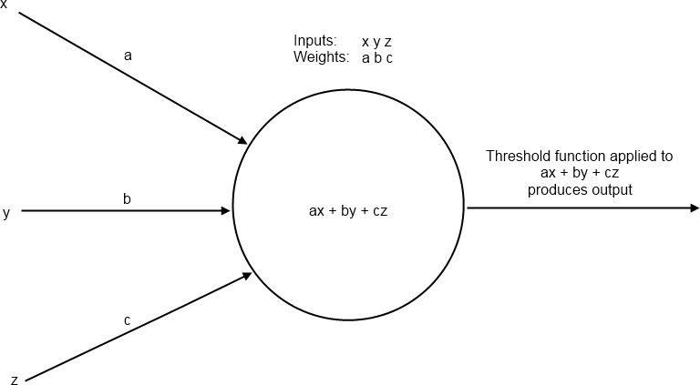
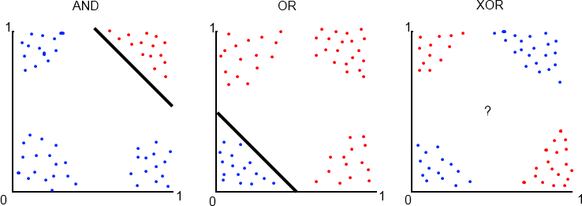
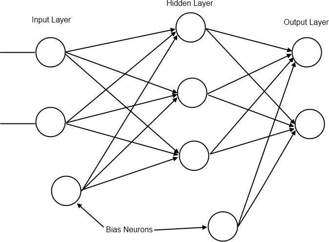
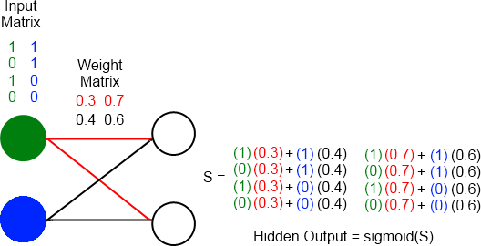
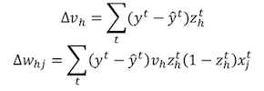
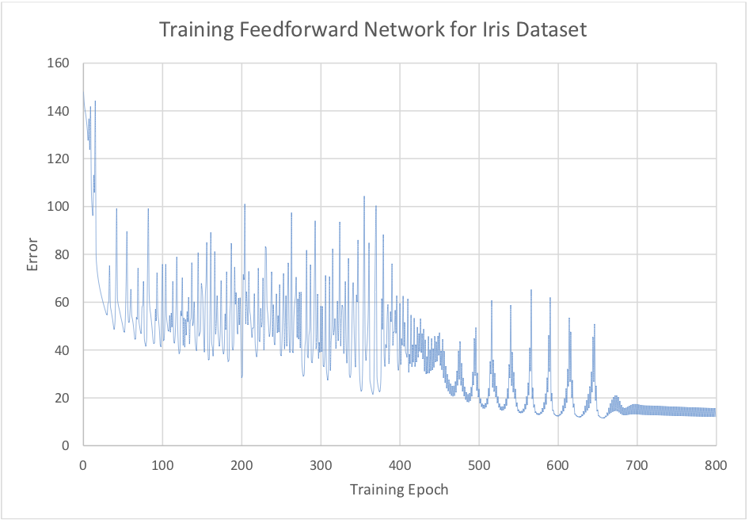

# An introduction to neural networks with kdb+


Due to the desire to understand the brain and mimic the way it works
by creating machines that learn, neural networks have been studied
with great interest for many decades. A simple mathematical model for
the neuron was first presented to the world by Warren McCulloch and
Walter Pitts in 1943.

With modern advances in technology and the computational power
available, this field of research has had massive implications on how
computers can be used to ‘think’ and learn to solve problems given an
appropriate algorithm. A few interesting examples of this research in
action include:

-   [Aiding in medical diagnostics](http://www.ijesit.com/Volume%202/Issue%202/IJESIT201302_33.pdf)

-   Interpreting art and painting images \[[Mordvintsev _et al._](http://googleresearch.blogspot.ca/2015/06/inceptionism-going-deeper-into-neural.html)\] \[[Gatys _et al._](http://arxiv.org/pdf/1508.06576v1.pdf)\]

-   [Performing stock market predictions](https://www.sciencedirect.com/science/article/pii/S2077188616300245)<!-- (http://reference.wolfram.com/applications/neuralnetworks/ApplicationExamples/12.2.0.html) -->

A number of different algorithms have been developed around this field
of research, and this paper is going to focus on the implementation of
a feedforward neural network in kdb+. A feedforward network (also
known as a _multi-layer perceptron_) is a type of supervised 
machine-learning algorithm which uses a series of nonlinear functions layered
together with an output. It can be used for classification or
regression purposes and has been shown to be a universal approximator
– an algorithm that can model any smooth function given enough
hidden units.

!!! note "Reference"

    See Kurt Hornik, “Approximation Capabilities of Multilayer Feedforward  Networks”, _Neural Networks_, Vol. 4, pp. 251-257, 1991

This design of feedforward networks can be represented through
operations on matrices and vectors. Array-programming languages such
as q are well suited to computational implementations in this
format due to the vectorised operations on lists.

All tests were run using kdb+ version 3.2 (2015.05.07)


## Feedforward networks

As mentioned in the introduction, a feedforward neural network is a
type of supervised machine-learning algorithm. This means that it is
trained on datasets for which the output for given inputs is already
known.

A neural network consists of a set of neurons connected together in
some order. Each neuron receives inputs from other neurons, performs
some action on these inputs and outputs a signal that becomes input
for another connected neuron.


### The perceptron

A single neuron by itself is often referred to as a _perceptron_ (Figure
1). The idea is to construct a predictor based on a linear combination
of the inputs and a set of weights which control the impact an input
has on the system. This linear combination (the dot product of the
inputs and the weights) is then used as the input to a chosen
threshold function which produces the desired output.

  
<small>_Figure 1: A perceptron_</small>


### Threshold function

A _threshold function_ represents the activation of the perceptron based
on its inputs. A common choice for this function is the sigmoid
function. 

<div markdown="1" style="text-align: center">

<!-- FIXME Get inline CMN to render in PDF.
LaTeX not currently rendered. 
Workaround: (1) use image files for equations, (2) replace inline expressions with HTML.
(2) fails to render

- combined subscripts and superscripts
- &beta; character

Currently using MathJAX for best results in HTML, but fails to compile in PDF.
2018.07.26
 -->

$$\sigma(x) = \frac{1}{1+e^{-x}}$$

<!--  -->
<!-- 𝜎(𝑥) = 1 ÷ (1 + 𝑒<sup>−𝑥</sup>) -->
</div>

```q
q)sigmoid:{1%1+exp neg x}
q)output:sigmoid[inputs mmu weights]
```

This function provides a smooth curve bounded asymptotically
by 0 and 1 on the vertical axis (Figure 2).

  
<small>_Figure 2: A plot of the sigmoid function_</small>


### Perceptrons as linear predictors

Perceptrons can only solve linearly-separable problems. A 
linearly-separable problem is one where two sets in a plane can be cleanly
divided by a straight line. We can demonstrate this by looking at
plots of truth table outputs.

Let us say that a red dot represents true and a blue dot represents
false. If we take the standard truth table inputs of 1 or 0 and add
some random noise to them so that they are either slightly smaller
than 1 or slightly larger than 0, then we get the plots shown in
Figure 3.

  
<small>_Figure 3: Truth Table Plots_</small>

Notice how we can easily separate the true results from false in the
AND and OR truth tables with a straight line. Perceptrons are good
predictors for these problems. However, if the data is not so easily
separable, as with the XOR plot, we need a way to be able to make
nonlinear predictions. Solving the XOR problem will form our
motivation for connecting many perceptrons into a network.


### A neural network

A network consists of neurons connected together in layers as shown in
Figure 4. Each neuron in one layer is connected to each neuron in the
next layer and each connection has an associated weight. The first
layer of neurons is the input layer. The neurons in this layer
represent input values from a data sample.

Following the input layer are the hidden layers. The number of neurons
in a hidden layer is determined through a combination of background
understanding of the problem and trial and error.

Finally there is the output layer. The number of neurons in this layer
is determined by the type of problem to be solved. For example one
might wish to classify an input data sample into one of two categories
(e.g. true or false as in the XOR problem). This type of problem is
referred to as a *binary classification* problem. For this type of
problem we only need one output neuron because the sigmoid function
will return values close to 1 or 0 after the network is trained.

However, the function which acts on the linear combination of inputs
and weights at the output layer is not always the same as the
threshold function used throughout the rest of the network. This is
because we do not always desire a value between 0 and 1. Output
functions for addressing different types of problems will be discussed
in detail in _Output functions for regression and multi-class classification_.

  
<small>_Figure 4: A feedforward network_</small>


### Bias neurons

A bias neuron is a neuron external to the main network. One is added
to the input layer and one to each of the hidden layers. The value it
passes to neurons in the next layer is always 1 and it receives no
inputs from previous layers (see Figure 4). The purpose of bias
neurons is analogous to the intercept parameter of a simple linear
model – commonly written as $y=mx+c=\beta_{1}x_{1}+\beta_{0}x_{0}$.

<!-- _y_ = _mx_ + _c_ = <i>&#223;</i>₁<i>x</i>₁ + <i>&beta;</i>₀<i>x</i>₀. -->
<!-- 𝑦 = 𝑚𝑥 + 𝑐 = 𝛽₁𝑥₁ + 𝛽₀𝑥₀. -->

The absence of <!-- 𝛽₀𝑥₀ -->$\beta_{0}x_{0}$ in the simple linear model results in the
predicted line always passing through (0, 0) and the model will
perform poorly when attempting to predict unknown values. Hence we
always set <!-- 𝑥₀ -->$x_{0}$ to 1 and alter <!-- 𝛽₀ -->$\beta_{0}$ as we find the line of best fit. 
In the neural network we represent the network’s version of the $\beta_{0}x_{0}$<!-- 𝛽₀𝑥₀ --> term
as a bias neuron and associated weights. For more information on bias
terms in statistical modelling see Chapter 3 in \[2\] and Chapter 7 in
\[1\].

Bias neurons are added to the input layer by adding a 1 to each of the
input samples in the data set used to train the network.

```q
// Inputs and expected target values for XOR problem
q)input:((0 0f);(0 1f);(1 0f);(1 1f))
// Add a bias neuron to each input
q)input:input,’1.0
q)target:0 1 1 0f
```


## Weight initialization

The initialization process begins by assigning values to the weights
present in the network. The weights are randomly assigned such that
the values of the weights between the input nodes and a receiving node
on the next layer are in the range (-1, 1) with mean 0.

Since there will be multiple neurons in the next layer we can
represent all the weights between two layers as a matrix, where the
number of rows represents the number of inputs and the number of
columns represents the number of neurons in the next layer. An example
of how this weight matrix and the input matrix interact is shown in
Figure 5.

```q
wInit:{
  // If only one input neuron is detected exit
  // This is most likely due to a missing bias neuron
  if[1=x;:"Number of input neurons must be greater than 1."];
  flip flip[r]-avg r:{[x;y]x?1.0}[y]each til x
  }
```

Initialize weights between three inputs and four outputs. 
The first column represents the weights (connections) between the three inputs and the first neuron in the next layer.
The second column is the weights leading to the second neuron
in the next layer and so on.

```q
q)wInit[3;4]
-0.3586151 0.09051553 -0.2815408 -0.05282783
0.02154042 0.4219367  0.2320934  -0.05853578
0.3370747  -0.5124522 0.04944742 0.1113636
```

  
<small>_Figure 5: Diagram showing 2 input neurons (green and blue neurons)
connecting to 2 hidden neurons. The colours in the matrices correspond
to the area of the network those values are found during execution
of a forward pass._</small>


### The feedforward network in kdb+

Once we have prepared the input data and the weights they can be
applied to the network to provide output. We will use the network to
predict the outputs of the XOR function.

```q
// weights between input layer and hidden layer (2 inputs + 1 bias neuron)
 q)w:wInit[3;4]
// weights between hidden layer and output layer (4 hidden neurons + 1 bias neuron)
 q)v:wInit[5;1]
 q)ffn:{[input;w;v]
// Apply inputs and their weights to the hidden layer
   z:sigmoid[input mmu w];
// Use output from hidden layer to generate an output
   sigmoid[z mmu v]
  }
 q)ffn[input;w;v]
 0.5028818
 0.5136649
 0.4891303
0.5
```

The network has produced an output, but these values are not close to
the target values. This is understandable as the weights have been
randomly initialized. In order to produce the desired output the
network must learn a more appropriate set of weights.


## Training the network

Training a network to produce accurate results involves determining
the weights which minimize the errors of the output nodes. The problem
of minimizing the error by adjusting the weights is solved by a
technique called back-propagation – a form of gradient descent.

Gradient descent begins by calculating the derivative of the error
function with respect to the weights. This derivative gives
information about the direction needed to move along the surface
described by the error function in order to arrive at a minimum. The
weights are gradually adjusted using this information until an
acceptable minimum in error has been reached.


### Back-propagation

Back-propagation trains the network by propagating information about
the error at the output back through the network and adjusting all the
weights of the connecting neurons. For an output node that applies the
sigmoid function the error function is the cross-entropy error
function defined as:

<div markdown="1" style="text-align: center">
  
$$-\sum_{t}y^t\log \widehat{y}^t + (1-y^t)\log(1-\widehat{y}^t)$$

<!--  -->
</div>

<!-- − ∑ 𝑦<sup>𝑡</sup> log 𝑦̂<sup>𝑡</sup> + (1 − 𝑦<sup>𝑡</sup>) log(1 −
𝑦̂<sup>𝑡</sup>)
𝑡
 -->
This gives us the following update rule for adjusting the weights
between the output node and the hidden layer:

<div markdown="1" style="text-align: center">

$$\Delta v_{h}=\sum_{t}z_{h}^t(y^t-\widehat{y}^t)$$

$$v_h \leftarrow v_h + \alpha\Delta v_h$$

<!--  -->
<!-- ∆𝑣ℎ = ∑ 𝑧<sup>𝑡</sup> (𝑦<sup>𝐭</sup> − 𝑦̂<sup>𝑡</sup>)
𝑡
𝑣ℎ ← 𝑣ℎ + 𝛼∆𝑣ℎ
 -->
</div>

where: 

$z^{t}_h$ <!-- 𝑧<sup>𝑡</sup><sub>_h_</sub>  -->

: the output after evaluating the hidden neuron $h$ for input sample $t$

$v_h$

: the weight between the output neuron and hidden neuron $h$

$y_t$

: the target for sample $t$

$\widehat{y}^t$

: the calculated output for sample $t$

$\alpha$ 

: the rate at which we adjust the weights (usually < 0.1)

!!! note "Update rules"

    The derivation of the update rules for back-propagation is beyond the scope of this paper. See Chapter 11 in \[3\] and Chapter 11 in \[2\].

Once the change in the above weights has been calculated we propagate
the error to the hidden layer and generate the update rule for the
weights between the input layer and the hidden layer:

<div markdown="1" style="text-align: center">

$$\Delta w_{hj} = \sum_t(y^t-\widehat{y}^t) v_h z^t_h(1-z^t_h)x^t_j$$

$$w_{hj} \leftarrow w_{hj}+\alpha\Delta w_{hj}$$

<!--  -->
<!-- ∆𝑤ℎ𝑗 = ∑(𝑦<sup>𝑡</sup> − 𝑦̂<sup>𝑡</sup>) 𝑣ℎ𝑧<sup>𝑡</sup>(1 − 𝑧<sup>𝑡</sup> )𝑥<sup>𝑡</sup>
ℎ ℎ 𝑗
𝑡
𝑤ℎ𝑗 ← 𝑤ℎ𝑗 + 𝛼∆𝑤ℎ𝑗
 -->
</div>

where:

$w_{hj}$

: the weight between hidden neuron $h$ and input neuron $j$

$x^t_j$

: the input from neuron $j$ for some sample $t$

Using these formulas we can update our feedforward network function
to implement back-propagation and allow training:

```q
// inputs - the input data set with bias node
// targets – known outputs corresponding to inputs
// lr – learning rate ‘alpha’
// d – dictionary with 3 items: output
//     weights between input and hidden layers
//     weights between hidden and output layers
ffn:{[inputs;targets;lr;d]
  z:1.0,/:sigmoid[inputs mmu d`w];
  o:sigmoid[z mmu d`v];
  // Error of output neurons
  deltaO:(targets-o);
  // Error of hidden neurons
  deltaZ:1_/:$[deltaO;flip d`v]*z*1-z;
  `o`v`w!(o;d[`v]+lr*flip[z]      mmu deltaO;
            d[`w]+lr*flip[inputs] mmu deltaZ)
  }
```

```q
// Example – the XOR problem
q)inputs
0 0 1
0 1 1
1 0 1
1 1 1
q)targets
0 1 1 0f
q)w
0.3257579   0.348099    -0.4320058 0.3356597
-0.07237444 -0.3028193  0.3088185  -0.3069554 
-0.2533834  -0.04527963 0.1231874  -0.02870423 
q)v
-0.0133154
0.04739764
0.2894549
-0.3235371
// Two training passes show little change 
q)finalResult:(ffn[inputs;targets;0.1]/)[2;`o`w`v!(0,();w;v)] 
q)finalResult`o
0.5025557
0.5133001
0.4888265
0.4996545
// 10000 training passes shows significant improvement 
q)finalResult:(ffn[inputs;targets;0.1]/)[10000;`o`w`v!(0,();w;v)] 
q)finalResult`o
0.009305227
0.9890354
0.9890087
0.01142469
q)\ts finalResult:(ffn[inputs;targets;0.1]/)[10000;`o`w`v!(0,();w;v)] 
164 2992
```
Now that the network has been trained it can be applied to a random
permutation of XOR inputs to see how it performs on a single pass.

```q
// generate a random permutation of list 0 to 99
q)rp:-100?til 100
// use rp to shuffle inputs and targets
// we generate rp first so that the shuffled indices of 
// the inputs and targets match up 
q)inputs:(100#inputs)rp
q)targets:(100#targets)rp
// using weights of trained network solve test inputs 
q)rw:finalResult`w; rv:finalResult`v
q)res: (ffn[inputs;targets;0.1]/)[1;`o`w`v!(0;rw;rv)] 
// Are all the predictions correct?
q)all raze[`int$res`o]=targets
1b
```


### Output functions for regression and multi-class classification

There are three types of output we are looking for when using a
network of this type. The first we have already discussed in 
_A neural network_ above – binary classification. 
We have also worked through an example of
this problem when applying the network to predict XOR outputs. The
other two problems we will discuss are multiclass outputs and
nonlinear regression outputs.


### Multiclass outputs

For multiclass outputs the goal is to determine the correct
classification of an input into three or more possible
classifications. Unlike the binary classification situation, in the
output layer there will be one neuron for each possible
classification. The target values are transformed using one-hot
encoding. This gives us a unique list of 0s and 1s for each possible
classification that is the same length as the number of possible
classifications. For example, if there are classifications A, B and C
the transformations are 0 0 1, 0 1 0 and 1 0 0 – giving the output
layer target patterns to match for training and testing. The output
function used is the softmax function:

<div markdown="1" style="text-align: center;">

$$\widehat{y}^t_i = \frac{\exp{S^t_i}}{\sum_k\exp{S^t_k}}$$

<!--  -->
<!--  # 𝑦̂ =
𝑖 ∑<sub>𝑘</sub> 𝑒𝑥𝑝 𝑆<sup>𝑡</sup>
 --></div>

where 

$\widehat{y}^t_i$

: the output from neuron $i$ for sample $t$

$S^t_i$

: the linear combination of outputs from the hidden layer and the weights connecting the hidden layer to output neuron $i$ for sample $t$

$S^t_k$

: the linear combination of outputs from the hidden layer and the weights connecting the hidden layer to output neuron $k$ for sample $t$

By using the softmax function we ensure that the sum of the outputs
from each of the neurons in the output layer is 1. That allows us to
pick the neuron with the highest output value as the most likely to be
the classification we expect for the given input; the ‘winning’ neuron
will be assigned a value of 1 and the other neurons a value of 0
resulting in a match to one of the one-hot encoded classifications.
The cross-entropy error function in this case is:

<div markdown="1" style="text-align: center;">

$$-\sum_t\sum_i y^t_i\log\widehat{y}^t_i$$

<!-- − ∑ ∑ 𝑦<sup>𝑡</sup> log 𝑦̂<sup>𝑡</sup>
𝑖 𝑖
𝑡 𝑖
 --></div>

where $\widehat{y}^t_i$ is the target value for output neuron $i$ with
sample $t$.

The update rules are:

<div markdown="1" style="text-align: center;">

$$\Delta v_{ih} = \sum_t(y^t_i - \widehat{y}^t_i)z^t_h$$

$$\Delta w_{hj} = \sum_t\left[\sum_i(y^t_i-\widehat{y}^t_i)v_{ih}\right]z^t_h(1-z^t_h)x^t_j$$

<!-- ∆𝑣<sub>𝑖ℎ</sub> = ∑(𝑦<sup>𝑡</sup> − 𝑦̂<sup>𝑡</sup>)𝑧<sup>𝑡</sup>
𝑖 𝑖 ℎ
𝑡
∆𝑤<sub>ℎ𝑗</sub> = ∑ \[∑(𝑦<sup>𝑡</sup> −
𝑦̂<sup>𝑡</sup>)𝑣<sub>𝑖ℎ</sub>\] 𝑧<sup>𝑡</sup> (1 −
𝑧<sup>𝑡</sup> )𝑥<sup>𝑡</sup>
𝑖 𝑖
𝑡 𝑖
ℎ ℎ 𝑗
 --></div>
where $v_{ih}$ is the weight between output neuron $i$ and hidden neuron
$h$.

An example implementation of the softmax output is shown below in
_Classification for 3+ classes_.


### Nonlinear regression outputs

If the goal is to predict a real value, not necessarily constrained
within the boundaries imposed by a threshold function, the output
function is just the linear combination of the outputs from the hidden
layer.

<div markdown="1" style="text-align: center;">

$$\widehat{y}^t=\textbf{v}\cdot\textbf{z}^t$$

<!--  -->
<!-- 𝑦̂<sup>𝑡</sup> = 𝐯 ∙ 𝐳<sup>𝑡</sup> -->
</div>

where 

$\textbf{v}$ 

: the vector of weights between the hidden layer and the output layer

$\textbf{z}^t$

: the vector of outputs from the hidden layer

In this case we change the error function from cross-entropy to the
sum-of-squared errors:

<div markdown="1" style="text-align: center;">

$$\frac{1}{2}\sum_t(y^t-\widehat{y}^t)^2$$

<!--  -->
<!-- 1 ∑(𝑦<sup>𝑡</sup> − 𝑦̂<sup>𝑡</sup>)<sup>2</sup>
2
𝑡
 -->
</div>

The update rules for a regression output are:

<div markdown="1" style="text-align: center;">

$$\Delta v_h = \sum_t(y^t-\widehat{y}^t)z^t_h$$

$$\Delta w_{hj} = \sum_t (y^t-\widehat{y}^t) v_h z^t_h (1-z^t_h) x^t_j$$

<!--  -->
<!-- ∆𝑣ℎ = ∑(𝑦<sup>𝑡</sup> − 𝑦̂<sup>𝑡</sup>)𝑧<sup>𝑡</sup>
𝑡
∆𝑤ℎ𝑗 = ∑(𝑦<sup>𝑡</sup> − 𝑦̂<sup>𝑡</sup>)𝑣ℎ𝑧<sup>𝑡</sup>(1 −
𝑧<sup>𝑡</sup> )𝑥<sup>𝑡</sup>
ℎ ℎ 𝑗
𝑡
-->
</div>

```q
q)lin:{x}
q)linErr:{0.5*sum sum a*a:x-y}
```

It’s useful now to put the different functions for error and output in
dictionary format as this will allow us to use the same `ffn` function
for all 3 types of classification:

```q
// x is linear combination of hidden outputs and weights
outputFuncs:`sig`smax`lin!
  ({1%1+exp neg x};{exp[x]%sum flip exp x};{x})
// x is target value, y is calculated
errFuncs:`sig`smax`lin!
  ({neg sum sum flip(x*log y)+(1-x)*log 1-y}; 
  {neg sum sum flip x*log y};
  {sum sum a*a:x-y})
```

```q
ffn:{[inputs;targets;lr;of;d]
  // Calculate the outputs of the hidden layer
  // and add bias node
  z:1.0,/:sigmoid[inputs mmu d`w];
  o:outputFuncs[of][z mmu d`v];
  // Error of output neurons
  deltaO:(targets-o);
  // Error of hidden neurons
  // Hidden bias node is not connected to any 
  // input layer nodes so we drop it   
  deltaZ:1_/:$[deltaO;flip d`v]*z*1-z; 
  `o`v`w`err!
    (o; 
    d[`v]+lr*flip[z] mmu deltaO;
    d[`w]+lr*flip[inputs] mmu deltaZ;
    errFuncs[of][targets;o])
  }
```


### Classification for 3+ classes

As an example, we will study a set of Iris flower data which was
originally introduced into research by Ronald Fisher in 1936. It
contains samples from three different species of the Iris flower and
has become a standard test case for many classification techniques
within machine learning. By taking measurements of certain metrics
(eg. length and width of sepals) the plants can be classified and
computationally distinguished from each other. The data and a
description of the data can be found in the links at
[archive.ics.uci.edu](http://archive.ics.uci.edu/ml/machine-learning-databases/iris)

We one-hot encode the different possible species of Iris, resulting in
a neural network with 5 inputs (including the bias neuron), 7 hidden
neurons (including the bias neuron) and 3 outputs. The data set is
randomly shuffled to reduce the likelihood of a biased output. From
this randomised selection of the data a random selection of 20 samples
is taken as the test set and the other 130 samples are used in
training.

```q
// one-hot encoding of classes
q)IrisOneH:oneHot[distinct Iris.species] 
q)IrisOneH
Iris-setosa    | 1 0 0
Iris-versicolor| 0 1 0
Iris-virginica | 0 0 1
q)Iris1h
slength swidth plength pwidth species     onehot
------------------------------------------------
5.1     3.5    1.4     0.2    Iris-setosa 1 0 0
4.9     3      1.4     0.2    Iris-setosa 1 0 0
4.7     3.2    1.3     0.2    Iris-setosa 1 0 0
..
// Random permutation of the dataset
q)IrisRP:Iris1h{neg[x]?til x}count Iris1h
// Pick a test set – samples from data not used in training
q)IrisTest:IrisRP[-20?count IrisRP]
q)IrisTrain:IrisRP except IrisTest
// Init weights, input and output variables
q)w:wInit[5;6]
q)v:wInit[7;3]
q)input:1.0,'flip flip[IrisTrain]`slength`swidth`plength`pwidth 
q)output:IrisTrain.onehot
// Train network 
q)resIris:(ffn[input;output;0.01;`smax]/)[800;`o`w`v`err!(0;w;v;1f)] 
// After 800 iterations (or epochs) how well does it perform? 
q)all(IrisOneH?"f"$"j"$resIris`o)=IrisOneH?output
0b
q)100*sum[(IrisOneH?"f"$"j"$resIris`o)=IrisOneH?output]%count output 
96.89922
// Init variables for test data
q)tinput:1.0,'flip flip[IrisTest]`slength`swidth`plength`pwidth 
q)toutput:IrisTest.onehot
// Run test data through network without training 
q)resIrisT:(ffn[tinput;toutput;0.01;`smax]/)[1;`o`w`v`err!(0;resIris`w;resIris`v;1f)] 
q)all (IrisOneH?"f"$"j"$resIrisT`o)=IrisOneH?toutput
1b
```

Plot of error vs training epoch is given in
Figure 6. We see that the error settles into an oscillation pattern
around training epoch 700. While these oscillations are slowly
converging it is likely that overfitting begins to take place shortly
after the 700th iteration of training.

  
<small>_Figure 6: Error while training network on Iris dataset_</small>


### Stochastic gradient descent

Often, in practice, computing the error and gradient for the entire
training set can be very slow and in some cases not possible if the
data will not fit entirely in memory. Stochastic gradient descent
solves this problem by performing the back-propagation training on
small batches of the training set chosen at random.

Randomly chosen batches simulate real-time streaming of data and help
to reduce bias in the final trained network (see chapter 7 in \[2\]
for more details on bias and variance in machine learning).


### Classification for 3+ classes using stochastic batch training

This time we will again use Fisher’s Iris dataset, but the network
will be trained using randomly selected small batches from the
training data.


## Conclusion

In this whitepaper we have explored a proof-of-concept implementation
of a feedforward network in kdb+. By constructing the model for the
network using linear algebra (inputs, outputs and weights represented
by matrices) we have shown that an array-processing language is well
suited to developing a complex system.

We have shown that multiple types of output functions can be easily
applied to the network depending on the desired result. This
generalisation demonstrates the adaptability of kdb+ to many problems
where numerical data can be arranged into lists, arrays or tables.

In the event that there is not enough main memory to carry out the
calculations on all the training data in one pass we presented an
alternative approach, stochastic gradient descent, which allows the
network to be trained on small batches of the data.

The network exhibited in this paper forms the groundwork for more
complicated networks. Adding additional hidden layers and different
options for threshold function will allow more complex convolutional
and deep networks to be developed.

All tests were run using kdb+ version 3.2 (2015.05.07) 


## Author

James Neill works as a kdb+ consultant for one of the world’s largest
investment banks, developing a range of applications. James has also
been involved in the design of training courses in data science and
machine learning as part of the First Derivatives training programme.


## References

1.  Murphy, K. P. (2012). _Machine Learning: a probabilistic
    perspective._ MIT Press.

2.  Hastie, T., Tibshirani, R. and Friedman, J. _The Elements of
    Statistical Learning._ Springer, New York. ([Online version](http://statweb.stanford.edu/~tibs/ElemStatLearn/))

3.  Alpaydin, E. _Introduction to Machine Learning, Second Edition._ MIT
    Press.
