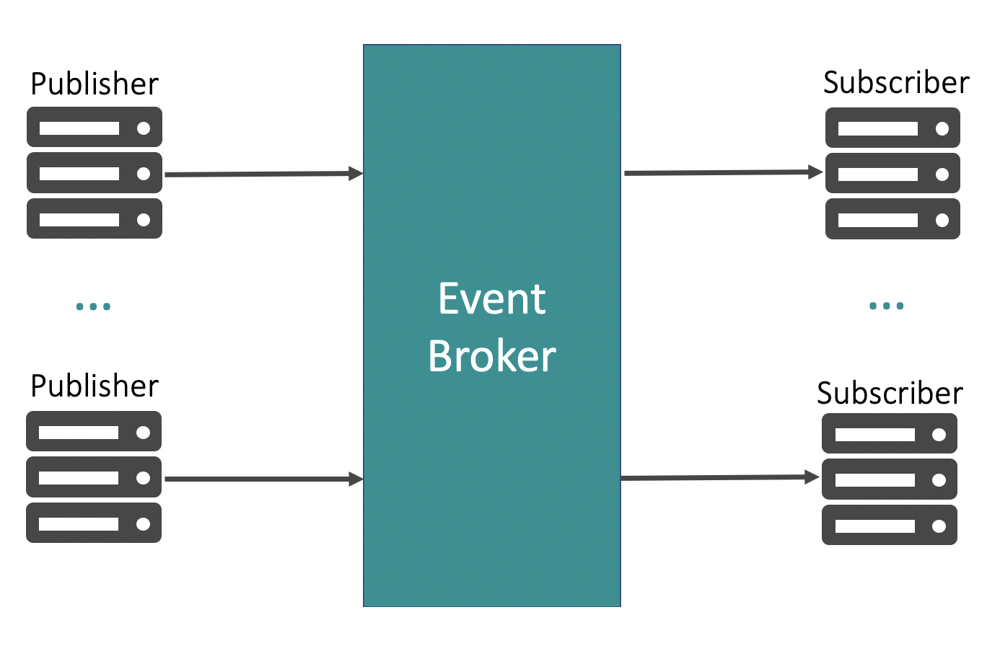
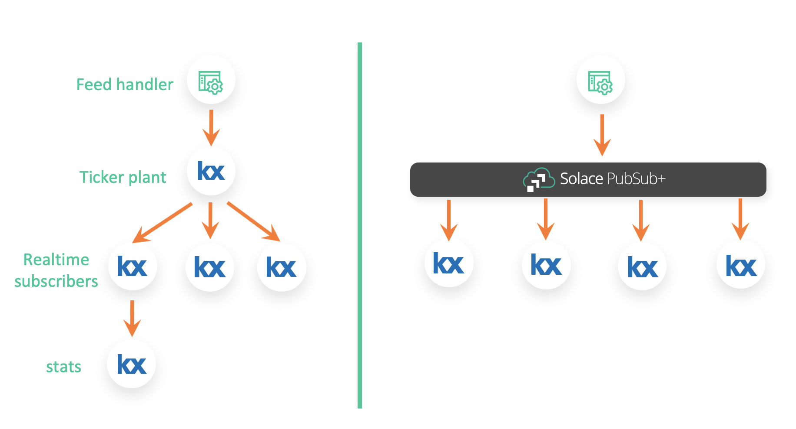
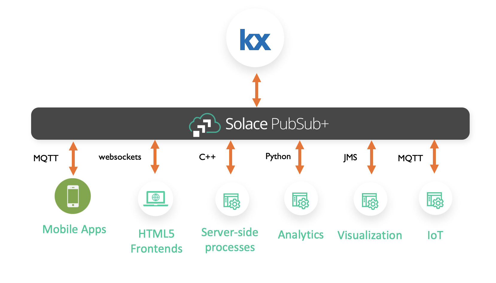
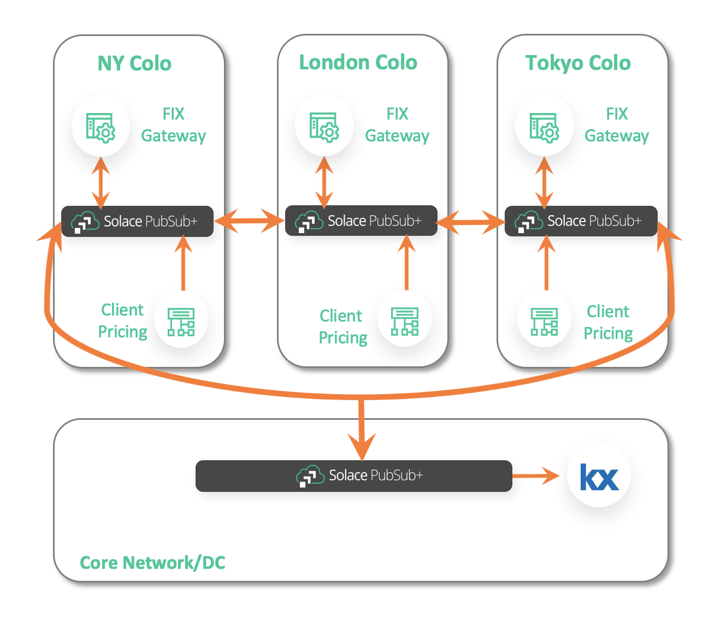
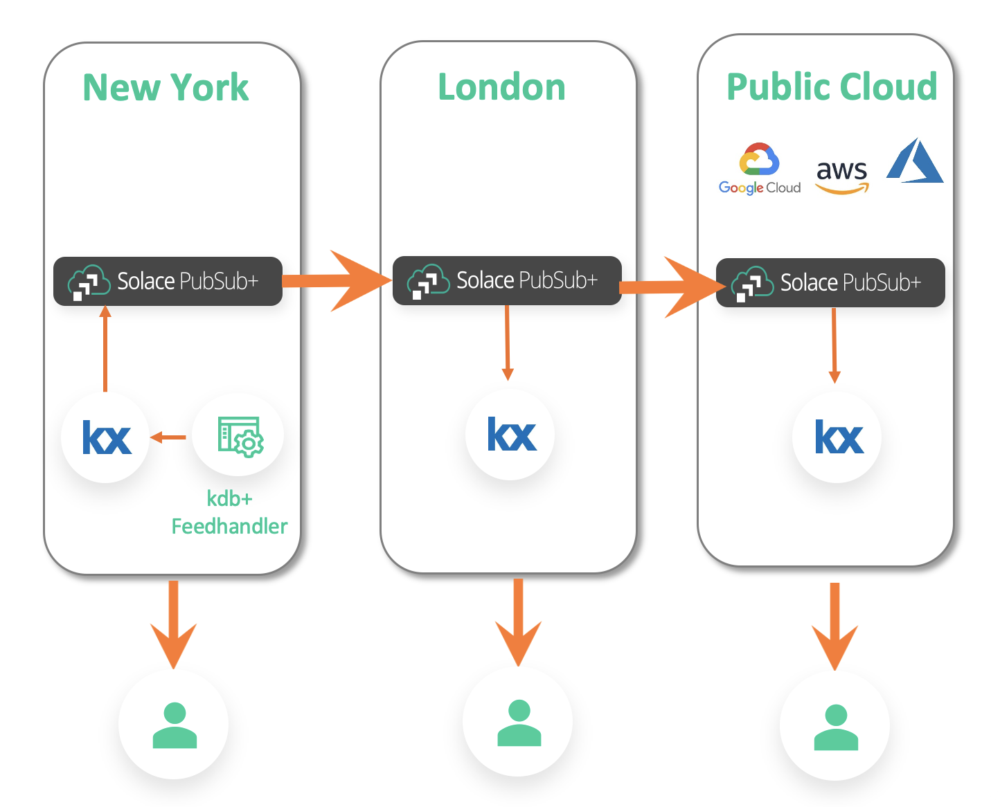
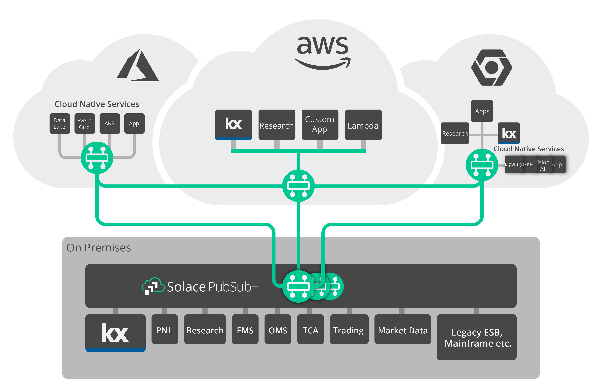
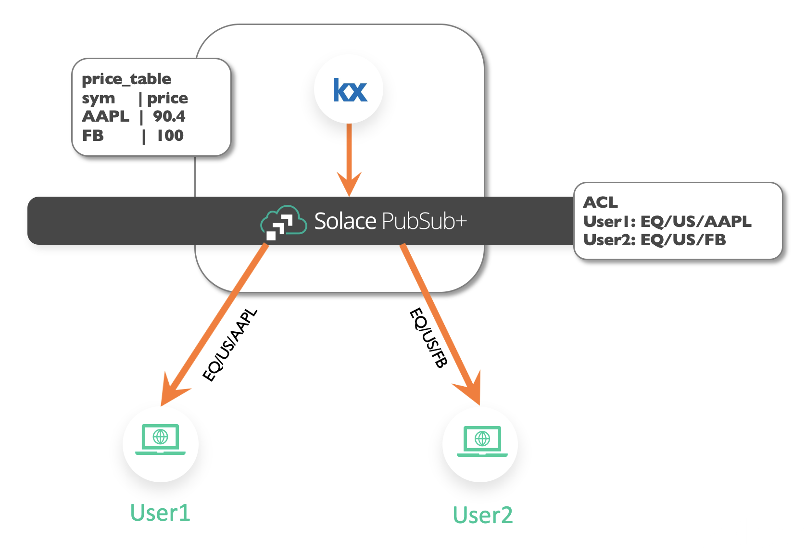
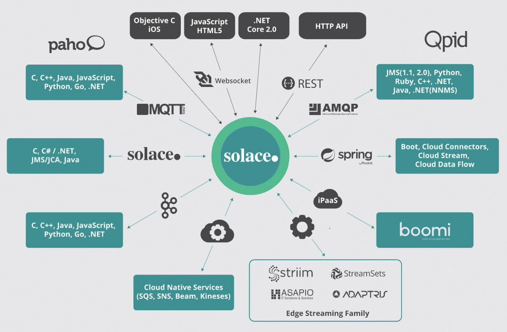
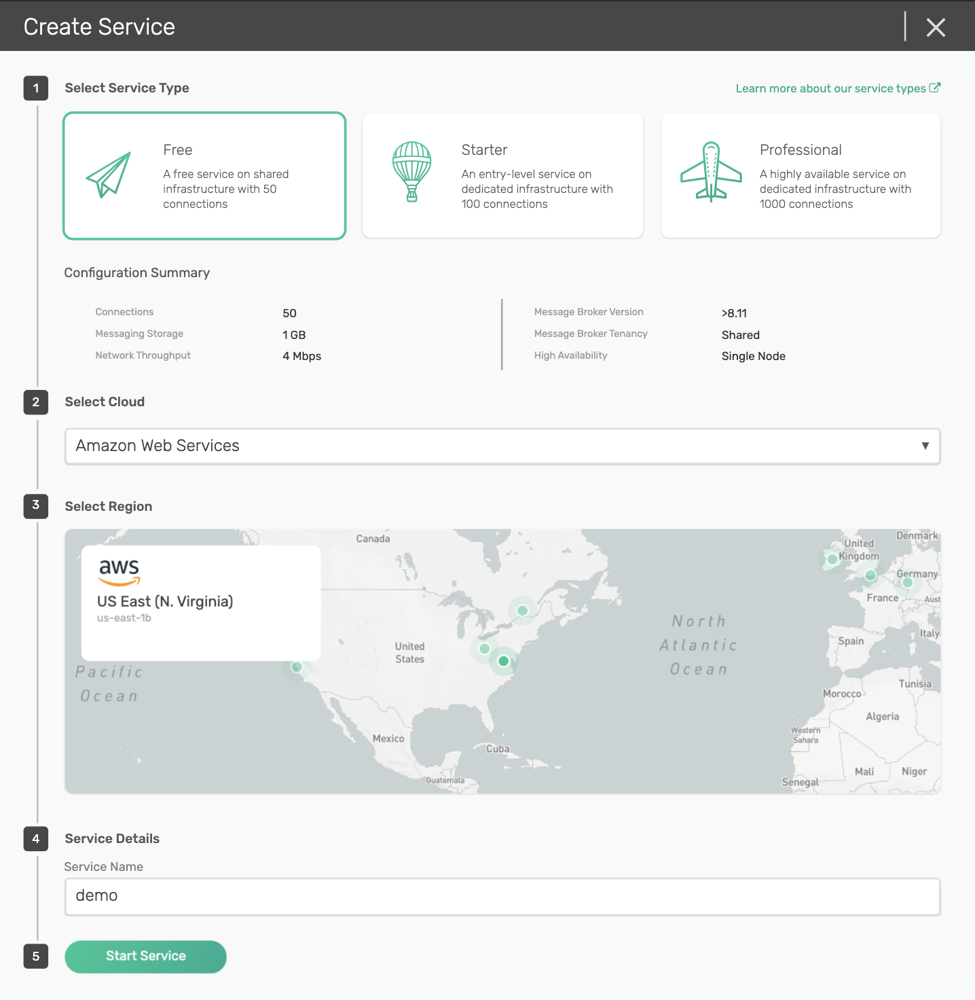
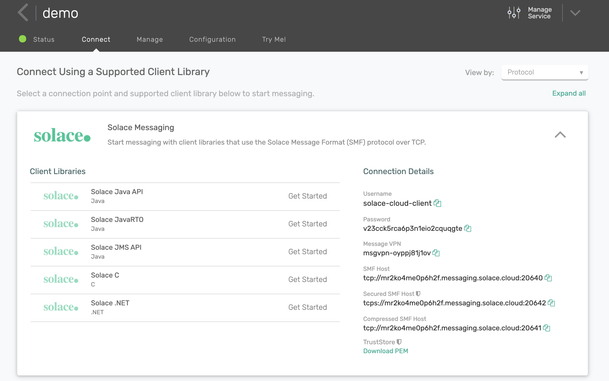

# Publish-subscribe messaging with Solace


It wouldn't be absurd to assume that most of us have heard of or are familiar with message brokers. After all, they have been around for decades and are deployed in most, if not all, large enterprises. However, like any technology that has been around for so long, message brokers have seen their fair share of transformation, especially in their capabilities and use-cases.

In this white paper, I would like to cover different ways applications communicate with each others, the pub/sub messaging pattern and its advantages, benefits of implementing pub/sub with kdb+, and finally, show how you can implement pub/sub with kdb+ using Solace's PubSub+ event broker.

Message brokers, or event brokers as they are commonly known these days, form the middle layer responsible for **transporting** your data. They are different from your databases because they are not meant for long-term storage. Event brokers specialize in **routing** your data to the interested applications. Essentially, event brokers allow your applications to easily communicate with each other without having to worry about data routing, message loss, protocol translation, and authentication/authorization to name a few.

At this point, you might be asking yourself:
- why do applications need to communicate with each other? 
- and, why do they need an event broker to communicate?

Let's discuss both.

## Why do applications need to communicate with each other?

We have all heard of monolithic applications. These are large pieces of software that barely had to worry about other applications and were mostly self-sufficient. Most, if not all of the business logic and interactions with other applications, was encapsulated in this one gigantic application. The monolithic application architecture had its advantages as it allowed you full control of the application without having to rely on other teams. It also simplified some things since your application didn't have to worry about interacting with other applications. When it came to deployment, all you had to do was roll out this one (albeit giant) piece of code. 

However, as business and applications grew, the monolithic architecture started showing several pain points, especially that it did not scale very well. It was difficult to manage, troubleshoot, and deploy. Adding new features became a tedious and risky task as it put the entire application at risk. 

In the last few years, many companies have started decomposing monolithic applications into smaller components or services where each application aligns with a business line or a service. Several companies have broken down applications even further into microservices which are small scale applications meant to manage one task only.  

As applications were broken down, there was a stronger demand for a way for them to interact with each other. Applications needed to communicate with other applications to share data and stay in sync. Before, a monolithic application could do everything itself, but now multiple applications need to rely on each other and they had to share data to accomplish that. 

This is just one example of why applications need to talk to each other. There are many others but at the core of it, each system architecture consists of multiple types of applications - databases, caches, load balancers, API gateways etc, and they cannot exist in isolation. They need to talk to each other. Most applications need to store/retrieve data into/from a database. Most web applications are a fronted with a load balancer that routes web traffic to different backend servers. These applications rely on communicating with each other to make the overall architecture work. 

But how do these applications communicate with each other? Let's take a look at common communication techniques and messaging patterns.

### Inter-process communication

Applications directly communicating with each other is known as **Inter-process Communication** (IPC). For example, your kdb+ architecture most likely consists of several *q* processes running in parallel and sharing data with each other using IPC. You can have *q* server process listen on a specific port and a client *q* process can establish a connection with the *q* server process by opening a handle:

```q
q)h:hopen `::5001 
q)h "3?20"  
1 12 9 
q)hclose h
```

### Synchronous vs asynchronous

As we saw in the example above, applications can communicate with each other using IPC. Specifically, in *q*, we can open a handle to a process, execute a remote query, and then close the handle. The previous example demonstrates how **synchronous** communication works. 

There are two popular ways of communication: **synchronous** and **asynchronous**. Both allow applications to communicate with each other but with a subtle, yet powerful, difference. In synchronous communication, when an application issues a request or executes a remote query, it cannot do anything else in the meantime but wait for the response. Conversely, with asynchronous communication, your application is free to continue its operations while it waits for a response from the remote server. 

In *q*, you can execute remote queries asynchronously using a negative handle:

```q
q)h:hopen `::5001 
q)(neg h)  "a:3?20"  / send asynchronously, no result 
q)(neg h)  "a"  / again no result 
q)h "a"  / synchronous, with result  
0  17  14
```

Asynchronous communication is extremely powerful because it frees up resources to be utilized for additional processing instead of sitting idle waiting for a response from the server. However, there are some use-cases when you must use synchronous communication, especially when you need to be certain that your remote query was executed by the server. For example, when authenticating users, you would use synchronous requests to make sure user is authenticated before giving the user access to your system.

But for the most part, it's best to go with asynchronous messaging and that's what we will be focusing on in this white paper. 


### Queueing

As applications scale, they are responsible for processing large quantities of messages. As these messages are sent to your application, in some cases, they are expected to be processed in order whereas in other cases, the order is not important. For example, an alerting system responsible for sending a push notification every time some value crosses a threshold might not care about order of events. Its job is to simply check whether the value is above or below a threshold and respond. On the other hand, a payment processing application at a bank, certainly cares about message order. It wouldn't want to let a customer continue withdrawing money from their account if they had already withdrawn all of the money earlier. 

Queues are popular data structures used to order messages in sequence. Queue semantics make it a FIFO (First In First Out) data structure in which events are dequeued in the order they were enqueued. For example, if you have multiple transaction orders from 10:00am to 11:00am being enqueued in a queue, they will be consumed by a subscriber in that order starting with the first transaction at 10:00am. 


Besides providing sequential ordering, queues are also known for providing persistence. A subscriber meant to process order transactions and persist them to a database might crash and not come back online for 10 minutes. The orders generated in those 10 minutes are still required to be processed albeit at a delay. A queue will persist those messages and make them available to the subscriber once it comes back online to avoid any data loss. 

Queues are commonly used in a pub/sub architecture (see below) to provide ordering and persistence.

### Request/Reply

Communication can be either unidirectional or bidirectional. The example in the IPC section above is a unidirectional example where one process sends a message to another process directly. Occasionally, you require the communication between your processes to be bidirectional where the second process is required to provide you with a response. For example, issuing a request to query a database will provide you with a response consisting of the result of your query.  

For such scenarios, there is asynchronous request/reply pattern which uses queues to store the requests and responses. In this version, the first application issues a request which is persisted in a queue for the second application to consume from. The payload of the message could contain a `replyTo` parameter which tells the second application which queue it should publish the response to. The first application is listening to the queue and consumes the message whenever it is available.


Asynchronous request/reply provides benefits of both bi-directional communication and asynchronous messaging.

---

## Pub/Sub

Now that we have covered the basics of different types of communication (synchronous vs asynchronous) and different messaging patterns (IPC and request/reply), let's turn our attention to a very popular messaging pattern known as publish/subscribe or commonly known as, pub/sub. 

Pub/sub supports bi-directional asynchronous communication from many to many applications. It is commonly used to distribute data among numerous applications in enterprises. The pub/sub messaging pattern can be implemented through the use of an event broker. In such an architecture, the event broker acts as an abstraction layer to decouple the publisher and consumers from each other. 



At a high level, the pub/sub messaging pattern consists of three components:
1. publishers
2. subscribers
3. brokers

Publishers are responsible for publishing data asynchronously to topics or queues without worrying about which process will consume this data. 

Alternatively, consumers are responsible for consuming data from topics or queues without worrying about which process published the data. 

Both publishers and consumers only connect to the event broker instead of directly connecting to each other. 


### Advantages of using pub/sub

With so many different messaging patterns to choose from, why should you invest time and resources in adopting and implementing pub/sub messaging pattern in your architecture? Pub/sub has numerous advantages that make your architecture efficient, robust, reliable, scalable and cloud-ready. Let's dive deeper into how it does that.

#### Efficient data distribution

When you are dealing with low throughput with a handful of processes it is OK to simply use direct communication instead of over engineering it. For example, if you are publishing data notifications with 10 messages per day and you have 3 different teams interested in that data, you can afford to connect directly to those three consumers and send the same data three times. 

However, as your business expands, you will have more teams interested in higher throughput data. For example, if you are an e-commerce company, you will have numerous consumers such as fraud detection, payment processing, order fulfilment, and shipping interested in the order transaction data. In such a scenario, you don't want to duplicate data transfer.

To efficiently distribute data to any consumers, you can use the pub/sub messaging pattern via an event broker. Your publisher(s) will only have to publish the data once and any consumer(s) interested in that data can subscribe to the appropriate topic and receive the data in real-time. 

Additionally, your publishers can leverage asynchronous messaging to avoid waiting for a response from consumers. Publishers can simply publish high throughput data in a non-blocking manner. 

#### Scalability

Another advantage of using the pub/sub messaging pattern is that it allows you to easily scale your architecture. In a pub/sub messaging pattern, processes are loosely coupled as opposed to being tightly coupled. In other words, publishers don't need to be aware of subscribers and vice versa. They can operate independently without relying or being aware of the other processes. 

For example, consider a scenario where you need to add a new service responsible for detecting fraudulent orders in real-time. In a tightly coupled architecture, such as one in which applications communicate directly using IPC, you will have to modify your publishers to start publishing data to the new fraudulent order service. Every change you make to an application introduces possibility of you introducing new bugs, hence can be risky. 

In a pub/sub architecture, your applications are loosely coupled and if you need to add a new service, you simply deploy a new service which connects to the event broker and starts consuming the real-time data. In such an architecture, there is no need to modify the publishers. 

Furthermore, pub/sub architecture also allows you to scale as message rates increase. As your e-commerce business becomes more popular and more orders start getting placed by your customers, you can easily horizontally scale your applications and continue consuming data from the event broker.

#### Resiliency

Now that your e-commerce business has been up for a while, it is slowly picking up. You are excited for upcoming Black Friday promotion for record sales but are worried whether your infrastructure will be able to support the record influx of customer orders. 

If you were still using direct communication between your applications, you would be right to be worried. Spikes in message throughput is a common cause of systems crashing and data loss. Such an event can cause reputational and monetary damage to your business. 

Adding an event broker to your architecture can alleviate many of these concerns. The event broker will act as a load balancer and shock absorber to make sure data can be efficiently load balanced across your processes. And in case something else goes wrong and your applications do crash for a short period of time, you will not lose any client orders as they will be queued up for your applications to consume when they recover.


#### Integration

As your business continues to grow, your overall architecture starts consisting of multiple components from different vendors. For example, you have an HR management system for your growing workforce to manage payroll, a payments system for managing transactions, a reporting system for daily/monthly/quarterly/annual reports, a ticketing system for customer support and many more. Each of these systems produces valuable data that needs to be shared with other services instead of kept in silos. For example, your payments data needs to be shared with the reporting system to generate reports. 

Each of these systems can be written in different languages such as Java, Python, and C++. They might also support different messaging protocols such as AMQP and MQTT. How do you make sure you can easily leverage the data produced by these systems and make it available to any service that needs it. How do you break down these silos and liberate your data?

Event brokers allow you to easily integrate different applications/systems together. A core feature of event brokers is protocol translation which means you can use different APIs written in different languages and publish/consume data using different protocols. For example, your publisher can use Java to publish data using the MQTT protocol to the broker and your subscriber can use Python to consume the data using AMQP protocol. The broker handles the protocol translation from MQTT to AMQP for you so different teams in your organization can continue to use the tech stack that suits their requirements. 

Integration is a critical advantage of using an event broker as it enables digital transformation by allowing companies to connect their internal systems and facilitate flow of data between these systems. 

## Using Pub/Sub with kdb+

Now that we have a good understanding of how applications communicate with each other and how your architecture can benefit from using the popular pub/sub messaging pattern, it's time to look at pub/sub in the context of a kdb+ architecture. 

kdb+, by Kx, is a powerful time-series database which allows users to store and analyze historical and real-time data. It's used in several different verticals, especially in financial services. A popular use-case is storing cross-asset pricing data for global securities in kdb+. We will be expanding on this use-case to show how the pub/sub messaging can enhance an existing kdb+ stack.


### Overview of kdb+ architecture

Before diving deeper into how pub/sub can complement your kdb+ stack, let's make sure we understand what a typical kdb+ stack looks like. Consider a tick data team at an investment bank responsible for capturing, storing, and analyzing real-time global cross-asset data. 

Their stack will consist of multiple non-q and *q* processes: **feed handlers**, **tickerplants**, **realtime databases**, **stats processes**, **historical databases** and **API gateways**. Let's look at them briefly.

#### Feed handlers

Feed handlers are responsible for connecting to external market data vendors such as Refinitiv and Bloomberg and capturing necessary real-time data for the securities in your universe. They are usually programmed in *Java* or *C++* but can also be written in *q*.

At large enterprises, tick data teams have feed handlers deployed in key regional markets such as New York, London, Hong Kong, and Tokyo. Additionally, they may also have colo deployments where some processes are co-located at the exchanges for speed efficiencies. 

#### Tickerplants

A tickerplant is a lightweight *q* process which has two key responsibilities:

 1. Manage all the connections and subscriptions for downstream processes interested in realtime data from feed handlers
 2. Store all the data in a replay log to avoid data loss in case of a crash

A tickerplant process is responsible for structuring the data it receives from the feed handler process into *q* data structures such as an in-memory tables and pushing the updates to any downstream subscribers, commonly known as realtime subscribers, based on their subscriptions.

#### Realtime subscribers

Processes interested in realtime updates from tickerplant are known as realtime subscribers. The most common realtime subscriber is a realtime database (RDB) which stores all the raw updates in memory, usually until the end of the day. Another common realtime subscriber is a stats process which is responsible for generating bucketed stats in realtime. 

Both of these processes connect to a tickerplant to register their subscriptions and receive realtime updates. For example, an RDB can register for all the updates from *trade* and *quote* tables whereas the stats process might only be interested in *trade* updates. 

#### Historical databases (HDBs)

Due to limited memory capacity, data eventually has to be persisted to disk. An RDB will typically store data for the day in memory and at the end of the day, it will persist it to disk and flush it from memory so it can start consuming data for the next day. 

#### API gateway

An API gateway is a *q* process which is responsible for authenticating users and providing them with an interface for querying different realtime and historical databases by providing predefined functions. Users can call these functions with appropriate parameters and get the data they need without having to know the inner setup.

For example, instead of allowing users to write raw *q-sql* queries, the tick data team might expose predefined functions such as *getStockLast* and *getStockStats*. 

Additionally, API gateways can be used to load balance queries and abstract away numerous connection details from users. For example, users won't have to worry about knowing which regional kdb+ database to query for US equities data and which one to query for Singapore's data. Instead, they will just run their queries against the API gateway and it will route the queries for them internally. 


### Advantages of using pub/sub with kdb+

With a high-level understanding of what a typical tick data kdb+ stack looks like, we are well equipped to understand the advantages of using the pub/sub messaging pattern with kdb+. 

Instead of using direct IPC communication between your *q* processes, you can use pub/sub as a messaging pattern in your kdb+ stack. Doing so allows you to efficiently distribute data, easily integrate with other applications, scale horizontally, avoid data loss, migrate to cloud, maintain hybrid cloud setup, and secure your data. 

Let's dive deeper into each of these advantages.

#### Efficient data distribution

Data is the lifeline of your kdb+ stack. It flows from feed handlers to tickerplants to downstream subscribers and then eventually to historical databases. However, kdb+ stacks don't operate in isolation. Depending on how the company is structured, there might be a central *market data* team responsible for managing connectivity with external data vendors and writing *Java* feed handlers to capture market data and then distributing it over an event broker for other teams to consume. 

The *tick data* team can be just one of many downstream consumers interested in all or subset of the data published by the *market data* team. Similarily, the *tick data* team can enrich the raw data by generating stats and distributing it to other downstream consumers via the same event broker. 

The key idea here is that the publisher only has to worry about publishing data to the event broker and not get bogged down in the details of how many downstream consumers there are, what their subscription interests are, what protocol they want to use and so forth. This is all responsibility of the event broker. Similarly, the subscribers don't need to worry about which publisher they need to connect to. They continue to connect to the same event broker and get access to realtime data. 

Moreover, there are events that can lead to data spikes and impact applications. For example, market volumes were multiple times over their usual daily average in March 2020 during Covid-19. Anyone not using an event broker to manage data distribution would have been impacted with sudden spikes in data volume. Brokers provide shock absorption that deal with sudden spikes to make your architecture robust and resilient.


#### Avoid tight coupling

As discussed earlier, processes directly communicating with each other leads to a tightly coupled architecture where each process is dependent on one or more other processes. Such an architecture gets harder to maintain as it scales since it requires more coordination between processes. 



In the context of kdb+, sharing data between your multiple tickerplants, RDBs and stats processes means they are dependent on each other. Stats process responsible for consuming raw data directly from a RDB and generating stats on that raw data makes it dependent on the RDB. If something were to happen to the RDB process, it will also impact the stats process. Additionally, if there was a change required in the RDB process, your developers will need to ensure that it doesn't impact any downstream processes that are dependent on the RDB process. This prevents you from making quick changes to your architecture. Each change that you do make introduces risks to downstream processes which is not desirable.

Instead, each *q* process, whether it be an RDB or stats process, can communicate via an event broker using the pub/sub messaging pattern. The tickerplant can publish data to the event broker without worrying about connection details of downstream subscribers and their subscriptions. Both RDB and stats process can subscribe for updates from the event broker without knowing a thing about the tickerplant. The stats process can generate minutely stats and then republish that data to event broker on a different topic allowing other processes to subscribe to those stats.

Doing so keeps your *q* processes independent, allows them to be flexible so they can easily adapt to new requirements, and reduces possibility of introducing bugs accidentally. 


#### Easily integrate other applications with kdb+

Most event brokers support a wide range of APIs and protocols which means different applications can leverage these APIs, which kdb+ may or may not natively support, to publish or consume data. For example, our stats process from earlier is still consuming raw data from event broker, generating stats on that data and then republishing it to a different topic. Now we have the **PNL** team interested in displaying these stats on a dynamic web dashboard using JavaScript. They can easily use the event broker's JavaScript API to consume the stats live and display on a shiny HTML5 dashboard without having to learn anything about kdb+. 

For example, your company might have IoT devices producing a lot of timeseries data that needs to be captured in your kdb+ database. IoT devices typically use lightweight MQTT protocol to transfer events. Using an event broker that supports the MQTT protocol would allow you to easily push data from your IoT devices to the event broker and then persist it in a kdb+ database to be analyzed in realtime or later. 



Using an event broker puts the kdb+ estate at the center of your big data ecosystem and allows different teams to leverage its capabilities by integrating with it. Don't let your kdb+ estate sit in isolation!  

#### Zero message loss

Not all events are equal. Some events don't matter at all and are not worth capturing, some such as *market data* are important but there is tolerance for some loss, and then there are some events, such as *order data*, that are extremely important and cannot be dropped.  A PNL dashboard can tolerate some loss in *market data* but an an *execution management system (EMS)* losing *order data* can result in monetary loss. 

While transferring market data using direct IPC connections might suffice, applications require zero message loss guarantee when dealing with critical data such as *order data*. There is zero tolerance for any message loss in such cases and using an event broker provides that guarantee. Event brokers use local persistence and acknowledgements to provide a guaranteed flow between publishers and subscribers. Publishers can publish data to the event broker and receive an acknowledgement back when broker has persisted the data locally. When a subscriber comes online and requests that data, it will receive it and will provide an acknowledgement back to the broker letting it know it is safe to delete the data from its local storage. 

#### Global data distribution and data consolidation via event mesh

Very rarely does data just sit in one local data center, especially at global financial firms using kdb+ for the tick data store. As discussed earlier, there are feed handlers deployed globally, potentially co-located at popular exchanges. Some institutions even have their kdb+ instances co-located to capture the data in realtime with ultra-low latency, and then ship it back to their own datacenters. 

We all know that co-location is expensive so storing your tick data in a colo is not an inexpensive process, especially when eventually it needs to be shipped back to your datacenter to be analyzed or accessed by other applications. 

A cost-effective alternative is to use event brokers deployed locally to form an **event mesh**. What is an event mesh? An event mesh is a configurable and dynamic infrastructure layer for distributing events among decoupled applications, cloud services and devices. It enables event communications to be governed, flexible, reliable and fast. An event mesh is created and enabled through a network of interconnected event brokers.

Modern event brokers can be deployed in different regions (NY vs LDN) and environments (on-premises vs cloud) yet still be connected together to seamlessly move data from one environment in one region such as a colo in New Jersey to a different environment in another region such as an AWS region in Singapore. 

Using an event mesh to distribute your data out of colo to your own datacenter(s) in different regions provides you with a cost-effective way to store your tick data in your core tick data store in your datacenter instead of at colos. You can consolidate data from different colos in different regions into your central tick data store. 



Conversely, you may want to localize your central tick data stores for your clients, such as researchers, spread across the globe to provide them with access to data locally and speed up their queries. Again, this can be done by distributing the data over an event mesh formed by event brokers deployed locally. 



#### Cloud migration

In the last decade, there has been a strong push to adopt cloud across industries. While many companies of various sizes and in different industries have chosen to fully adopt cloud, global financial companies are still in the process of migrating due to their size and strict regulatory requirements. With the rise in cloud adoption, there has been a rise in multiple vendors offering cloud services as well, mainly AWS, GCP, and Azure. Again, many companies have decided to pick one of these popular options, but other companies have chosen to go with either hybrid cloud or multi-cloud route. 

With hybrid cloud, companies still have their own datacenter but limit its use to critical applications only. For non-critical applications, they have chosen to deploy their applications in the cloud. Other companies have decided to go with not just one but at least two cloud providers to avoid depending heavily on just one. As you can see, this adds more complexity on how data needs to be shared across an organization. No longer do you only have to worry about applications being deployed in different geographical regions but also across multiple environments. Again, this is where an event mesh (see above) can help. 



As you decide to migrate your applications slowly from on-premises to the cloud, you will also need to run two instances of your application in parallel for some time period. Again, you can use event broker to share the data easily between the two processes in realtime. 

Once you have migrated some applications, your central kdb+ tick data store located in your local datacenter in Virginia needs to be able to share data with the new on-demand kdb+ instances in AWS spun up by your researchers in Hong Kong running machine learning algorithms across realtime tick data. And you need to make sure that the data is shared in a cost-effective and federated manner.

Ideally, data should only traverse from one environment to another if it is requested. You shouldn't simply replicate data from one environment to another if there are no active subscribers to avoid unnecessary network costs. From a security point of view, you don't want to replicate sensitive data to environments unless required.

#### Restricting access

If you have worked with market data before, you know how expensive it can be and how many market data licenses you need to be aware of and navigate when providing users and applications access to real-time market data. Market data access is limited by strict licenses so one needs to be careful of not just which applications are using the data but who has **potential** access to the data to avoid fees by data vendors and exchanges. 



Only the applications that require the data and are authorized to access the data should be able to consume that data. This is where *Access Control Lists (ACLs)* come in handy. Event brokers allow you to lock down exactly which applications have access to the data in a transparent manner. You can control what topics publishers can publish to and what topics subscribers can subscribe from to make sure no one is accessing any data they are not authorized to access. For example, if all the market data in our organization is published to topics of this topology: `EQ/{region}/{exchange}/{stock}` then we can restrict applications so they can only consume US's equities data by limiting them to only consume from `EQ/US/>` hierarchy. Additionally, I can provide a subscriber access to only data from New York Stock Exchange (NYSE) by only granting it access to topic: `EQ/US/NYSE/>`. 

Having strong ACL profiles provides transparency and strong security. And in case of market data, it helps avoid an expensive bill from exchanges and market data vendors!


### Implementing pub/sub messaging pattern with kdb+ and Solace PubSub+

By now, we should have a good understanding of different messaging patterns such as IPC, request/reply and pub/sub. We should also be familiar with the core advantages of using pub/sub over other messaging patterns and different ways it can complement a typical kdb+ stack. In this section, let's focus on how we can implement pub/sub with kdb+ using Solace's PubSub+ event broker. 

#### Solace PubSub+ event broker

Before picking a suitable broker for your kdb+ stack, make sure to gather all your requirements and cross reference them with all the features provided by different brokers. For this white paper, I have chosen Solace's PubSub+ broker which is heavily used in the financial services just like Kx's kdb+. It supports open APIs and protocols, dynamic topics, wildcard filtering, and event mesh. Additionally, its support for high throughout messaging and low latency makes it a suitable companion for kdb+.

Here are some core features of Solace PubSub+:
- **Rich hierarchical dynamic topics/wildcard filtering** - PubSub+ topics are dynamic, so you don't need to manually create them, thus making them low maintenance. They are also hierarchical which means consumers can use wildcards to filter data on each of the levels in the topic. 
- **In-memory/persistent messaging** - Use in-memory (direct) messaging for high throughput use-cases and persistent (guaranteed) messaging for critical messages such as *order data*. 
- **Event mesh** - distribute data dynamically across regions and environments by linking different PubSub+ brokers to form an event mesh.



Recently, Kx open-sourced a [kdb+ interface to Solace](https://code.kx.com/q/interfaces/solace/) as part of their Fusion Interfaces initiative. This interface or API makes it extremely easy to use PubSub+ event broker from within your *q* code. 

Currently, the API supports:
-  Connecting to a PubSub+ instance
-  Creating and destroying endpoints
-  Performing topic-to-queue mapping with wildcard support
-  Publishing to topics and queues
-  Subscribing to topics and binding to queues
-  Setting up direct and guaranteed messaging
-  Setting up request/reply messaging pattern

Let's see how you can implement pub/sub using PubSub+ event broker using this API.

#### Spinning up a PubSub+ instance

As discussed earlier, there are multiple ways to deploy a PubSub+ instance. The easiest way is to sign-up for a [Solace Cloud account](https://console.solace.cloud/login/new-account) and spin up a 60-day free instance. Alternatively, you can setup a local [PubSub+ instance via Docker](https://docs.solace.com/Solace-SW-Broker-Set-Up/Docker-Containers/Set-Up-Docker-Container-Image.htm). PubSub+ Standard Edition is free to use in production as well. 

On Solace Cloud, we can create a free service very quickly by selecting the 'free' tier and picking AWS as our cloud provider. I have selected `US East` as my availability zone and have named my service `demo`. Because this is a `free` tier, we are given a very lightweight PubSub+ instance with the following configuration:
- 50 connections
- 1GB storage
- 4Mbps network throughput
- Shared tenancy (as opposed to dedicated)
- Single node deployment (as opposed to high availability)



Because we have shared tenancy, the service will be up in just few seconds. 


Now that we have a PubSub+ instance up and running, we are ready to install the kdb+ interface to Solace. 

The API is open sourced and available on [github](https://github.com/KxSystems/solace) with detailed instructions on how to install and get started. The API is available for `windows`, `mac`, and `linux`. I will be using it on an AWS EC2 instance. 

Please follow the instructions on how to install the API for your setup. Here is a [video](https://www.youtube.com/watch?v=_cGnkrim4K8) that walks you through the installation.


#### Connecting to PubSub+ from *q*

Once you have the API installed, you are ready to start using it from q/kdb+ code. Before doing anything fancy, let's first connect to the Solace Cloud service we created in the previous section. 

The API provides several useful examples to help you get started. To establish a connection, we can use the [sol_capabilities.q](https://github.com/KxSystems/solace/blob/master/examples/sol_capabilities.q) example. 

But before we do that, let's first add our connection information to [sol_init.q](https://github.com/KxSystems/solace/blob/master/examples/sol_init.q). This file contains several initialization settings, including several connection defaults. It is also responsible for defining and registering several callback functions.

You can find connection details for your Solace Cloud service under the `connect` tab:



You will need `Username`, `Password`, `Message VPN`, and `SMF Host information`. Update the relevant values in `sol_init` with these details:

```q
default.host :"mr2ko4me0p6h2f.messaging.solace.cloud:20640"
default.vpn  :"msgvpn-oyppj81j1ov"
default.user :"solace-cloud-client"
default.pass :"v23cck5rca6p3n1eio2cquqgte"
```

Once we have done that, we can test our connection:
```q
(kdb) [ec2-user@ip-172-31-70-197 examples]$ q sol_capabilities.q -opt SESSION_PEER_SOFTWARE_VERSION
KDB+ 3.6 2019.08.20 Copyright (C) 1993-2019 Kx Systems
l64/ 2(16)core 7974MB ec2-user ip-172-31-70-197.ec2.internal 172.31.70.197 EXPIRE 2021.05.10 himoacs@gmail.com KOD #4170793

### Registering session event callback
### Registering flow event callback
### Initializing session
SESSION_HOST    | mr2ko4me0p6h2f.messaging.solace.cloud:20640
SESSION_VPN_NAME| msgvpn-oyppj81j1ov
SESSION_USERNAME| solace-cloud-client
SESSION_PASSWORD| v23cck5rca6p3n1eio2cquqgte
[22617] Solace session event 0: Session up
### Getting capability : SESSION_PEER_SOFTWARE_VERSION
`9.3.1.5
### Destroying session
```

As you can see from the output, we were able to register a session callback and flow event callback, initialize a session, get a confirmation that our session is up, get the PubSub+ version our Solace Cloud service is running and finally, destroy the session before exiting. 


#### Publishing messages to PubSub+

Now that we know we have setup everything correctly, we are ready to publish messages to PubSub+. In PubSub+, you can either publish to a topic or a queue. Publishing to a topic facilitates the pub/sub messaging pattern because it allows multiple subscribers to subscribe to the topic. Conversely, publishing to a queue allows only one consumer to consume from that queue and hence implements a point-to-point messaging pattern. Since we are more interested in the pub/sub messaging pattern, we will publish to a topic. 

Additionally, PubSub+ offers two types of quality-of-service (QoS): *direct* and *persistent*. In *direct messaging*, messages are not persisted to disk and hence, are less reliable but offer higher throughput and lower latency. *Persistent messaging*, also known as *guaranteed messaging*, involves persistence and acknowledgements to guarantee zero end-to-end message loss. Because of additional overhead of persistence and acknowledgements, *guaranteed messaging* is more suitable for critical data distribution in low throughput use-cases. As an example, you should use *direct messaging* for market data distribution and *guaranteed messaging* for order flows.

To publish a `direct message`, we can refer to the [sol_pub_direct.q](https://github.com/KxSystems/solace/blob/master/examples/sol_pub_direct.q) example. The example loads `sol_init.q` file and calls `.solace.sendDirect` function with `topic` and `data` as parameters:

```q
\l sol_init.q

-1"### Sending message";
.solace.sendDirect . 0N!params`topic`data;

exit 0
```

Let's publish "Hello, world" to the topic: `data/generic/hello`

```q
(kdb) [ec2-user@ip-172-31-70-197 examples]$ q sol_pub_direct.q -topic "data/generic/hello" -data "Hello, world"
### Sending message
`data/generic/hello`Hello, world
### Destroying session
```


Similarly, we can publish a *guaranteed message* by calling the function: *.solace.sendPersistent* as shown in the [sol_pub_persist.q](https://github.com/KxSystems/solace/tree/master/examples/sol_pub_persist.q) example.


#### Creating a queue and mapping topics to it 

Just like you can publish data to either topics or queues, you can also consume data by either subscribing to a topic or instead mapping one or more topics to a queue and binding to that queue. Subscribing directly to a topic represents *direct messaging* and is used in high throughput, low latency use-cases since there is no additional overhead of persistence and acknowledgements. 

If your subscriber would like a higher quality of service, then it can promote *direct messages* to *guaranteed messages* by using *topic-to-queue* mapping. *Topic-to-queue* mapping is simply using a queue and mapping one or more topics to that queue to enqueue all of the messages sent to those topics in that queue. Queues provide persistence and ordering across topics so if the subscriber disconnects, there will be no data loss. 

The kdb+ interface to Solace allows you to create queues, map topics to them and destroy queues as well. 

This is nicely demonstrated via the example `q sol_endpoint_create.q` to create a queue and via example `q sol_topic_to_queue_mapping.q` to map topics to that queue. You can use the example `q sol_endpoint_destroy.q` to destroy the queue once you are done.

Let's create a queue called `hello_world`.

```q
(kdb) [ec2-user@ip-172-31-70-197 examples]$ q sol_endpoint_create.q -name "hello_world"
### Creating endpoint
### Destroying session
```

We can confirm that our queue was created via PubSub+ UI. 


As we can see, our `hello_world` queue was created. Now let's map the `data/generic/hello` topic to it.

```q
(kdb) [ec2-user@ip-172-31-70-197 examples]$ q sol_topic_to_queue_mapping.q -queue "hello_world" -topic "data/generic/hello"
### Destroying session
```

There is not much to output but once again, you can confirm via PubSub+ UI. 


Let's rerun our example from previous example to publish data to the same topic (`data/generic/hello`) and see if it gets enqueued to our newly created queue.

```q
(kdb) [ec2-user@ip-172-31-70-197 examples]$ q sol_pub_direct.q -topic "data/generic/hello" -data "Hello, world"
### Sending message
`data/generic/hello`Hello, world
### Destroying session
```

Now, let's check our queue again and this time we have 1 message enqueued in our queue. 


We can now delete this queue by calling `.solace.destroyEndpoint` as shown in [sol_endpoint_destroy.q](https://github.com/KxSystems/solace/blob/master/examples/sol_endpoint_destroy.q).

```q
(kdb) [ec2-user@ip-172-31-70-197 examples]$ q sol_endpoint_destroy.q -name "hello_world"
### Destroying endpoint
### Destroying session
```


#### Subscribing to messages from PubSub+

We now know how to manage queues and publish messages from q/kdb+ using the API. Let's see how we can consume those messages. As discussed before, we can consume messages by either subscribing to a topic or by binding to a queue which has topics mapped to it.

The example `sol_sub_direct.q` shows how you can subscribe to a topic directly. When subscribing, we need to define a callback function which will be executed whenever a message is received. In this example, it simply prints the message to console. The actual subscription is implemented via the `.solace.subscribeTopic` function. The callback function, `subUpdate`, is registered via the `.solace.setTopicMsgCallback` function. 

Let's start our subscriber and have it subscribe to our topic: `data/generic/hello`

```q
(kdb) [ec2-user@ip-172-31-70-197 examples]$ q sol_sub_direct.q -topic "data/generic/hello"
### Registering topic message callback
### Subscribing to topic : data/generic/hello
### Session event
eventType   | 0i
responseCode| 0i
eventInfo   | "host 'mr2ko4me0p6h2f.messaging.solace.cloud:20640', hostname 'mr2ko4me0p6h2f.messaging.solace.cloud:20640' IP 3.88.1 (host 1 of 1) (host connection attempt 1 of 1) (total connection attempt 1 of 1)"
```

Note that your *q* session is still running and is waiting for messages.

To publish a message, I will open a new terminal and run our publishing example from earlier. 

```q
(kdb) [ec2-user@ip-172-31-70-197 examples]$ q sol_pub_direct.q -topic "data/generic/hello" -data "Hello, world"
### Sending message
`data/generic/hello`Hello, world
### Destroying session
```

As soon as this message is published, our subscriber running in our original terminal will receive the message and print it to the console.

```q
### Message received
payload  | "Hello, world"
dest     | `data/generic/hello
isRedeliv| 0b
isDiscard| 0b
isRequest| 0b
sendTime | 2000.01.01D00:00:00.000000000
```
Note, we can see different properties of the message such as payload, destination, whether the message is being redelivered, timestamp and so on. 

Instead of subscribing directly to a topic, we can bind to a queue with the topic mapped to it. Let's use the queue `hello_world` we created in previous section with our topic `data/generic/hello` mapped to it. 

We can use the example [sol_sub_persist.q](https://github.com/KxSystems/solace/blob/master/examples/sol_sub_persist.q) to bind to a queue. Note that this example is similar to `sol_sub_direct.q` but this time we need to send an acknowledgement after receiving the message via `.solace.sendAck`. We can bind to a queue via `.solace.bindQueue`.

```q
(kdb) [ec2-user@ip-172-31-70-197 examples]$ q sol_sub_persist.q -dest "hello_world"
### Registering queue message callback
[16958] Solace flowEventCallback() called - Flow up (destination type: 1 name: hello_world)
q### Session event
eventType   | 0i
responseCode| 0i
eventInfo   | "host 'mr2ko4me0p6h2f.messaging.solace.cloud:20640', hostname 'mr2ko4me0p6h2f.messaging.solace.cloud:20640' IP 3.88.1 (host 1 of 1) (host connection attempt 1 of 1) (total connection attempt 1 of 1)"
### Flow event
eventType   | 0i
responseCode| 200i
eventInfo   | "OK"
destType    | 1i
destName    | "hello_world"
```

Run the `sol_pub_direct.q` example again to publish a direct message to the topic: `data/generic/hello` and our consumer should consume it from the queue. 

```q
### Message received
payload      | "Hello, world"
dest         | `hello_world
destType     | 0i
destName     | "data/generic/hello"
replyType    | -1i
replyName    | ""
correlationId| ""
msgId        | 1
```

As soon as you publish the data, it will be enqueued in the queue and then consumed by our consumer binding to that queue. The consumer will print the message and its properties to the terminal. As we can see, the destination in this example is our queue `hello_world` and not the topic `data/generic/hello` as it was earlier. `destType` being `0i` tells us that it is a queue. A topic is represented by `1i`. 

We are not restricted to just having one consumer. To fully take advantage of pub/sub messaging pattern, we can have multiple consumers subscribing to the same topic and/or queue and getting same message without the publisher having to publish multiple times.


### Implementing a market data simulator and real-time subscriber (RDB)

Now that we understand how the API works and what its capabilities are, let's look at an in-depth example that shows how you can distribute market data over Solace PubSub+ and capture that data in real-time in kdb+ using the kdb+ interface to Solace. 

#### Market data simulator

I have coded a simple market data simulator in Java which generates random L1 market data for some preconfigured securities. The simulator publishes data to PubSub+ topics of this syntax:  `<assetClass>/marketData/v1/<country>/<exchange>/<sym>`

For example, `AAPL`'s data will be published on `EQ/marketData/v1/US/NASDAQ/AAPL`  and IBM's data will be published on  `EQ/marketData/v1/US/NYSE/IBM`

By default, the simulator is configured to publish data for multiple stocks from 4 exchanges:  `NYSE`,  `NASDAQ`,  `LSE`, and  `SGX`.

Here are two sample messages for `AAPL` and `IBM`:
```json
{
"symbol":"AAPL",
"askPrice":250.3121,
"bidSize":630,
"tradeSize":180,
"exchange":"NASDAQ",
"currency":"USD",
"tradePrice":249.9996,
"askSize":140,
"bidPrice":249.6871,
"timestamp":"2020-03-23T09:32:10.610764-04:00"
}

{
"symbol":"IBM",
"askPrice":101.0025,
"bidSize":720,
"tradeSize":490,
"exchange":"NYSE",
"currency":"USD",
"tradePrice":100.5,
"askSize":340,
"bidPrice":99.9975,
"timestamp":"2020-03-23T09:32:09.609035-04:00"
}
```

This specific topic hierarchy is used to take full advantage of Solace PubSub+’s rich hierarchical topics which provide strong wildcard support and advance filtering logic. You can read more about that [here](https://docs.solace.com/Best-Practices/Topic-Architecture-Best-Practices.htm#mc-main-content).

The simulator uses Solace's JMS API to publish *direct messages* to PubSub+. I could have used Solace's proprietary Java API but I decided to pick a more standard API instead. 

You can find the code for market data simulator on [github](https://github.com/himoacs/market-data-simulator) and a more detailed post that explains how it works [here](http://abitdeployed.com/2020/03/29/streaming-market-data-simulator-for-your-projects/). 

### Real-time subscriber

In a typical kdb+ stack, you will have a market data feed handler publishing data to a tickerplant which is then pushed to one or more real-time subscribers such as an RDB and/or a stats process. In this section, I will show you how you can implement an RDB which is responsible for capturing real-time updates and inserting them in a `prices` table.

First, we need to decide *how* we will be consuming the market data messages being published to PubSub+. We can either map topics to a queue and bind to that queue or we can subscribe directly to a topic. Since we are dealing with market data, we want to avoid persistence so we will subscribe directly to a topic.

Solace PubSub+ allows subscribers to subscribe to an exact topic or to a generic topic using wildcards. PubSub+ supports two wildcards: `*` and `>`. `*` allows you to abstract away one level from the topic and `>` allows you to abstract away one or more levels. Both wildcards can be used together and `*` can be used more than once.

For example, we know our publisher is publishing pricing data to a well-defined topic of the following topology: `<assetClass>/marketData/v1/<country>/<exchange>/<sym>`

This provides our subscriber with flexibility of filtering on several different fields. For example, we can subscribe to either of these topics:

-   `EQ/>` – to subscribe to all equities
-   `*/*/*/*/NYSE/>` – to subscribe to all NYSE securities
-   `EQ/marketData/v1/US/>` – to subscribe to all US equities

The PubSub+ wildcarding feature is extremely powerful and allows subscribers to receive filtered data instead of having to filter data themselves. For our example, we will subscribe to equities data from all countries by subscribing to: `EQ/marketData/v1/>`.

In our *q* code, we will define our topic as:
```q
topic:`$"EQ/marketData/v1/>";
```

Then, we will create an empty table called `prices` which will store our updates:
```q
prices:flip (`date`time`sym`exchange`currency`askPrice`askSize`bidPrice`bidSize`tradePrice`tradeSize)!(`date$();`time$();`symbol$();`symbol$();`symbol$();`float$();`float$();`float$();`float$();`float$();`float$());
```

Then, we will define a callback function called `subUpdate` where we will define the logic of how to parse incoming JSON market data updates. 

```q
subUpdate:{[dest;payload;dict]
    // Convert binary payload
    a:"c"$payload;   

    // Load JSON to kdb table
    b:.j.k "[",a,"]";

    // Update types of some of the columns
    b:select "D"$date,"T"$time,sym:`$symbol,`$exchange,`$currency,askPrice,
      askSize,bidPrice,bidSize,tradePrice,tradeSize from b;
    // Insert into our global prices table
    `prices  insert b;
    }
```

`subUpdate` has three parameters `dest`, `payload`, and `dict`. We will be mostly using `payload` which is the actual pricing data. Our callback function will convert the binary payload to characters and load JSON data into a kdb+ row using `.j.k`. Then, we will update types of some of the columns and insert the row in our `prices` table. 

Finally, we will register our callback function and subscribe to the topic.

```q
.solace.setTopicMsgCallback`subUpdate;
.solace.subscribeTopic[topic;1b];
```

And that's it! Here is the full code:

```q
// This q script is responsible for listening to a Solace topic and capturing all the raw records in real-time.

// Load sol_init.q which has all the PubSub+ configurations
\l sol_init.q

// Topic that we would like to subscribe to
topic:`$"EQ/marketData/v1/>";

// Create a global table for capturing L1 quotes and trades
prices:flip (`date`time`sym`exchange`currency`askPrice`askSize`bidPrice`bidSize`tradePrice`tradeSize)!(`date$();`time$();`symbol$();`symbol$();`symbol$();`float$();`float$();`float$();`float$();`float$();`float$());

-1"### Subscribing to topic : ",string topic;

// Define callback function which will be triggered when a new message is received
subUpdate:{[dest;payload;dict]
    // Convert binary payload
    a:"c"$payload;   

    // Load JSON to kdb table
    b:.j.k "[",a,"]";

    // Update types of some of the columns
    b:select "D"$date,"T"$time,sym:`$symbol,`$exchange,`$currency,askPrice,
      askSize,bidPrice,bidSize,tradePrice,tradeSize from b;
    // Insert into our global prices table
    `prices insert b;
    }

// Assign callback function
.solace.setTopicMsgCallback`subUpdate;

// Subscribe to topic
.solace.subscribeTopic[topic;1b];
```

Given that we have our market data simulator running and publishing data, we can run the code above and capture those updates.

```q
(kdb) [ec2-user@ip-172-31-70-197 examples]$ q rdb.q
### Subscribing to topic : EQ/marketData/v1/>
### Session event
eventType   | 0i
responseCode| 0i
eventInfo   | "host 'mr2ko4me0p6h2f.messaging.solace.cloud:20640', hostname 'mr2ko4me0p6h2f.messaging.solace.cloud:20640' IP 3.88.1 (host 1 of 1) (host connection attempt 1 of 1) (total connection attempt 1 of 1)"
```

We can see that our `prices` table has been created and is capturing our market data updates:
```q
q)\a
,`prices
q)10#prices
date       time         sym  exchange currency askPrice askSize bidPrice bidSize tradePrice tradeSize
-----------------------------------------------------------------------------------------------------
2020.09.15 14:47:27.671 AAPL NASDAQ   USD      249.243  640     247.9999 370     248.6215   140
2020.09.15 14:47:27.672 FB   NASDAQ   USD      171.389  140     167.5756 260     169.4823   80
2020.09.15 14:47:27.673 INTC NASDAQ   USD      59.07073 110     58.33693 490     58.70383   280
2020.09.15 14:47:27.674 IBM  NYSE     USD      98.69098 670     98.19876 80      98.44487   140
2020.09.15 14:47:27.674 BAC  NYSE     USD      22.32329 680     22.04598 680     22.18464   410
2020.09.15 14:47:27.674 XOM  NYSE     USD      42.51064 50      42.193   480     42.35182   500
2020.09.15 14:47:27.675 VOD  LSE      GBP      97.71189 210     96.98179 480     97.34684   200
2020.09.15 14:47:27.675 BARC LSE      GBP      92.5173  720     91.13987 710     91.82858   470
2020.09.15 14:47:27.675 TED  LSE      GBP      135.2894 520     135.2894 630     135.2894   390
2020.09.15 14:47:27.676 DBS  SGX      SGD      19.40565 30      19.11673 410     19.26119   500
```

We can confirm that all new updates are being inserted into the table since the count is increasing:
```q
q)count prices
192
q)count prices
228
q)count prices
240
```

As you can see, it is fairly simple to implement an RDB that consumes data from PubSub+ broker instead of directly consuming it from another *q* process. Additionally, we can have more than one process consume the same data without changing any existing processes. In the next section, we will see how to implement a stats process using the same L1 market data.

#### Implementing a stats process

Now that we have an RDB consuming raw market data updates, we would like to build a stats process that takes that raw data and generates some meaningful stats on it. The stats will be generated every minute and will only be for US securities. Because our publisher (market data simulator) is using a hierarchical topic, our stats process can filter on US equities data easily by subscribing to the topic: `EQ/marketData/v1/US/>`. 

To make things more interesting, once the stats are generated every minute, we will publish them to PubSub+ for other downstream processes to consume. To make things more interesting again, we will also consume from a queue instead of subscribing to a topic.

First, we will need to create our queue and map the relevant topic to it:

```q
// Market Data queue that we would like to subscribe to
subQueue:`$"market_data";
topicToMap:`$"EQ/marketData/v1/US/>";

-1"### Creating endpoint";
.solace.createEndpoint[;1i]`ENDPOINT_ID`ENDPOINT_PERMISSION`ENDPOINT_ACCESSTYPE`ENDPOINT_NAME!`2`c`1,subQueue;

-1"### Mapping topic: ", (string topicToMap), " to queue";
.solace.endpointTopicSubscribe[;2i;topicToMap]`ENDPOINT_ID`ENDPOINT_NAME!(`2;subQueue);
```

Then, we will create our `prices` table again like we did in previous example but this time, we will also create a `stats` table which will store our minutely stats.

```q
// Create a global table for capturing L1 quotes and trades
prices:flip (`date`time`sym`exchange`currency`askPrice`askSize`bidPrice`bidSize`tradePrice`tradeSize)!(`date$();`time$();`symbol$();`symbol$();`symbol$();`float$();`float$();`float$();`float$();`float$();`float$());

// Create a global table for stats
stats: flip (`date`sym`time`lowAskSize`highAskSize`lowBidPrice`highBidPrice`lowBidSize`highBidSize`lowTradePrice`highTradePrice`lowTradeSize`highTradeSize`lowAskPrice`highAskPrice`vwap)!(`date$();`symbol$();`minute$();`float$();`float$();`float$();`float$();`float$();`float$();`float$();`float$();`float$();`float$();`float$();`float$();`float$());
```

Once again, we define our callback function `subUpdate` which holds the parsing logic:

```q
subUpdate:{[dest;payload;dict]
    // Convert binary payload
    a:"c"$payload;   

    // Load JSON to kdb table
    b:.j.k "[",a,"]";

    // Send ack back to Solace broker
    .solace.sendAck[dest;dict`msgId];

    // Update types of some of the columns
    b:select "D"$date,"T"$time,sym:`$symbol,`$exchange,`$currency,askPrice,
      askSize,bidPrice,bidSize,tradePrice,tradeSize from b;
    // Insert into our global prices table
    `prices insert b;
    }
```

Just like before, we are parsing incoming messages and inserting them into the `prices` table. However, unlike before, we are also acknowledging the messages using `.solace.sendAck`. 

Now, we need to register the callback function and bind to our queue:

```q
// Assign callback function
.solace.setQueueMsgCallback`subUpdate;

// Bind to queue
.solace.bindQueue`FLOW_BIND_BLOCKING`FLOW_BIND_ENTITY_ID`FLOW_ACKMODE`FLOW_BIND_NAME!`1`2`2,subQueue;
```

So far, we have a realtime subscriber that simply subscribes to raw updates and writes them to a table. Now, we need to generate minutely stats on our raw data from the `prices` table and store those stats in our `stats` table. To encapsulate this logic, we will create the `updateStats` function:

```q
updateStats:{[rawTable]

    // Generate minutely stats on data from last minute
    `prices  set  rawTable:select  from rawTable where time>.z.T-00:01;

    min_stats:0!select 
      lowAskSize: min askSize,highAskSize: max askSize,lowBidPrice: min bidPrice,
      highBidPrice: max bidPrice,lowBidSize: min bidSize,highBidSize: max bidSize,
      lowTradePrice: min tradePrice,highTradePrice: max tradePrice,lowTradeSize: min tradeSize,
      highTradeSize: max tradeSize,lowAskPrice: min askPrice,highAskPrice: max askPrice,
      vwap:tradePrice wavg tradeSize by date, sym, time:1  xbar time.minute
      from rawTable;
    
    min_stats:select from min_stats where time=max time;  

    // Inserts newly generated stats to global stats table
    `stats  insert min_stats;
  
    // Get all the unique syms
    s:exec  distinct sym from min_stats;
  
    // Generate topic we will publish to for each sym
    t:s!{"EQ/stats/v1/",string(x)} each s; 

    // Generate JSON payload from the table for each sym
    a:{[x;y] .j.j select  from x where sym=y}[min_stats;];
    p:s!a each s;
  
    // Send the payload
    l:{[x;y;z] .solace.sendDirect[`$x[z];y[z]]}[t;p];
    l each s;
    }
```

Note that in our `updateStats` function, we are doing the following:
- Trim the `prices` table to only hold data from last minute
- Generate minutely stats on the trimmed data
- Insert the stats into `stats` table
- Publish the stats to PubSub+ broker in JSON format using dynamic topics of topology: `EQ/stats/v1/{symbol_name}`

Finally, we will set a timer to execute the `updateStats` function every minute. 

```q
// Send generated stats every minute
\t 60000
.z.ts:{updateStats[prices]}
```

The final code looks like this:
```q
// Load sol_init.q which has all the PubSub+ configurations
\l sol_init.q
  
// Market Data queue that we would like to subscribe to
subQueue:`$"market_data";
topicToMap:`$"EQ/marketData/v1/US/>";
  
-1"### Creating endpoint";
.solace.createEndpoint[;1i]`ENDPOINT_ID`ENDPOINT_PERMISSION`ENDPOINT_ACCESSTYPE`ENDPOINT_NAME!`2`c`1,subQueue;
  
-1"### Mapping topic: ", (string topicToMap), " to queue";
.solace.endpointTopicSubscribe[;2i;topicToMap]`ENDPOINT_ID`ENDPOINT_NAME!(`2;subQueue);
  
// Create a global table for capturing L1 quotes and trades
prices:flip (`date`time`sym`exchange`currency`askPrice`askSize`bidPrice`bidSize`tradePrice`tradeSize)!(`date$();`time$();`symbol$();`symbol$();`symbol$();`float$();`float$();`float$();`float$();`float$();`float$());

// Create a global table for stats
stats: flip (`date`sym`time`lowAskSize`highAskSize`lowBidPrice`highBidPrice`lowBidSize`highBidSize`lowTradePrice`highTradePrice`lowTradeSize`highTradeSize`lowAskPrice`highAskPrice`vwap)!(`date$();`symbol$();`minute$();`float$();`float$();`float$();`float$();`float$();`float$();`float$();`float$();`float$();`float$();`float$();`float$();`float$());
  
-1"### Registering queue message callback";

// Define callback function which will be triggered when a new message is received
subUpdate:{[dest;payload;dict]
    // Convert binary payload
    a:"c"$payload;   

    // Load JSON to kdb table
    b:.j.k "[",a,"]";

    // Send ack back to Solace broker
    .solace.sendAck[dest;dict`msgId];

    // Update types of some of the columns
    b:select "D"$date,"T"$time,sym:`$symbol,`$exchange,`$currency,askPrice,
      askSize,bidPrice,bidSize,tradePrice,tradeSize from b;
    // Insert into our global prices table
    `prices  insert b;
    } 

// Assign callback function
.solace.setQueueMsgCallback`subUpdate;
.solace.bindQueue`FLOW_BIND_BLOCKING`FLOW_BIND_ENTITY_ID`FLOW_ACKMODE`FLOW_BIND_NAME!`1`2`2,subQueue;

updateStats:{[rawTable]

    // Generate minutely stats on data from last minute
    `prices  set  rawTable:select  from rawTable where time>.z.T-00:01;

    min_stats:0!select 
      lowAskSize: min askSize,highAskSize: max askSize,lowBidPrice: min bidPrice,
      highBidPrice: max bidPrice,lowBidSize: min bidSize,highBidSize: max bidSize,
      lowTradePrice: min tradePrice,highTradePrice: max tradePrice,lowTradeSize: min tradeSize,
      highTradeSize: max tradeSize,lowAskPrice: min askPrice,highAskPrice: max askPrice,
      vwap:tradePrice wavg tradeSize by date, sym, time:1  xbar time.minute
      from rawTable;
    
    min_stats:select from min_stats where time=max time;  

    // Inserts newly generated stats to global stats table
    `stats  insert min_stats;
  
    // Get all the unique syms
    s:exec  distinct sym from min_stats;
  
    // Generate topic we will publish to for each sym
    t:s!{"EQ/stats/v1/",string(x)} each s; 

    // Generate JSON payload from the table for each sym
    a:{[x;y] .j.j select  from x where sym=y}[min_stats;];
    p:s!a each s;
  
    // Send the payload
    l:{[x;y;z] .solace.sendDirect[`$x[z];y[z]]}[t;p];   
    l each s;
    }
  
// Send generated stats every minute
\t 60000
.z.ts:{updateStats[prices]}
```

Let's run the stats process! 

This time, we have 2 tables: `prices` and `stats`
```q
q)\a
`s#`prices`stats
```

After a minute has passed, we can see the `stats` table being populated with minutely stats for `US` stocks only. 

```q
q)stats
date       sym  time  lowAskSize highAskSize lowBidPrice highBidPrice lowBidSize highBidSize lowTradePrice highTradePrice lowTradeSize highTradeSize lowAskPrice highAskPrice vwap
--------------------------------------------------------------------------------------------------------------------------------------------------------------------------------------
2020.09.15 AAPL 15:32 60         720         180.4279    186.577      70         790         181.5788      187.0443       40           430           181.8058    189.3824     230.3561
2020.09.15 BAC  15:32 90         800         11.82591    12.18924     20         780         11.96047      12.21979       70           460           12.0796     12.34199     260.956
2020.09.15 FB   15:32 20         790         99.74284    102.7611     0          790         100.3953      104.0619       20           410           100.6463    105.3627     167.8411
2020.09.15 IBM  15:32 50         750         49.56313    51.59694     70         790         49.93766      51.85622       0            500           50.18766    52.1155      266.1778
2020.09.15 INTC 15:32 50         770         56.3434     60.07335     70         730         56.76917      60.22391       0            440           56.76917    60.44816     177.8193
2020.09.15 XOM  15:32 0          770         36.76313    37.64447     20         740         36.94868      37.73882       20           440           37.04106    38.15767     254.9052
```

In addition to being stored locally in the `stats` table, these minutely stats are also being published to the PubSub+ broker and we can see that by starting another subscriber process that subscribes to `EQ/stats/>` topic:

```q
(kdb) [ec2-user@ip-172-31-70-197 examples]$ q sol_sub_direct.q -topic "EQ/stats/>"
### Subscribing to topic : EQ/stats/>
q)### Session event
eventType   | 0i
responseCode| 0i
eventInfo   | "host 'mr2ko4me0p6h2f.messaging.solace.cloud:20640', hostname 'mr2ko4me0p6h2f.messaging.solace.cloud:20640' IP 3.88.1 (host 1 of 1) (host connection attempt 1 of 1) (total connection attempt 1 of 1)"
### Message received
payload  | "[{\"date\":\"2020-09-15\",\"sym\":\"AAPL\",\"time\":\"15:36\",\"lowAskSize\":160,\"highAskSize\":720,\"lowBidPrice\":187.7551,\"highBidPrice\":193.4258,\"lowBidSize\":30,\"highBidSize\":740,\"lowTradePrice\":189.4145,\"highTradePrice\":194.8875,\"lowTradeSize\":60,\"highTradeSize\":480,\"lowAskPrice\":189.6513,\"highAskPrice\":196.3491,\"vwap\":308.9069}]"
dest     | `EQ/stats/v1/AAPL
isRedeliv| 0b
isDiscard| 0b
isRequest| 0b
sendTime | 2000.01.01D00:00:00.000000000
```

That's it for this example in which I showed how you can easily code a stats process that gets updates from a PubSub+ event broker instead of a tickerplant or a realtime subscriber. This makes the stats process rely solely on the broker and not other *q* processes and hence promotes a loosely coupled architecture. If in the future you needed to add another stats process, you can do so effortlessly without modifying any existing processes. 

Moreover, these processes can be deployed on-premises or in the cloud since they can easily get the realtime data from PubSub+ brokers deployed in an event mesh configuration. The RDB process can be on-premises with the market data feed handlers whereas the stats process can be deployed in AWS. 

### Conclusion

In this white paper we have covered a lot of concepts so let's recap what we learned. When designing your architecture, there are several factors you need to consider and one of them is how your applications will communicate with each other. Depending on the size and complexity of your architecture, you can choose direct communication via IPC, bi-direction request/reply or the pub/sub messaging pattern. 

The Pub/sub messaging pattern via an event broker allows you to efficiently distribute data at scale and take advantages of loose coupling, dynamic filtering, easy integration and event mesh.

We explored all of these advantages using Solace's PubSub+ event broker and showed how you can use Kx's open-sourced API to bring the power of pub/sub messaging to kdb+.

### Author
Himanshu Gupta is currently a Solutions Architect at Solace. He has experience working at both buy and sell side as a tick data developer. In these roles, he has worked with popular timeseries databases, such as kdb+, to store and analyze real-time and historical financial market data.